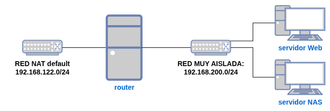

## Objetivos

* Crear un escenario virtualizado con QEMU/KVM + libvirt en un servidor sin entorno gráfico.
* Practicar las distintas operaciones sobre los recursos virtualizados que hemos aprendido en esta unidad.
* Vamos a crear una infraestructura con un servidor web que sirva el contenido estático desde un directorio compartido por un servidor NAS.

Toda la práctica se debe realizar **desde la línea de comandos con `virsh`** y las herramientas asociadas (`virt-install`, `qemu-img`…). **No uses `virt-manager`**: en las entregas debe poder comprobarse que las operaciones se han hecho con `virsh`.

## Infraestructura que vamos a crear

* Redes que vamos a usar:
	* La red de tipo **NAT** `default` que ya trae libvirt por defecto.
	* Crea con `virsh` una **red muy aislada** llamada `red_intra`.
* Máquinas virtuales:
	* `router`:
		* Máquina virtual con Debian 13.
		* Realiza la instalación por red, siguiendo [este manual](https://github.com/josedom24/curso_kvm_ow/blob/main/curso2/contenidos/unidad07/clase1.md).
		* Está conectada a la red **default** y la **red_intra**.
		* El hostname de esta máquina debe ser `router-tunombre`.
		* Se debe poder acceder a ella por ssh con el usuario `user` sin que te pida contraseña (configura tu clave pública y la mía).
		* El usuario `user` debe poder ejecutar el comando `sudo` sin que te pida contraseña.
		* Esta máquina se debe iniciar cada vez que arrancamos el host.
	* `servidorNAS`:
		* Máquina virtual con Alpine 3.24.
		* Realiza la instalación desde una imagen ISO.
		* Esta máquina debe tener un disco extra de 1Gb que deberás montar en el directorio `/srv/data`.
		* El hostname de esta máquina debe ser `nas-tunombre`.
		* Se debe poder acceder a ella por ssh con el usuario `user` sin que te pida contraseña (configura tu clave pública y la mía).
		* Esta máquina se debe iniciar cada vez que arrancamos el host.
	* `servidorWeb`:
		* Máquina virtual Ubuntu 24.04.
		* Crea esta máquina usando clonación enlazada y configuración de cloud-init desde la imagen cloud.
		* El hostname de esta máquina debe ser `web-tunombre`.
		* Se debe poder acceder a ella por ssh con el usuario `user` sin que te pida contraseña (configura tu clave pública y la mía).
		* Esta máquina se debe iniciar cada vez que arrancamos el host.
* Configura la máquina **router** para que haga SNAT y permita que las máquinas tengan acceso al exterior (**la configuración debe ser persistente**).

**Pregunta**: hemos instalado cada máquina de una forma distinta: `router` por red, `servidorNAS` desde ISO y `servidorWeb` mediante clonación enlazada con `cloud-init`. De las tres, ¿cuál es la gran ventaja de la clonación enlazada frente a las otras dos formas de instalación, y por qué?

:::tip[Entrega: Infraestructura]
1. Salida de `virsh net-list --all` y `virsh list --all` mostrando las redes y las máquinas activas.
2. Comprobación del hostname y del acceso SSH sin contraseña (con tu usuario) en las tres máquinas.
3. Comprobación de que las tres máquinas tienen acceso a Internet a través del **router** (SNAT).
4. Respuesta a la pregunta sobre la clonación enlazada.
:::

## Instalación de servicios

1. Instala el servidor web **nginx** en el `servidorWeb`.
2. Configura el **router** para que se pueda acceder al servidor web desde el exterior del escenario (por ejemplo, con una regla DNAT que redirija el puerto 80 del router al `servidorWeb`).
3. Instala en el `servidorNAS` un servidor NFS y comparte el directorio `/srv/data` donde has guardado una página web estática, una plantilla HTML con CSS o la página generada en IAW. En la página principal debe aparecer tu nombre completo y la fecha.
4. Monta en el `servidorWeb` el directorio compartido en `/var/www/data` y crea un Virtual Host que sirva ese sitio web usando el nombre `data.tunombre.org`.

**Pregunta**: ¿Por qué montamos por NFS el directorio del `servidorNAS` en el `servidorWeb` en vez de copiar los ficheros directamente al `servidorWeb`? ¿Qué ocurre si cambias el contenido de la página en el `servidorNAS`?

:::tip[Entrega: Servicios]
1. Comprobación de que el recurso NFS está compartido y montado correctamente.
2. Comprobación de que se puede acceder al puerto 80 del `router` desde el exterior del escenario.
3. Comprobación de acceso a la página web desde el exterior del escenario, mostrando tu nombre y la fecha.
4. Respuesta a la pregunta sobre el uso de NFS.
:::

## Otras operaciones

1. El disco donde tenemos la información de la página web en el `servidorNAS` se ha quedado pequeño. Redimensiona el disco y el sistema de ficheros a 2GB.
2. Realiza un snapshot a cada una de las máquinas para que podamos volver a ese estado si tenemos algún problema. Muestra la lista de snapshots.

**Pregunta**: ¿en qué momento del proceso conviene hacer el snapshot de cada máquina, antes o después de instalar y configurar los servicios? Razona la respuesta.

:::tip[Entrega: Otras operaciones]
1. Comprobación de que el disco y el sistema de ficheros del `servidorNAS` tienen el nuevo tamaño.
2. Lista de snapshots de cada máquina.
3. Respuesta a la pregunta sobre el momento del snapshot.
:::

## Vídeo de demostración

Además de los comandos y comprobaciones anteriores, graba un **vídeo de 3 a 6 minutos** mostrando tu escenario **funcionando en directo**, con **narración en voz** explicando qué está pasando y por qué.

:::tip[Qué debe mostrar el vídeo]
1. Acceso a la página web desde el exterior del escenario (a través del `router`), mostrando tu nombre y la fecha.
2. Un cambio del contenido de la página en el `servidorNAS` y la comprobación en directo, en el navegador, de que el cambio se refleja al momento gracias al montaje NFS.
3. Salida de `virsh list --all` y `virsh net-list --all` mostrando el escenario completo en marcha.
:::

Se valorará que la explicación hablada demuestre que entiendes qué papel juega cada pieza del escenario (redes, NFS, `virsh`), no solo que el resultado en pantalla sea el esperado. Sube el vídeo a YouTube (puede ser como **oculto** / **no listado**) y añade la URL en la incidencia de Redmine junto con el resto de la entrega.
