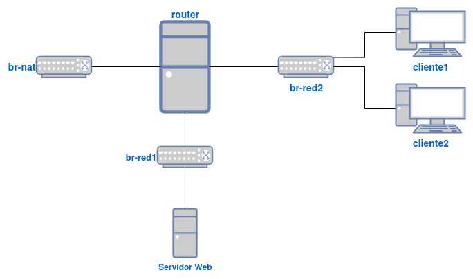

## ¿Qué vas a aprender en esta práctica?

* Realizar la configuración de un router Linux.
* Activar el reenvío de paquetes.
* Configurar reglas SNAT y DNAT.
* Realizar la instalación y configuración del servidor Kea DHCP.
* Entender los tiempos involucrados en el protocolo DHCP.
* Comprender el comportamiento de los clientes cuando no tienen comunicación con el servidor DHCP.
* Configurar reservas DHCP.

## Teoría

### Router Linux, SNAT y DNAT

* **¿Para qué se usa un router Linux?**

* Para **conectar dos o más redes** y permitir el **enrutamiento de paquetes** entre ellas.
* Útil en redes domésticas, laboratorios o firewalls personalizados.
* Puede realizar funciones como:
  * NAT (traducción de direcciones).
  * Filtrado de paquetes.
  * Redirección de puertos.
  * Compartir conexión a Internet.

* **Habilitar el reenvío de IPs (IP Forwarding)**: Permite que el kernel reenvíe paquetes entre interfaces de red.
    * Comando temporal: `echo 1 > /proc/sys/net/ipv4/ip_forward`
    * Para hacerlo **persistente**:  ~~Editar el archivo `/etc/sysctl.conf` y añadir o descomentar `net.ipv4.ip_forward = 1`. Y ejecutar: `sysctl -p`~~. En Debian13 ha cambiado la gestión de los parámetros del kernel, tienes que buscar información para añadir el parámetro `net.ipv4.ip_forward = 1` y de esa forma activar el bit de forwarding.

* **SNAT (Source NAT)**: Se usa para **salir a Internet** desde una red local con IPs privadas. Cambia la **IP de origen** de los paquetes por la IP pública del router.

    * Con `iptables`:

    ```bash
    iptables -t nat -A POSTROUTING -o eth0 -s 192.168.0.0/24 -j SNAT --to-source 192.0.2.1
    ```

    * `eth0`: interfaz de salida (por ejemplo, hacia Internet).
    * `-s`: Se indica la red desde la que queremos tener acceso a internet.
    * `192.0.2.1`: IP pública del router.

    * Alternativa más sencilla (masquerade) si se usa IP dinámica:

    ```bash
    iptables -t nat -A POSTROUTING -o eth0 -s 192.168.0.0/24 -j MASQUERADE
    ```

* **DNAT (Destination NAT)**: Se usa para **redirigir tráfico entrante** desde el exterior a una máquina interna. Cambia la **IP de destino** de los paquetes.
    * Con `iptables`:

      ```bash
      iptables -t nat -A PREROUTING -i eth0 -p tcp --dport 80 -j DNAT --to-destination 192.168.1.100:80
      ```

    * Redirige el puerto 80 entrante a una máquina interna con IP 192.168.1.100.

* **Hacer reglas `iptables` persistentes**: Las reglas de `iptables` no sobreviven a un reinicio, se deben guardar. Lo más sencillo para hacerla persistente es usar el paquete `iptables-persistent` (Debian/Ubuntu):
    * Guarda las reglas actuales:

    ```bash
    iptables-save > /etc/iptables/rules.v4
    ```
    * Se restauran automáticamente al iniciar el sistema.

### Servidor DHCP

Para realizar la parte de DHCP de esta práctica te puede ayudar una:

* [Introducción a Kea DHCP](/sri/main/u2/kea/)

## Recursos

* El [Ejemplo 3: Configuración de un router/NAT](https://github.com/josedom24/curso_kvm_ow/blob/main/curso1/contenidos/unidad06/clase7.md) del curso de virtualización.

## Ejercicio

Vamos a crear el siguiente escenario:



Llamaremos a las máquinas de la siguiente manera:

* La máquina **router** la llamaremos `router.tunombre.org`, y tendrá una distribución Debian sin entorno gráfico.
* La máquina **Servidor Web** la llamaremos `web.tunombre.org`, y tendrá una distribución Ubuntu Server (sin entorno gráfico),
* El **cliente1** la llamaremos `cliente1.tunombre.org`, y tendrá una distribución Fedora.
* El **cliente2** la llamaremos `cliente2.tunombre.org`, y tendrá un sistema operativo Windows 11.

Puedes reutilizar las máquinas que has usado en los distintos ejercicios.

Tendremos 3 redes:

* Una **red de tipo NAT**, cuyas características son:
  * Utiliza un bridge llamado **br-nat**.
  * No tiene servidor DHCP.
  * Está conectada la máquina **router**, y le da acceso a internet.
* Una red de tipo **muy aislada**, cuyas características son:
  * Utiliza un bridge llamado **br-red2**.
  * Tiene que tener un direccionamiento con masca de red /16.
  * Están conectadas las máquinas **router**, **cliente1** y **cliente2**.
* Una red de tipo **aislada**, cuyas características son:
  * Utiliza un bridge llamado **br-red1**.
  * No tiene servidor DHCP.
  * Tiene que tener un direccionamiento con masca de red /24.
  * Están conectadas las máquinas **router**, **Servidor Web**.

### Parte 1: Configuración con direccionamiento estático

1. Configura de forma adecuada las interfaces de red de las máquinas que están conectadas a las distintas redes, comprueba que hay conectividad entre ellas.
2. Configura el FQDN de forma correcta en las máquinas.
3. Crea un usuario llamado `tunombre` que tenga permisos para ejecutar `sudo` sin que te pida contraseña en las máquinas Linux.
4. Configura el acceso a todas las máquinas Linux por shh con tu clave pública para acceder con el usuario que has creado. Investiga el uso de `ssh -A` para acceder a las máquinas internas desde el exterior.
5. Configura la máquina router para que permita que las máquinas internas tenga acceso a internet. Las reglas que has configurado deben ser persistentes. ¿Es necesario usar *enmascaramiento*?
6. Instala un servidor web en la máquina **Servidor Web**: `sudo apt install apache2`. Crea la regla necesaria para acceder desde el exterior al servidor web con un navegador. Usa resolución estática para acceder a la página web usando el nombre `www.tunombre.org`, para acceder desde el exterior, y desde las máquinas conectadas a la red **muy aislada**. **Nota**: Desde el exterior se debe acceder a la máquina **router** para acceder a la página web.

### Parte 2: Configuración con servidor DHCP

Vamos a seguir trabajando con el escenario de la parte anterior.

1. Instala un servidor DHCP en la máquina `router.tunombre.org` con un ámbito que tenga las siguientes características:
    * Tiene que ofrecer configuración automática para los equipos clientes de la **red muy aislada**.
    * Determinar el rango de direcciones, la máscara de red, la puerta de enlace, el servidor DNS y la dirección de broadcast.
    * Duración de la concesión: 30 minutos.
2. Configura las máquinas **cliente1** y **cliente2** para que tomen configuración de red dinámica y puedas probar que realmente está funcionando el servidor.
3. Realizar una captura, desde el servidor usando `tcpdump`, de los cuatro paquetes que corresponden a una concesión: `DISCOVER`, `OFFER`, `REQUEST`, `ACK`.
4. **Para hacer esta prueba configura un tiempo de concesión bajo**. Los clientes toman una configuración, y a continuación apagamos el servidor DHCP. ¿qué ocurre con el cliente windows? ¿Y con el cliente linux? Comprueba el funcionamiento y razona el motivo.
5. Los clientes toman una configuración, y a continuación cambiamos la configuración del servidor DHCP (por ejemplo el rango). ¿qué ocurriría con un cliente windows? ¿Y con el cliente linux? Comprueba el funcionamiento y razona el motivo.
6. Actualmente el **servidorWeb** tiene una ip fija para que se pueda acceder a ese servicio. Configura un nuevo ámbito en el servidor DHCP con las siguientes características:
    * Tiene que ofrecer configuración automática para los equipos clientes de la **red aislada**.
    * Determinar el rango de direcciones, la máscara de red, la puerta de enlace, el servidor DNS y la dirección de broadcast.
    * Duración de la concesión: 24 horas.
7. Crea una reserva en el servidor para que el **servidorWeb** tenga la misma IP que había configurado de forma estática.
8. Modifica la configuración de red del **servidorWeb** para que configure la red de forma dinámica.
9. Conecta la máquina **router** a una red de tipo NAT con servidor DHCP (por ejemplo la `default`). Configura la interfaz correspondiente para que tome direccionamiento dinámico.
10. Recuerda que si la interfaz "pública" de un router toma direccionamiento dinámico, las reglas de SNAT deben usar la técnica de enmascaramiento. Modifica las reglas de SNAT para que el escenario siga funcionando.

:::tip[Entrega]

**Parte 1 — Direccionamiento estático**

1. Configuración de red de las máquinas. Comprobación de que las máquinas que están conectadas en distintas redes hacen ping entre ellas (usa una de las máquinas conectada a la red **muy aislada**).
2. Comprobación de que el nombre FQDN está bien configurado en las máquinas.
3. Comprobación de que al ejecutar sudo no se pide la contraseña en las máquinas Linux.
4. Comprobación del acceso a la máquina **cliente1** y **Servidor Web** con ssh desde el exterior.
5. Comprobación de que las máquinas internas tienen acceso a internet y resolución DNS.
6. Comprobación del acceso a la página web con un navegador desde el exterior y desde alguna de las máquinas conectadas a la red **muy aislada**.
7. ¿Se puede acceder a la máquina **Servidor Web** desde el exterior sin acceder por el router? Razona tu respuesta.

**Parte 2 — Servidor DHCP**

8. Entrega el fichero de configuración que tienes que realizar en el apartado 1 del servidor DHCP.
9. Muestra la configuración de los clientes para que tomen direccionamiento dinámico. Muestra la configuración de red (dirección ip, puerta de enlace, DNS,...) con la que se han configurado. Muestra la lista de concesiones.
10. Una comprobación donde se comprueba que los dos clientes tienen conectividad al exterior.
11. Comprobación donde se vean los 4 paquetes que se transmite en la negociación de la concesión, del apartado 3.
12. Explica, con pruebas de funcionamiento, el motivo del comportamiento que se indica en los puntos 4 y 5. Muestra al profesor el funcionamiento del punto 4 y 5.
13. La configuración del servidor DHCP que se solicita en el apartado 6. Muestra la configuración del **servidorWeb** después de cambiar su configuración de red. Comprueba que puedes seguir accediendo a la página web desde el exterior y desde los clientes.
14. Muestra el cambio que has realizado en la configuración de la interface "pública" del **router**. Muestra la configuración de red que ha tomado.
15. Muestras las nuevas reglas SNAT.
16. Comprueba que los clientes y el **servidorWeb** siguen teniendo conectividad con el exterior.

:::
