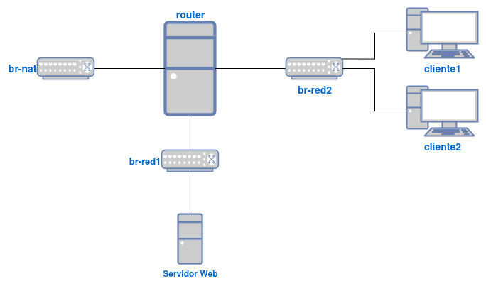

Vamos a crear el siguiente escenario:

Llamaremos a las máquinas de la siguiente manera:

* La máquina **router** la llamaremos `router.tunombre.org`, y tendrá una distribución Debian sin entorno gráfico.
* La máquina **Servidor Web** la llamaremos `web.tunombre.org`, y tendrá una distribución Ubuntu Server (sin entorno gráfico),
* El **cliente1** la llamaremos `cliente1.tunombre.org`, y tendrá una distribución Fedora.
* El **cliente2** la llamaremos `cliente2.tunombre.org`, y tendrá un sistema operativo Windows 11.

Puedes reutilizar las máquinas que has usado en los distintos ejercicios.

Tendremos 3 redes:

* Una **red de tipo NAT**, cuyas características son:
  * Utiliza un bridge llamado **br-nat**.
  * No tiene servidor DHCP.
  * Está conectada la máquina **router**, y le da acceso a internet.
* Una red de tipo **muy aislada**, cuyas características son:
  * Utiliza un bridge llamado **br-red2**.
  * Tiene que tener un direccionamiento con máscara de red /16.
  * Están conectadas las máquinas **router**, **cliente1** y **cliente2**.
* Una red de tipo **aislada**, cuyas características son:
  * Utiliza un bridge llamado **br-red1**.
  * No tiene servidor DHCP.
  * Tiene que tener un direccionamiento con máscara de red /24.
  * Están conectadas las máquinas **router**, **Servidor Web**.

En esta práctica, **«desde el exterior»** significa desde fuera del escenario, entrando por la IP pública del router (la de la red **br-nat**). Ten en cuenta que el anfitrión también tiene IP en algunas de las redes.

### Parte 1: Configuración con direccionamiento estático

1. Configura de forma adecuada las interfaces de red de las máquinas que están conectadas a las distintas redes, comprueba que hay conectividad entre ellas. La configuración debe mantenerse al reiniciar.
2. Configura el nombre de la máquina y su FQDN de forma correcta en todas las máquinas.
3. Crea un usuario llamado `tunombre`, el mismo en todas las máquinas Linux, que tenga permisos para ejecutar `sudo` sin que te pida contraseña.
4. Configura el acceso a todas las máquinas Linux por ssh con tu clave pública para acceder con el usuario que has creado. Investiga el uso de `ssh -A` para acceder a las máquinas internas desde el exterior.
5. Configura la máquina router para que las máquinas de **las dos redes internas** tengan acceso a internet. Las reglas que has configurado deben ser persistentes.
6. Instala un servidor web en la máquina **Servidor Web**: `sudo apt install apache2`. Crea la regla necesaria para acceder desde el exterior al servidor web con un navegador. Usa resolución estática para acceder a la página web usando el nombre `www.tunombre.org`, para acceder desde el exterior, y desde las máquinas conectadas a la red **muy aislada**. **Nota**: Desde el exterior se debe acceder a la máquina **router** para acceder a la página web.

**Pregunta**: ¿Para qué sirve `ssh -A` al acceder al router y desde ahí a las máquinas internas? ¿Qué problema de seguridad evita frente a copiar tu clave privada dentro del router?

:::tip[Entrega Parte 1]

1. (Tarea 1) Ficheros de configuración de red de las máquinas y la configuración que tienen activa. Comprobación de que las máquinas que están conectadas en distintas redes hacen ping entre ellas (usa una de las máquinas conectada a la red **muy aislada**).
2. (Tarea 2) Comprobación de que el nombre de la máquina y el FQDN están bien configurados en las máquinas.
3. (Tarea 3) Comprobación de que al ejecutar sudo no se pide la contraseña en las máquinas Linux. La prueba debe demostrar que sudo no la pide, no que la recuerda de una ejecución anterior.
4. (Tarea 5) Comprobación de que las máquinas de las dos redes internas tienen acceso a internet y resolución DNS. Demuestra que las reglas de SNAT se aplican al arrancar el router.
5. (Tarea 6) Captura de pantalla del navegador accediendo a `www.tunombre.org` desde el exterior y desde un cliente de la red **muy aislada**. ¿Se puede acceder a la máquina **Servidor Web** sin pasar por el router? Razona tu respuesta.
6. Contesta la pregunta sobre `ssh -A`.

:::

### Parte 2: Configuración con servidor DHCP

Vamos a seguir trabajando con el escenario de la parte anterior.

1. Instala un servidor DHCP en la máquina `router.tunombre.org` con un ámbito que tenga las siguientes características:
    * Tiene que ofrecer configuración automática para los equipos clientes de la **red muy aislada**.
    * Determinar el rango de direcciones, la máscara de red, la puerta de enlace, el servidor DNS y la dirección de broadcast.
    * Duración de la concesión: 30 minutos.
2. Configura las máquinas **cliente1** y **cliente2** para que tomen configuración de red dinámica y puedas probar que realmente está funcionando el servidor.
3. Realizar una captura, desde el servidor usando `tcpdump`, de los cuatro paquetes que corresponden a una concesión: `DISCOVER`, `OFFER`, `REQUEST`, `ACK`.
4. **Para hacer esta prueba configura un tiempo de concesión bajo** (cuando termines, vuelve a poner los 30 minutos). Los clientes toman una configuración, y a continuación apagamos el servidor DHCP. Comprueba qué ocurre en el cliente windows y en el cliente linux mientras dura la concesión y cuando intentan renovarla, y razona el motivo.
5. Los clientes toman una configuración y, con la concesión activa, cambiamos la configuración del servidor DHCP (por ejemplo el rango). Comprueba qué ocurre en el cliente windows y en el cliente linux mientras dura la concesión y cuando intentan renovarla, y razona el motivo.
6. Actualmente el **servidorWeb** tiene una ip fija para que se pueda acceder a ese servicio. Configura un nuevo ámbito en el servidor DHCP con las siguientes características:
    * Tiene que ofrecer configuración automática para los equipos clientes de la **red aislada**.
    * Determinar el rango de direcciones, la máscara de red, la puerta de enlace, el servidor DNS y la dirección de broadcast.
    * Duración de la concesión: 24 horas.
7. Crea una reserva en el servidor para que el **servidorWeb** tenga la misma IP que había configurado de forma estática.
8. Modifica la configuración de red del **servidorWeb** para que configure la red de forma dinámica.
9. Conecta la máquina **router** a una red de tipo NAT con servidor DHCP (por ejemplo la `default`). Configura la interfaz correspondiente para que tome direccionamiento dinámico. Puedes cambiar la interfaz conectada a **br-nat** o añadir una nueva; al final solo debe haber una ruta por defecto, por la interfaz que toma la IP por DHCP.
10. Recuerda que si la interfaz "pública" de un router toma direccionamiento dinámico, las reglas de SNAT deben usar la técnica de enmascaramiento. Modifica las reglas de SNAT para que el escenario siga funcionando.

:::tip[Entrega Parte 2]

1. (Tarea 1) Entrega el fichero de configuración que tienes que realizar en el apartado 1 del servidor DHCP.
2. (Tarea 2) Muestra la configuración de los clientes para que tomen direccionamiento dinámico. Muestra la configuración de red (dirección ip, puerta de enlace, DNS,...) con la que se han configurado. Muestra la lista de concesiones.
3. (Tarea 2) Una comprobación donde se comprueba que los dos clientes tienen conectividad al exterior.
4. (Tareas 4 y 5) Explica, con pruebas de funcionamiento en los dos clientes, el motivo del comportamiento en los dos casos.
5. (Tareas 6, 7 y 8) La configuración del nuevo ámbito y de la reserva. Muestra la configuración del **servidorWeb** después de cambiar su configuración de red y la IP que ha recibido. Comprueba que puedes seguir accediendo a la página web desde el exterior (a través del router) y desde los clientes.
6. (Tarea 9) Muestra el cambio que has realizado en la configuración de la interfaz "pública" del **router**. Muestra la configuración de red que ha tomado y la tabla de rutas.
7. (Tarea 10) Muestra las nuevas reglas de SNAT y que se aplican al arrancar el router.
8. Comprueba que los clientes y el **servidorWeb** siguen teniendo conectividad con el exterior.

:::

## Vídeo de demostración

Además de las capturas y ficheros de configuración, debes grabar un **vídeo de 3 a 6 minutos** mostrando tu escenario **funcionando en directo**, con **narración en voz** explicando qué está pasando y por qué. No repitas en el vídeo el contenido de los ficheros de configuración: eso ya se entrega por escrito.

:::tip[Qué debe mostrar el vídeo]
1. Acceso por SSH a `cliente1` o al `Servidor Web` desde el exterior, a través del router, usando `ssh -A`, explicando por qué hace falta el reenvío del agente.
2. Acceso a `www.tunombre.org` desde el exterior y desde un cliente de la red **muy aislada**.
3. Captura en directo con `tcpdump` de los cuatro paquetes `DISCOVER`/`OFFER`/`REQUEST`/`ACK` mientras un cliente obtiene su configuración por DHCP.
4. Apagar el servidor DHCP con una concesión activa y mostrar la reacción del cliente Windows y del cliente Linux, explicando la diferencia.
5. Cambiar el rango del servidor DHCP con una concesión activa y mostrar de nuevo la reacción de ambos clientes.
:::

Se valorará que la explicación hablada demuestre que entiendes lo que ocurre en cada paso, no solo que el resultado en pantalla sea el esperado. Sube el vídeo a YouTube (puede ser como **oculto** / **no listado**) y añade la URL en la incidencia de Redmine junto con el resto de la entrega.
