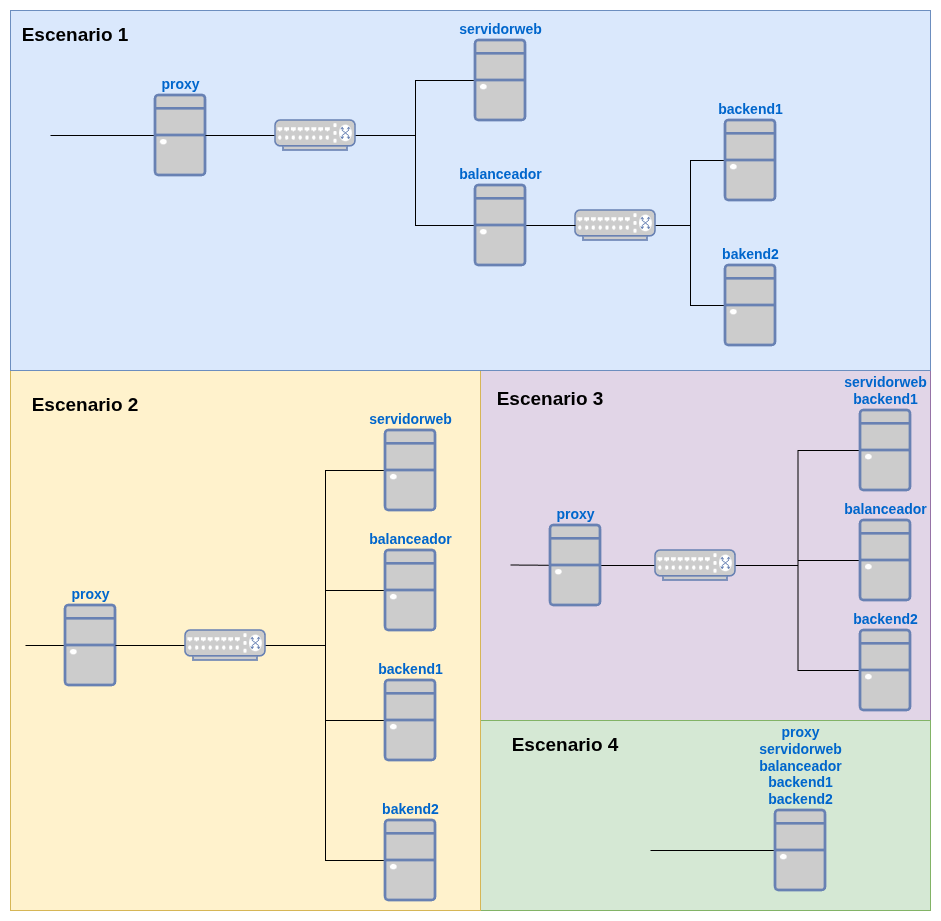

En esta práctica vamos a trabajar con las distintas aplicaciones que hemos estudiado que utilizan el protocolo HTTP: **servidor web, proxy inverso y balanceador de carga**. Vamos a configurar un proxy inverso que nos permite el acceso a diferentes aplicaciones web. Algunas de las aplicaciones web se sirven desde un servidor web y otras se sirven desde un balanceador de carga.

Posteriormente, sobre ese mismo escenario, añadiremos un **servidor de almacenamiento** que ofrecerá una **SAN** (protocolo **iSCSI**) y una **NAS** (protocolo **NFS**) a los servidores web y backends.

## Infraestructura

Podemos usar contenedores LXC para crear las distintas máquinas, **aunque el `servidorWeb` tiene que ser una máquina virtual, ya que posteriormente será un cliente iscsi.**

Podemos hacer la práctica en varios escenarios distintos:

* **Escenario 1**: Es más real, tenemos cada servidor en una red privada.
* **Escenario 2**: En este caso todos los servidores están en la misma red.
* **Escenario 3**: En este caso sólo tenemos dos servidores web, uno de ellos será backend para el balanceador de cargar y servidor web para el acceso desde el proxy inverso.
* **Escenario 4**: Todos los servicios están en un servidor, habrá que trabajar con los puertos.



Elige el escenario que más te guste.

## Configuración de servicios

### Servidor web

* Elige entre el servidor web apache2 o nginx.
* Tendrá una página principal con hoja de estilo, con distinta información (tu nombre, ...).
* Cuando se accede a la ruta `/nas` se redirecciona a `/documentos`.
* En la ruta `/documentos` hay una autentificación básica.
* Cuando nos autentificamos, nos muestra una página con documentos pdf que se pueden descargar.
* Esta página será accesible desde el proxy inverso con la url `nas.tunombre.org`.

El servidor web tendrá además dos aplicaciones web implantadas en contenedores docker:

* Una aplicación llamada **JuiceShop** (imagen docker `bkimminich/juice-shop`, esta aplicación sirve el contenido en el puerto 3000) que será accesible desde el proxy inverso con el nombre `www.tunombre.org/shop`.
* Un juego llamado **2048** (imagen docker `josedom24/2048:v1`) que será accesible desde el proxy inverso con el nombre `www.tunombre.org/game`.

### Balanceador de carga

* En el escenario 1 tendrá qué funciona como router/nat.
* Instalaremos `haproxy` y balanceara la carga sobre los servidores `backend1` y `backend2`.
* En los servidor web instalaremos una aplicación PHP con hoja de estilo, que tendrá en el cuero de la página, el siguiente código PHP para que muestre los nombres de los servidores en los que está accediendo:
    ```php
    <?php
    // Mostrar el hostname del servidor
    echo "<h1>Servidor: " . gethostname() . "</h1>";

    // Información adicional opcional (útil para diagnóstico)
    echo "<p>Dirección IP del servidor: " . $_SERVER['SERVER_ADDR'] . "</p>";
    echo "<p>Dirección IP del cliente: " . $_SERVER['REMOTE_ADDR'] . "</p>";
    echo "<p>Fecha y hora: " . date('Y-m-d H:i:s') . "</p>";
    ?>
    ``` 
* La página balanceada será accesible desde el proxy inverso con la url `app.tunombre.org`.

### Proxy inverso

* En el escenario 1 y en el escenario 2 tendrá qué funciona como router/nat.
* Elige entre el servidor web apache2 o nginx.
* Las url y las páginas a las que vamos a acceder son:
    * `nas.tunombre.org`: Accederemos al servidor web.
    * `www.tunombre.org/shop`: Accedemos a la aplicación docker `JuiceShop`.
    * `www.tunombre.org/game`: Accedemos a la aplicación `2048`.
    * `app.tunombre.org`: Accedemos a al balanceador de carga.

:::tip[Entrega del protocolo HTTP]
1. Indica el escenario que has escogido.
2. Configuración del balanceador de carga y del proxy inverso.
3. Comprobación de que se produce una redireción al acceder a la aplicación web `nas.tunombre.org` desde el proxy inverso.
4. Capturas de pantallas accediendo a las distintas aplicaciones.
5. Captura de pantalla accediendo con `hatop` al balanceador de carga.
:::

## Servidor de almacenamiento

Sobre el escenario anterior vamos a trabajar con los **protocolos de almacenamiento** que hemos estudiado.

Crea una máquina virtual que va a ser nuestro **servidor de almacenamiento** que va a ofrecer una **SAN** (protocolo **iSCSI**) y una **NAS** (protocolo **NFS**). Dicha máquina virtual tendrá las siguientes características:

* Estará conectada a la red del **servidorweb**, al **backend1** y al **backend2**.  Si lo hiciéramos más real crearíamos una **red de datos** que conecta los servidores web con el servidor de almacenamiento.
* Estará conectada a una red de tipo NAT para que tenga salida a internet.
* Tendrá tres discos adicionales de 3Gb.
* Crearemos un RAID5 de los tres discos con **`mdadm`**. ¿Qué tamaño tiene el dispositivo de bloque correspondiente al RAID5?
* Crearemos un grupo de volúmenes cuyo dispositivo físico es el disco RAID5. En este grupo de volúmenes crearemos volúmenes que serán los dispositivos que vamos a compartir con otros servidores.

Es importante darse cuenta que cuando tengamos el dispositivo de bloque compartido en otro servidor, todo lo que se guarde en ese disco se guardará en nuestro servidor SAN en un dispositivo disco RAID5 con lo que la información estará respaldada y se podrá recuperar aunque algunos de los discos fallen.

### Servidor SAN

Ya tenemos el servidor de almacenamiento preparado, vamos a añadir la funcionalidad de servidos SAN y poder empezar a compartir dispositivos de bloque:

* Crea un target con 2 LUN (correspondientes a dos volúmenes lógicos de 512Mb cada uno) y autenticación por CHAP y conéctala al **servidorweb**.
* Explica cómo escaneas desde el **servidorweb** (cliente iSCSI) buscando los targets disponibles y utiliza uno de las unidades lógicas proporcionadas, formateándola y montándola.
* Utiliza [systemd mount](https://eltallerdelbit.com/montar-unidades-con-systemd/) para que el target se monte automáticamente al arrancar el cliente.

El sistema debe funcionar después de un reinicio de las máquinas.

**Pregunta**: ¿Qué ocurriría si montamos el mismo dispositivo en otra máquina? ¿Podrían leer las dos máquinas del mismo disco? ¿Y escribir?

### Servidor NAS

Ahora vamos a crear un servidor NAS en nuestro servidor de almacenamiento, para compartir almacenamiento mediante **NFS**, de forma que otros servidores GNU/Linux puedan montar carpetas remotas y utilizarlas como si fueran locales.

* Crea en el servidor un **volumen lógico** de 1 GB dentro del grupo de volúmenes existente (basado en el RAID5). Ese volumen será el que se compartirá mediante NFS. Formatea el volumen.
* Crea un punto de montaje en el servidor con le volumen formateado y configura el servicio NFS para **exportar** dicho directorio a la red local, de modo que cualquier servidor del mismo segmento pueda acceder con permisos de lectura y escritura.
* En el **backend1**,  **monta el directorio compartido** en una carpeta local.
* Haz lo mismo en el **backend2**.
* Crea una página web en dicho directorio y añade un **alias** al virtualhost para que se sirva dicha página.
* Configura los servidores backend para que el **montaje NFS se realice automáticamente al arrancar** utilizando una unidad de montaje de systemd.

**Pregunta**: ¿Ha habido algún problema de que el directorio este compartido en los dos servidores? ¿Qué ocurre si modificas el fichero en uno de ellos? 

:::tip[Entrega del servidor de almacenamiento]
### Del servidor SAN

1. El contenido del fichero de configuración del servidor iSCSI.
2. La salida de la instrucción en el cliente iSCSI para ver las sesiones que tienes activas.
3. La lista de dispositivos en el cliente iSCSI, para ver los dispositivos que se han compartido.
4. El fichero de configuración de la unidad de montaje.
5. Después de un reinicio, entrega las pruebas necesarias para comprobar que sigue funcionando el sistema.
6. Contesta la pregunta, después de buscar información.

### Del servidor NAS

1. El fichero de configuración de la unidad de montaje en el servidor.
2. El fichero de configuración del servidor NFS.
3. Prueba de que has montado el directorio en los servidores **backend1** y **backend2**.
4. Acceso a la página `app.tunombre.org` para acceder a la nueva página balanceada.
5. Contesta la pregunta, después de buscar información.
:::

## netplan en lxc debian/ubuntu

En los contenedores LXC con el sistema operativo Debian, tenemos `systemd-netword` para configurar nuestras interfaces de red. Para facilitar la configuración de red podemos instalar `netplan`:

```
apt install netplan.io
```

Y creamos un fichero de configuración de `netplan`, por ejemplo `/etc/netplan/10-lxc.conf`. Recuerda que este fichero debe tener permisos restrictivos: `chmod 600`.

El problema surge cuando ejecutamos `netplan apply` que nos da un error. Ese error está causado por el componente `udev` no está instalado en los contenedores LXC. Lo que podemos hacer es simular que ese componente está instalado, ejecutando:

```
mkdir -p /usr/local/bin
echo -e '#!/bin/sh\nexit 0' > /usr/local/bin/udevadm
chmod +x /usr/local/bin/udevadm
```
Y ya podremos usar `netplan` cono herramienta para configurar la red.
