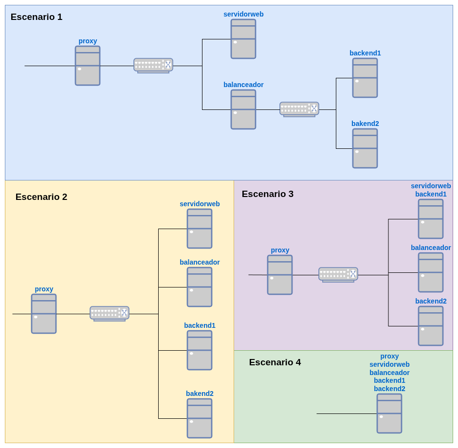

En esta práctica vamos a trabajar con las distintas aplicaciones que hemos estudiado que utilizan el protocolo HTTP: **servidor web, proxy inverso y balanceador de carga**. Vamos a configurar un proxy inverso que nos permite el acceso a diferentes aplicaciones web. Algunas de las aplicaciones web se sirven desde un servidor web y otras se sirven desde un balanceador de carga.

Posteriormente, sobre ese mismo escenario, añadiremos un **servidor de almacenamiento** que ofrecerá una **SAN** (protocolo **iSCSI**) y una **NAS** (protocolo **NFS**) a los servidores web y backends.

## Infraestructura

Podemos usar contenedores LXC para crear las distintas máquinas, **aunque `servidorweb`, `backend1` y `backend2` tienen que ser máquinas virtuales**: en la segunda parte, `servidorweb` será cliente iSCSI y los backends montarán un directorio por NFS, y eso no se puede hacer en un contenedor LXC sin cambiar su configuración de seguridad. Para configurar la red de los contenedores con netplan, tienes las indicaciones en la [presentación de contenedores LXC](https://raw.githubusercontent.com/josedom24/marp-presentaciones/main/iv/lxc.pdf) de Infraestructura Virtual.

Podemos hacer la práctica en varios escenarios distintos:

* **Escenario 1**: Es más real, tenemos cada servidor en una red privada.
* **Escenario 2**: En este caso todos los servidores están en la misma red.
* **Escenario 3**: En este caso sólo tenemos dos servidores web, uno de ellos será backend para el balanceador de carga y servidor web para el acceso desde el proxy inverso.
* **Escenario 4**: Todos los servicios están en un servidor, habrá que trabajar con los puertos.



Elige el escenario que más te guste. En todos ellos, el **servidor de almacenamiento** de la segunda parte es una máquina virtual aparte.

## Configuración de servicios

### Servidor web

* Usa **nginx** como servidor web.
* Tendrá una página principal con hoja de estilo, con distinta información (tu nombre, ...).
* Cuando se accede a la ruta `/nas` se redirecciona a `/documentos`.
* En la ruta `/documentos` hay una autenticación básica.
* Cuando nos autenticamos, nos muestra una página con documentos pdf que se pueden descargar.
* Esta página será accesible desde el proxy inverso con la url `nas.tunombre.org`.

El servidor web tendrá además dos aplicaciones web implantadas en contenedores docker:

* Un juego llamado **2048** (imagen docker `josedom24/2048:v1`, que sirve el contenido en el puerto 80 del contenedor) que será accesible desde el proxy inverso con la URL `www.tunombre.org/game`.
* La aplicación de monitorización **Grafana** (imagen docker `grafana/grafana`, que sirve el contenido en el puerto 3000) que será accesible desde el proxy inverso con la URL `www.tunombre.org/grafana`. Grafana, por defecto, espera estar en la raíz del sitio: para publicarla en una subruta hay que indicarle cuál es su URL pública y que se sirve desde una subruta, con las variables de entorno `GF_SERVER_ROOT_URL` y `GF_SERVER_SERVE_FROM_SUB_PATH`. Busca en su documentación qué valor necesitan, y piensa qué URL tiene que pasarle el proxy inverso para que funcione.

### Balanceador de carga

* En el escenario 1 también funcionará como router/NAT.
* Instalaremos `haproxy` y balanceará la carga sobre los servidores `backend1` y `backend2`.
* En los servidores web instalaremos una aplicación PHP con hoja de estilo, que tendrá en el cuerpo de la página el siguiente código PHP, para que muestre el nombre del servidor al que se está accediendo:
    ```php
    <?php
    // Mostrar el hostname del servidor
    echo "<h1>Servidor: " . gethostname() . "</h1>";

    // Información adicional opcional (útil para diagnóstico)
    echo "<p>Dirección IP del servidor: " . $_SERVER['SERVER_ADDR'] . "</p>";
    echo "<p>Dirección IP del cliente: " . $_SERVER['REMOTE_ADDR'] . "</p>";
    echo "<p>Fecha y hora: " . date('Y-m-d H:i:s') . "</p>";
    ?>
    ```
* La página balanceada será accesible desde el proxy inverso con la url `app.tunombre.org`.
* Configura la página de estadísticas de haproxy.

### Proxy inverso

* En el escenario 1 y en el escenario 2 también funcionará como router/NAT.
* Usa **nginx** como proxy inverso.
* Las url y las páginas a las que vamos a acceder son:
    * `nas.tunombre.org`: Accederemos al servidor web.
    * `www.tunombre.org/game`: Accedemos a la aplicación `2048`.
    * `www.tunombre.org/grafana`: Accedemos a la aplicación `Grafana`.
    * `app.tunombre.org`: Accedemos al balanceador de carga.

**Pregunta**: El proxy inverso y el balanceador de carga son dos piezas distintas que trabajan juntas. ¿Qué función cumple cada una? ¿Qué pasaría si detuvieras el servicio web en uno de los dos backends (`backend1` o `backend2`)? Compruébalo en tu escenario y explica lo que observas.

:::tip[Entrega del protocolo HTTP]
Las comprobaciones con `curl` se entregan como texto, con el comando y su salida.

1. Indica el escenario que has escogido y qué máquinas son máquinas virtuales y cuáles contenedores.
2. La configuración del sitio `nas.tunombre.org` en el servidor web. `curl -I` a `nas.tunombre.org/nas` (código de la redirección y cabecera `Location`), a `nas.tunombre.org/documentos/` sin credenciales (401) y con ellas (`-u`, 200).
3. La configuración del balanceador de carga y del proxy inverso.
4. Los comandos con los que has creado los contenedores de 2048 y de Grafana. Capturas de pantalla accediendo a `www.tunombre.org/game` y a `www.tunombre.org/grafana`, y `curl -I` a `www.tunombre.org/game` (sin barra final). **¿Qué has tenido que configurar en Grafana y en el proxy inverso para que funcione en `/grafana`, y por qué no hace falta con 2048?**
5. Captura de pantalla de la página de estadísticas de haproxy.
6. Contesta la pregunta, comprobándolo en tu escenario.
:::

## Servidor de almacenamiento

Sobre el escenario anterior vamos a trabajar con los **protocolos de almacenamiento** que hemos estudiado.

Crea una máquina virtual que va a ser nuestro **servidor de almacenamiento** que va a ofrecer una **SAN** (protocolo **iSCSI**) y una **NAS** (protocolo **NFS**). Dicha máquina virtual tendrá las siguientes características:

* Estará conectada a las redes donde están `servidorweb`, `backend1` y `backend2`. Si lo hiciéramos más real crearíamos una **red de datos** que conecta los servidores web con el servidor de almacenamiento.
* Estará conectada a una red de tipo NAT para que tenga salida a internet.
* Tendrá tres discos adicionales de 3 GB.
* Crearemos un RAID5 de los tres discos con **`mdadm`**, de forma que se mantenga después de reiniciar. ¿Qué tamaño tiene el dispositivo de bloque correspondiente al RAID5?
* Crearemos un grupo de volúmenes cuyo dispositivo físico es el disco RAID5. En este grupo de volúmenes crearemos volúmenes que serán los dispositivos que vamos a compartir con otros servidores.

Es importante darse cuenta de que cuando tengamos el dispositivo de bloque compartido en otro servidor, todo lo que se guarde en ese disco se guardará en nuestro servidor SAN en un dispositivo disco RAID5 con lo que la información estará respaldada y se podrá recuperar aunque algunos de los discos fallen.

### Servidor SAN

Ya tenemos el servidor de almacenamiento preparado, vamos a añadir la funcionalidad de servidor SAN y poder empezar a compartir dispositivos de bloque:

* Crea un target con 2 LUN (correspondientes a dos volúmenes lógicos de 512 MB cada uno) y autenticación por CHAP, y conéctalo al `servidorweb`.
* Explica cómo escaneas desde `servidorweb` (cliente iSCSI) buscando los targets disponibles y utiliza una de las unidades lógicas proporcionadas, formateándola y montándola.
* Utiliza una **unidad de montaje de systemd** (las vimos en la presentación de almacenamiento) para que el disco se monte automáticamente al arrancar el cliente. Monta el disco por su **UUID**, no por su nombre (`/dev/sda`, `/dev/sdb`…), que puede cambiar al reiniciar.

El sistema debe funcionar después de un reinicio de las máquinas: el cliente tiene que volver a conectarse al target y montar el disco solo.

**Pregunta**: ¿Qué ocurriría si montamos el mismo dispositivo en otra máquina? ¿Podrían leer las dos máquinas del mismo disco? ¿Y escribir?

### Servidor NAS

Ahora vamos a crear un servidor NAS en nuestro servidor de almacenamiento, para compartir almacenamiento mediante **NFS**, de forma que otros servidores GNU/Linux puedan montar carpetas remotas y utilizarlas como si fueran locales.

* Crea en el servidor un **volumen lógico** de 1 GB dentro del grupo de volúmenes existente (basado en el RAID5). Ese volumen será el que se compartirá mediante NFS. Formatea el volumen.
* Monta el volumen en un directorio del servidor (por ejemplo `/srv/nfs`) de forma **permanente**, para que siga montado después de reiniciar. Configura el servicio NFS para **exportar** dicho directorio a la red local, de modo que cualquier servidor del mismo segmento pueda acceder con permisos de lectura y escritura.
* En `backend1`, **monta el directorio compartido** en una carpeta local.
* Haz lo mismo en `backend2`.
* Crea una página web en dicho directorio y añade un **alias** al virtualhost para que se sirva dicha página. Si al crearla obtienes *Permission denied*, piensa por qué (recuerda la opción `root_squash` y cómo comprueba NFS los permisos) y resuélvelo dando los permisos adecuados en el servidor.
* Configura los servidores backend para que el **montaje NFS se realice automáticamente al arrancar** utilizando una unidad de montaje de systemd.

**Pregunta**: ¿Ha habido algún problema de que el directorio esté compartido en los dos servidores? ¿Qué ocurre si modificas el fichero en uno de ellos?

:::tip[Entrega del servidor de almacenamiento]
Las comprobaciones se entregan como texto, con el comando y su salida.

1. El RAID5 y los volúmenes: la salida de `mdadm --detail` (o `lsblk`) donde se vea el tamaño del RAID5, con la respuesta a la pregunta, y la de `lvs` con los volúmenes creados.

### Del servidor SAN

2. El contenido del fichero de configuración del servidor iSCSI.
3. En el cliente iSCSI: el descubrimiento de los targets (comando y salida), la instrucción para ver las sesiones que tienes activas y la lista de dispositivos, para ver los dispositivos que se han compartido.
4. El fichero de la unidad de montaje y, después de reiniciar las máquinas, las pruebas de que el cliente ha vuelto a conectarse al target y el disco está montado (por ejemplo `uptime`, `iscsiadm -m session` y `findmnt`).
5. Contesta la pregunta, después de buscar información.

### Del servidor NAS

6. Cómo has montado el volumen de forma permanente en el servidor de almacenamiento (`/etc/fstab` o unidad de montaje) y el fichero de configuración del servidor NFS.
7. El fichero de la unidad de montaje de systemd de los backends y la comprobación, después de reiniciar, de que el directorio está montado en `backend1` y en `backend2`. Cómo has resuelto los permisos para crear la página en el directorio compartido. El acceso a la página por `app.tunombre.org`, servida mediante el alias del virtualhost.
8. Contesta la pregunta, después de buscar información.
:::

## Vídeo de demostración

Además de las capturas y ficheros de configuración, debes grabar un **vídeo de 3 a 6 minutos** mostrando tu escenario **funcionando en directo**, con **narración en voz** explicando qué está pasando y por qué. No repitas en el vídeo el contenido de los ficheros de configuración: eso ya se entrega por escrito.

:::tip[Qué debe mostrar el vídeo]
1. Acceso a `nas.tunombre.org` a través del proxy inverso, con el nombre: la redirección a `/documentos`, la autenticación y la descarga de un PDF.
2. Varios refrescos de `app.tunombre.org`, comentando en voz que el nombre del servidor va alternando entre `backend1` y `backend2`: el balanceo de carga ocurriendo en vivo.
3. Una demostración en directo de la pregunta del protocolo HTTP: para el servicio web de uno de los backends y muestra que `app.tunombre.org` sigue funcionando y que la página de estadísticas de haproxy lo marca como caído.
4. Tras reiniciar las máquinas, comprobación de que el montaje iSCSI en `servidorweb` y el montaje NFS en `backend1`/`backend2` siguen activos sin intervención manual (las unidades de montaje de systemd funcionando solas).
5. Una demostración en directo de la pregunta del servidor NAS: modifica un fichero desde `backend1` y comprueba que el cambio aparece inmediatamente en `backend2`.
:::

Se valorará que la explicación hablada demuestre que entiendes lo que ocurre en cada paso, no solo que el resultado en pantalla sea el esperado. Sube el vídeo a YouTube (puede ser como **oculto** / **no listado**) y añade la URL en la incidencia de Redmine junto con el resto de la entrega.
