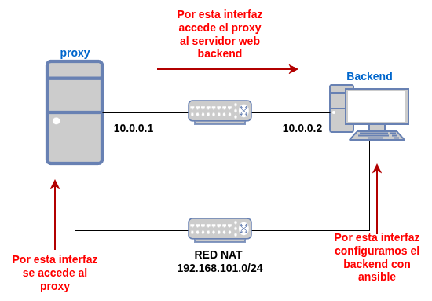
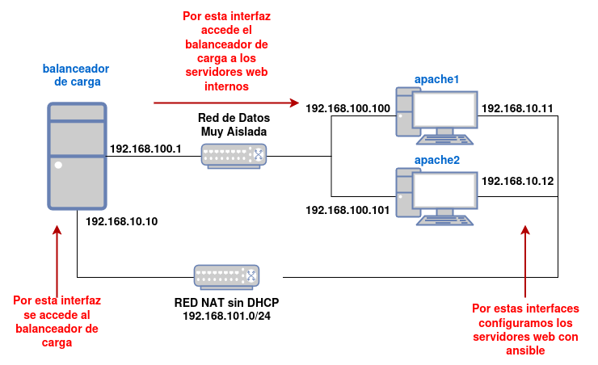

En esta tarea vas a configurar un **proxy inverso** que da acceso a dos sitios web internos y un **balanceador de carga** que reparte las peticiones entre dos servidores web. Elige el servidor con el que vas a hacer el proxy inverso: **apache2** o **nginx**.

:::caution[Elige servidor]
En la **práctica de la unidad** tendrás que usar como proxy inverso **el otro**: si haces esta tarea con apache2, en la práctica usarás nginx, y al revés.
:::

## Parte 1: Proxy inverso

Vamos a usar el **escenario2** del repositorio [ejercicios_sri](https://github.com/josedom24/ejercicios_sri) para montar el siguiente escenario:



* Una máquina `proxy` que está conectada al exterior por una red NAT y a una red interna muy aislada (dirección `10.0.0.1`).
* Una máquina `backend` que tendrá un servidor web interno, conectada a la red interna muy aislada (dirección `10.0.0.2`). También está conectada a la red NAT, pero sólo para poder configurarla con la receta ansible.

La receta de ansible del escenario (directorio `ansible/`) instala apache2 en el `backend` y crea los virtual hosts que indiques en la variable `virtualhosts` del fichero `ansible/group_vars/all`. Configúrala para crear dos virtual hosts:

* `vhost1.conf`, con el nombre `interno.example1.org` y DocumentRoot `/var/www/example1`.
* `vhost2.conf`, con el nombre `interno.example2.org` y DocumentRoot `/var/www/example2`.

Pon tu clave pública en los ficheros `cloud-init/user-data-*.yaml` y crea el escenario con `tofu init` y `tofu apply`. OpenTofu genera el inventario de ansible (`ansible/hosts`) con la IP del `backend` en la red NAT. Después, desde el directorio `ansible/`, ejecuta el playbook con `ansible-playbook site.yaml`.

1. **Proxy inverso**. Instala el servidor elegido en el `proxy` y configúralo para acceder a la primera página con el nombre `www.app1.org` y a la segunda con `www.app2.org`. Añade en la resolución estática del `proxy` los nombres internos de las páginas.
2. **La cabecera `Host`**. Cambia la configuración para que el proxy envíe al `backend` el nombre que ha pedido el cliente (`ProxyPreserveHost On` en apache2, `proxy_set_header Host $host` en nginx). Accede a `www.app1.org` y a `www.app2.org`, mira el log del `backend` y vuelve a dejar la configuración que funciona.
3. **Redirecciones**. En el `backend`, configura `interno.example1.org` para que `/directorio` redirija a `/nuevodirectorio`. Accede a `http://www.app1.org/directorio` a través del proxy con la reescritura de las redirecciones y sin ella (`ProxyPassReverse` en apache2; `proxy_redirect off;` frente al comportamiento por defecto en nginx).

## Parte 2: Balanceador de carga

Vamos a usar el **escenario3** del repositorio [ejercicios_sri](https://github.com/josedom24/ejercicios_sri): crea el escenario con OpenTofu y, desde el directorio `ansible/`, ejecuta el playbook (el inventario también lo genera OpenTofu). La receta instala apache2 con php en `apache1` y `apache2`, con una página `index.php` que muestra el nombre del servidor.



4. **Balanceador y la IP del cliente**. Instala **haproxy** en el `balanceador` y configúralo para repartir la carga entre `apache1` y `apache2`, con el nombre `www.example.org`. Mira en el log de uno de los servidores web qué IP aparece como cliente. Después, configura haproxy para que envíe la IP real del cliente (`option forwardfor`) y cambia el formato de log del servidor web para que la registre.
5. **Afinidad de sesión**. Crea en los dos servidores web el fichero `sesion.php`:

    ```php
    <?php
    session_start();
    $_SESSION['visitas'] = ($_SESSION['visitas'] ?? 0) + 1;
    echo "<h1>Servidor: " . gethostname() . "</h1>";
    echo "<p>Visitas en esta sesión: " . $_SESSION['visitas'] . "</p>";
    ?>
    ```

    Recarga varias veces `http://www.example.org/sesion.php` y fíjate en el contador. Después, configura haproxy para que un mismo cliente vaya siempre al mismo servidor usando una cookie (`cookie SERVERID insert`) y vuelve a probar.

:::tip[¿Qué tienes que entregar?]
Las comprobaciones con `curl` y los logs se entregan como texto, con el comando y su salida.

1. El servidor que has elegido. La configuración del proxy inverso. `curl` a `www.app1.org` y a `www.app2.org`.
2. La página que se muestra al enviar el nombre del cliente y la línea del log del `backend`. **¿Por qué responde otro virtual host?**
3. `curl -I` a `http://www.app1.org/directorio` con la reescritura y sin ella. **¿Qué cabecera cambia y por qué al cliente no le sirve sin la reescritura?**
4. La configuración de haproxy y una línea del log del servidor web antes y después de configurar la IP real. **¿Por qué el servidor web ve la IP del balanceador?**
5. El contador de `sesion.php` sin afinidad y con ella, y la configuración de la cookie en haproxy. **¿Dónde se guarda la sesión y por qué se pierde sin afinidad?**
:::
