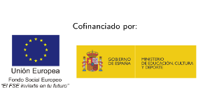

## Proyecto de Innovación Implantación y puesta a punto de la infraestructura de un cloud computing privado para el despliegue de servicios en la nube

Se permite el uso comercial de la obra y de las posibles obras derivadas, la distribución de las cuales se debe hacer con una licencia igual a la que regula la obra original.
Creative Commons Attribution ShareAlike 3.0 License. [http://creativecommons.org/licenses/by-sa/3.0/legalcode](http://creativecommons.org/licenses/by-sa/3.0/legalcode)

Los ficheros fuentes de todo el material generado en este proyecto en formato DocBook o LaTeX está disponible en:

* [http://github.com/pi-fp-cloud/](http://github.com/pi-fp-cloud/)

Puedes acceder a los contenidos de este curso mediante una página html:

* [informatica.gonzalonazareno.org/cloud](http://informatica.gonzalonazareno.org/cloud)

## Presentación del proyecto

* [Presentación del Proyecto](files/anexo-ii.pdf)
* [Memoria final](files/memoria-final.pdf)

## Virtualización

* [Introducción a la virtualización](files/03.01.IntroVirtualizacion.pdf)
* [KVM: Kernel-based Virtual Machine](files/03.02.KVM.pdf)

## Cloud Computing en la educación

* [IaaS en los estudios de informática [presentación]](files/iaas-educacion.pdf)
* [IaaS en educación](files/cloud_en_la_educacion.pdf)

## Introducción al Cloud Computing

* [Introducción a OpenStack](files/intro-openstack.pdf)
* [www.openstack.org](http://www.openstack.org)
* [TryStack: The Easiest Way To Try Out OpenStack](http://trystack.org)

## Utilización de OpenStack

* [Introducción a OpenStack Horizon](files/intro-horizon.pdf)
* [Vídeo-tutorial: Primeros pasos con OpenStack Horizon (Essex)](http://vimeo.com/51806641)
* [Vídeo-tutorial: Primeros pasos con OpenStack Horizon (Essex): instancias de máquinas Windows](http://vimeo.com/52254675)
* [OpenStack nova client](files/nova-cli.pdf)

## Infraestructura para el Cloud

* [Infraestructura para el Cloud](files/infraestructura.pdf)

## Instalación, configuración y administración de OpenStack

* [Administración de OpenStack](files/bk-admin-openstack.pdf)

## API de OpenStack

* [Utilización de las APIs de OpenStack](files/apis-openstack.pdf)

## Curso de formación

### Materiales del curso de formación impartido por Miguel Vidal y José Castro de la empresa [FLOSSystems](http://flossystems.com/).

* [Introducción a la Virtualización](files/cloud/virtualizacion.pdf)
* [StaaS: almacenamiento como servicio](files/cloud/storage.pdf)
* [Introducción a Open Stack](files/cloud/openstack.pdf)
