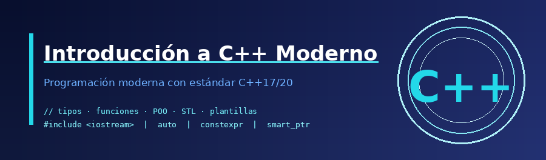

## ¿Por qué aprender C++ moderno?

**C++** es uno de los lenguajes de programación más potentes y versátiles que existen. Presente en sistemas operativos, motores de videojuegos, software de simulación, aplicaciones embebidas y de alto rendimiento, sigue siendo una elección fundamental en la industria del software.

El estándar moderno de C++ (desde **C++11** en adelante, con especial atención a **C++17** y **C++20**) ha transformado el lenguaje profundamente: ahora es más expresivo, más seguro y más fácil de usar que sus versiones anteriores, sin perder la potencia que lo caracteriza.

## ¿Qué aprenderás en este curso?

Este curso cubre los fundamentos de la programación con C++ moderno, desde cero hasta los conceptos más avanzados:

* Fundamentos del lenguaje: tipos de datos, variables, operadores y control de flujo
* Programación estructurada con funciones, punteros y referencias
* Programación orientada a objetos: clases, herencia y polimorfismo
* Uso de la **STL** (Standard Template Library): `std::vector`, `std::map`, `std::string`...
* Programación genérica con plantillas de función
* Gestión de errores mediante excepciones
* Trabajo con archivos

## Repositorio

* [Ejercicios y ejemplos](https://github.com/josedom24/ejercicios_curso_cpp_moderno)

## Curso

1. Fundamentos de la programación

    * [¿Qué es un lenguaje de programación?](/pledin/cursos/cpp_moderno/contenido/modulo01/introduccion/)
    * [Introducción a C++ moderno](/pledin/cursos/cpp_moderno/contenido/modulo01/cpp/)
    * [Instalación de un entorno de desarrollo para C++](/pledin/cursos/cpp_moderno/contenido/modulo01/instalacion/)
    * [Estructura de un programa en C++](/pledin/cursos/cpp_moderno/contenido/modulo01/estructura/)
    * [Cómo compilar y ejecutar programas](/pledin/cursos/cpp_moderno/contenido/modulo01/compilacion/)

2.  Tipos de datos

    * [Tipos de datos fundamentales](/pledin/cursos/cpp_moderno/contenido/modulo02/tipos/)
    * [Tipos de datos carácter y booleano](/pledin/cursos/cpp_moderno/contenido/modulo02/caracter_bool/)
    * [Tipos de datos numéricos y operaciones aritméticas](/pledin/cursos/cpp_moderno/contenido/modulo02/numeros/)
    * [Declaración e inicialización de variables](/pledin/cursos/cpp_moderno/contenido/modulo02/variables/)
    * [Ámbito y duración de almacenamiento de variables](/pledin/cursos/cpp_moderno/contenido/modulo02/ambito/)
    * [Declaración e inicialización de constantes](/pledin/cursos/cpp_moderno/contenido/modulo02/constantes/)
    * [Conversión de tipos de datos](/pledin/cursos/cpp_moderno/contenido/modulo02/casting/)
    * [Introducción a las cadenas de caracteres](/pledin/cursos/cpp_moderno/contenido/modulo02/cadenas/)
    * [Conversión de cadenas de caracteres](/pledin/cursos/cpp_moderno/contenido/modulo02/casting_cadenas/)
    * [Entrada y salida estándar](/pledin/cursos/cpp_moderno/contenido/modulo02/entrada_salida/)
    * [Ejercicios estructura secuencial](/pledin/cursos/cpp_moderno/contenido/modulo02/secuencial/)
    * [Tipos definidos por el usuario: `enum class`](/pledin/cursos/cpp_moderno/contenido/modulo02/enum/)
    * [Tipos definidos por el usuario: `struct`](/pledin/cursos/cpp_moderno/contenido/modulo02/struct/)

3. Control de flujo

    * [Operadores relacionales y lógicos](/pledin/cursos/cpp_moderno/contenido/modulo03/operadores/)
    * [Estructuras alternativas: if](/pledin/cursos/cpp_moderno/contenido/modulo03/if/)
    * [Estructuras alternativas: switch](/pledin/cursos/cpp_moderno/contenido/modulo03/switch/)
    * [Ejercicios estructuras alternativas](/pledin/cursos/cpp_moderno/contenido/modulo03/alternativa/)
    * [Estructuras repetitivas: while](/pledin/cursos/cpp_moderno/contenido/modulo03/while/)
    * [Estructuras repetitivas: do-while](/pledin/cursos/cpp_moderno/contenido/modulo03/dowhile/)
    * [Estructuras repetitivas: for](/pledin/cursos/cpp_moderno/contenido/modulo03/for/)
    * [Uso específico de variables: contadores, acumuladores e indicadores](/pledin/cursos/cpp_moderno/contenido/modulo03/variables/)
    * [Ejercicios estructuras repetitivas](/pledin/cursos/cpp_moderno/contenido/modulo03/repetitiva/)

4. Programación estructurada

    * [Introducción a la programación estructurada y uso de funciones](/pledin/cursos/cpp_moderno/contenido/modulo04/funciones/)
    * [Ámbito y duración de las variables en funciones](/pledin/cursos/cpp_moderno/contenido/modulo04/ambito/)
    * [Gestión de memoria con punteros](/pledin/cursos/cpp_moderno/contenido/modulo04/punteros/)
    * [Gestión de memoria con referencias](/pledin/cursos/cpp_moderno/contenido/modulo04/referencias/)
    * [Paso de argumentos a funciones](/pledin/cursos/cpp_moderno/contenido/modulo04/argumentos/)
    * [Ejemplos de paso de argumentos a funciones](/pledin/cursos/cpp_moderno/contenido/modulo04/argumentos2/)
    * [Valores de retorno de una función](/pledin/cursos/cpp_moderno/contenido/modulo04/retorno/)
    * [Tipos de funciones: constexpr, inline, lambda y recursivas](/pledin/cursos/cpp_moderno/contenido/modulo04/tipos/)
    * [Organización del código en archivos (.h y .cpp)](/pledin/cursos/cpp_moderno/contenido/modulo04/organizacion/)
    * [Ejercicios con funciones](/pledin/cursos/cpp_moderno/contenido/modulo04/ejercicios/)

5. Programación orientada a objetos

    * [Introducción a la programación orientada a objetos](/pledin/cursos/cpp_moderno/contenido/modulo05/introduccion/)
    * [Definición de clases y creación de objetos](/pledin/cursos/cpp_moderno/contenido/modulo05/poo_c++/)
    * [Introducción al encapsulamiento](/pledin/cursos/cpp_moderno/contenido/modulo05/encapsulamiento/)
    * [Miembros estáticos de clase](/pledin/cursos/cpp_moderno/contenido/modulo05/estatico/)
    * [Composición de objetos](/pledin/cursos/cpp_moderno/contenido/modulo05/composicion/)
    * [Herencia de clases](/pledin/cursos/cpp_moderno/contenido/modulo05/herencia/)
    * [Introducción al polimorfismo](/pledin/cursos/cpp_moderno/contenido/modulo05/polimorfismo/)
    * [Ejercicios de programación orientada a objetos](/pledin/cursos/cpp_moderno/contenido/modulo05/ejercicios/)

6. Estructuras dinámicas en la STL

    * [Gestión de memoria y estructuras dinámicas](/pledin/cursos/cpp_moderno/contenido/modulo06/introduccion/)
    * [Cadenas de caracteres: `std::string`](/pledin/cursos/cpp_moderno/contenido/modulo06/string/)
    * [Arreglos: `std::array`](/pledin/cursos/cpp_moderno/contenido/modulo06/array/)
    * [Vectores: `std::vector`](/pledin/cursos/cpp_moderno/contenido/modulo06/vector/)
    * [Listas: `std::list`](/pledin/cursos/cpp_moderno/contenido/modulo06/list/)
    * [Mapas: `std::map` y `std::unordered_map`](/pledin/cursos/cpp_moderno/contenido/modulo06/map/)
    * [Algoritmos de la STL](/pledin/cursos/cpp_moderno/contenido/modulo06/algoritmos/)
    * [Ejercicios con `std::string`](/pledin/cursos/cpp_moderno/contenido/modulo06/ejercicios_string/)
    * [Ejercicios con `std::array`](/pledin/cursos/cpp_moderno/contenido/modulo06/ejercicios_array/)
    * [Ejercicios con `std::vector`](/pledin/cursos/cpp_moderno/contenido/modulo06/ejercicios_vector/)
    * [Ejercicios con `std::list`](/pledin/cursos/cpp_moderno/contenido/modulo06/ejercicios_list/)
    * [Ejercicios con `std::map` y `std::unordered_map`](/pledin/cursos/cpp_moderno/contenido/modulo06/ejercicios_map/)

7. Introducción a la programación genérica

    * [Introducción a la programación genérica](/pledin/cursos/cpp_moderno/contenido/modulo07/generica/)
    * [Plantillas de funciones](/pledin/cursos/cpp_moderno/contenido/modulo07/plantillas/)
    * [Ejemplos típicos de plantillas de funciones](/pledin/cursos/cpp_moderno/contenido/modulo07/ejemplos/)
    * [Uso de funciones genéricas con contenedores STL](/pledin/cursos/cpp_moderno/contenido/modulo07/stl/)
    * [Ejercicios con plantillas de función](/pledin/cursos/cpp_moderno/contenido/modulo07/ejercicios/)

8. Excepciones: gestión de errores 
    * [Gestión de errores en C++](/pledin/cursos/cpp_moderno/contenido/modulo08/errores/)
    * [Introducción a las excepciones](/pledin/cursos/cpp_moderno/contenido/modulo08/excepcioones/)
    * [Manejo de excepciones con `try`, `catch` y `throw`](/pledin/cursos/cpp_moderno/contenido/modulo08/try/)
    * [Ejercicios con excepciones](/pledin/cursos/cpp_moderno/contenido/modulo08/ejercicios/)

9. Trabajo con archivos
    * [Introducción al trabajo con archivos](/pledin/cursos/cpp_moderno/contenido/modulo09/archivos/)
    * [Apertura, lectura y escritura de archivos](/pledin/cursos/cpp_moderno/contenido/modulo09/operaciones/)
    * [Ejercicios con archivos](/pledin/cursos/cpp_moderno/contenido/modulo09/ejercicios/)
