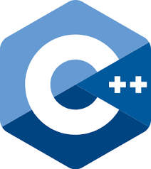

En este curso seguirás aprendiendo los fundamentos del lenguaje de programación C++, en este caso las funciones y la Programación Orientada a Objetos, una de las características más importantes de C++.

Los siguientes contenidos forman parte de un curso que he impartido para [OpenWebinars](https://openwebinars.net/cursos/cpp-estructurada-poo/) en septiembre de 2020.

Puedes obtener todo el contenido del curso en el repositorio [GitHub](https://github.com/josedom24/curso_cplusplus).

## Unidades

### Punteros y estructuras

1. [Introducción a los punteros (I)](curso/u01)
2. [Introducción a los punteros (II)](curso/u02)
3. [Introducción a las referencias en C++](curso/u03)
4. [Tipos de datos complejos: estructuras](curso/u04)

### Programación estructurada

5. [Programación estructurada](curso/u05)
6. [Funciones y procedimientos](curso/u06)
7. [Funciones recursivas](curso/u07)
8. [Ejercicios con funciones](curso/u08)
9. [Más ejercicios](curso/u09)

### Programación orientada a objetos

10. [Introducción a la programación orientada a objetos](curso/u10)
11. [Encapsulamiento en la programación orientada a objetos](curso/u11)
12. [Herencia y delegación](curso/u12)
13. [Ejercicios de programación orientada a objetos](curso/u13)
