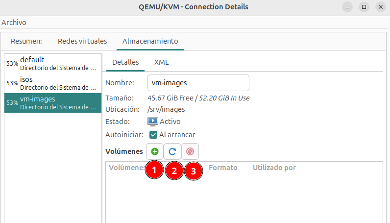
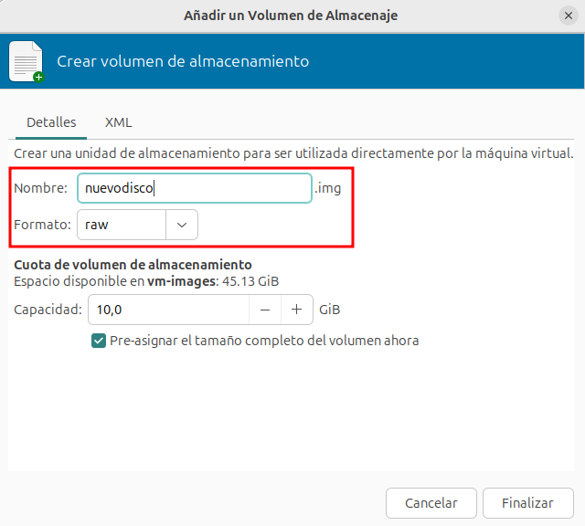
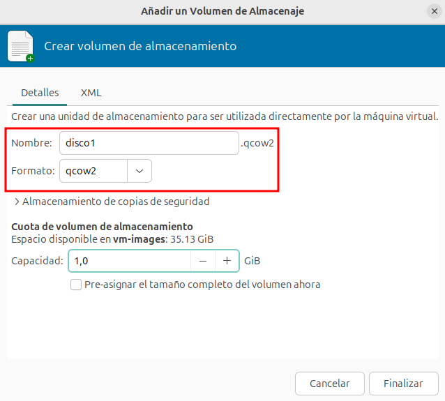
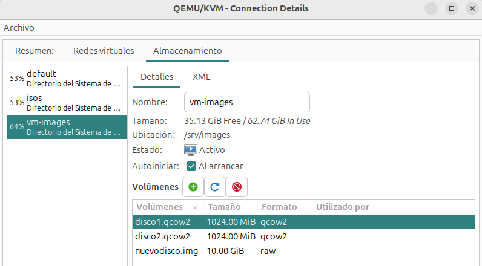

Desde la pestaña **Almacenamiento** de los **Detalles de la conexión** podemos ver los grupos de almacenamiento y los volúmenes que tenemos creados y podemos gestionarlos:

Tenemos las siguientes opciones relacionadas con los volúmenes:

* **Botón 1**: Añadir un nuevo volumen en el grupo seleccionado.
* **Botón 2**: Refrescar el grupo seleccionado. Actualiza el contenido del grupo para incluir los volúmenes que se han creado o modificado con herramientas externas.
* **Botón 3**: Eliminar el volumen seleccionado.

## Creación de nuevos volúmenes

Vamos a crear un nuevo volumen en el grupo que hemos creado en el apartado anterior. Si creamos un nuevo volumen, vemos la siguiente pantalla donde indicamos la siguiente información (la información solicitada dependerá del tipo de grupo con el que estemos trabajando):

* El **nombre** del volumen.
* El **formato**: qcow2 o raw.
* **Almacenamiento de copias de seguridad**: Nos proporciona la característica de crear volúmenes a partir de un volumen base o imagen base. Solo es compatible con el formato qcow2. Lo estudiaremos más adelante en el curso. 
* **Capacidad**: Indicamos el tamaño del volumen. Por defecto, si usamos el formato qcow2 obtendremos la característica de aprovisionamiento ligero, el tamaño indicado será el que ve la máquina virtual, pero no lo que se ocupa realmente en el disco del host. Si elegimos la opción **Pre-asignar el tamaño completo del volumen ahora**, se perderá esa característica y se ocupará el disco la capacidad total elegida.

### Creación de volúmenes raw

Vamos a crear un volumen con formato raw de 10 GB llamado `nuevodisco.img`. Este volumen tendrá asignado el tamaño completo. Lo utilizaremos en el siguiente apartado.

### Creación de volúmenes qcow2

En el siguiente apartado también vamos a utilizar dos volúmenes que vamos a crear a continuación con formato qcow2 de 1 GB. Se llamarán `disco1.qcow2` y `disco2.qcow2`. Recordamos que estos ficheros no ocuparán el tamaño completo, irán aumentando el tamaño de forma dinámica.

Podemos comprobar los volúmenes que hemos creado en el grupo de almacenamiento `vm-images`:

