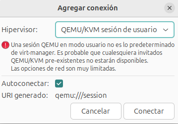
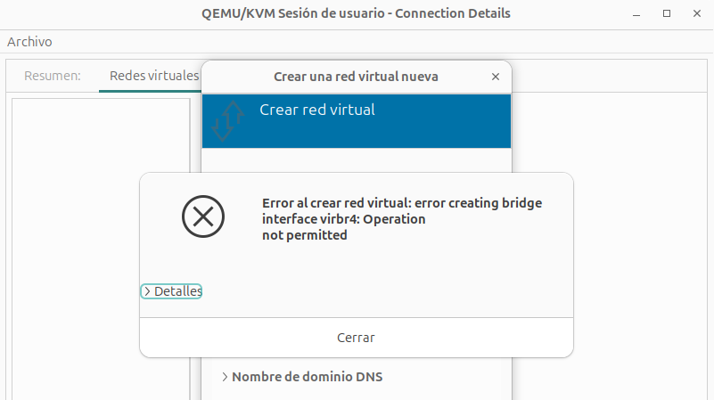
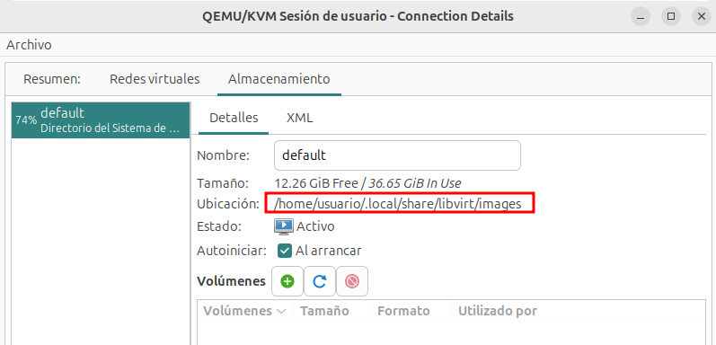
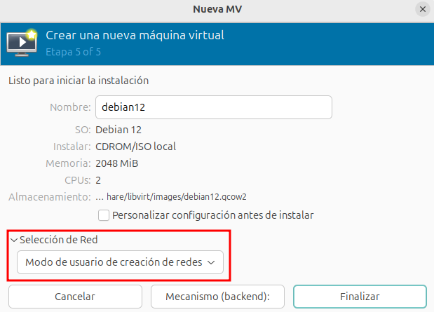
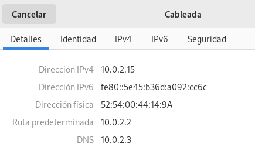
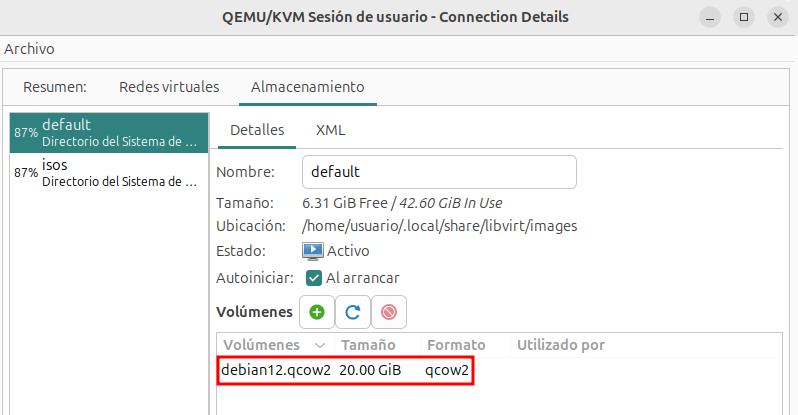

Durante todo el curso hemos hecho uso de la conexión privilegiada a libvirt y, por tanto, es el superusuario el que ha gestionado los recursos virtualizados.

En este apartado vamos a comprobar que un usuario sin privilegio puede crear sus máquinas virtuales. Para ello realizará una conexión local a libvirt usando la URI `qemu:///session`. En este modo de conexión, el usuario no tiene permisos para crear conexiones de red, por lo que se limita su uso de la red no privilegiada de QEMU ([SLIRP](https://wiki.qemu.org/Documentation/Networking#User_Networking_.28SLIRP.29)) que es útil para casos simples, pero que tiene bajo rendimiento y es poco configurable. 

## Configuración de virt-manager para una conexión no privilegiada

Desde **virt-manager** podemos crear una nueva conexión no privilegiada, eligiendo la opción **Archivo - Añadir conexión...** y eligiendo como **Hipervisor** la opción **QEMU/KMV sesión de usuario**.

Si seleccionamos la conexión que acabamos de añadir y escogemos la opción **Detalles** podemos fijarnos en los siguientes aspectos:

* No tenemos configurada ninguna red virtual y si intentamos crear una nueva nos va a dar un error, ya que el usuario sin privilegio no puede crear nuevas redes.

    

* Tenemos un grupo de almacenamiento llamado `default` de tipo directorio, donde observamos que los ficheros de imágenes de discos de las máquinas virtuales se guardarán en un directorio del usuario. En mi caso que uso el usuario llamado `usuario` este directorio sería: `/home/usuario/.local/share/libvirt/images`.

    

## Creación de una máquina virtual

El procedimiento para crear una nueva máquina virtual es similar al descrito en apartados anteriores a este apartado, teniendo en cuenta los siguientes aspectos:

* Aunque nos da la opción de conectar la máquina virtual a un puente externo a conectarla al exterior compartiendo una interfaz física (macvtap), solo  podemos conectarla a la red de usuario, opción **Modo usuario de creación de redes**.

    

* Una vez instalada la máquina virtual, esta se conecta a la red de usuario de QEMU ([SLIRP](https://wiki.qemu.org/Documentation/Networking#User_Networking_.28SLIRP.29)) que configura la máquina con la dirección IP `10.0.2.15`, su puerta de enlace, que es el anfitrión (la máquina física) es la dirección IP `10.0.2.2` y configura un servidor DNS en la dirección IP `10.0.2.3`. Esta red permite que la máquina tenga acceso a internet, pero no tendrá conectividad con el anfitrión u otras máquinas que creemos.

    

* Podemos observar como se ha creado un nuevo volumen que corresponde al disco de la máquina en el grupo de almacenamiento `default` de la conexión no privilegiada.

    

