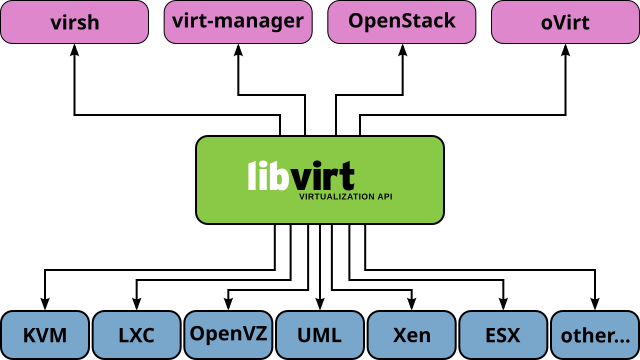

## QEMU/KVM

QEMU (**Quick Emulator**) es un emulador y virtualizador de código abierto que proporciona una solución flexible para ejecutar máquinas virtuales y emular diferentes arquitecturas de hardware. Cuando se utiliza junto con **KVM** (Kernel-based Virtual Machine), QEMU permite obtener un rendimiento cercano al de la ejecución directa en hardware, aprovechando las extensiones de virtualización del procesador.

### Arquitectura de QEMU/KVM

**KVM** es un hipervisor de tipo 1 integrado directamente en el kernel de Linux. Proporciona la infraestructura necesaria para crear y gestionar máquinas virtuales, utilizando las extensiones de virtualización del procesador, como **Intel VT-x** o **AMD-V**, lo que permite virtualizar de manera eficiente sin la necesidad de emulación completa. KVM se compone de los siguientes módulos:

* **kvm.ko**: El módulo principal de KVM, que interactúa con el hardware y proporciona las capacidades básicas de virtualización.
* **kvm-intel.ko / kvm-amd.ko**: Módulos específicos de procesador que habilitan las características de virtualización en CPUs Intel o AMD.

Cuando se usa **QEMU** en combinación con **KVM**, el hipervisor se ejecuta en modo kernel, y QEMU actúa como el componente de emulación y virtualización. QEMU se encarga de manejar dispositivos, I/O y otros aspectos necesarios para virtualizar máquinas completas, mientras que KVM permite la ejecución eficiente de las instrucciones del procesador.

### Virtualización completa y paravirtualización

El uso de QEMU/KVM permite un modelo de **virtualización completa** donde el sistema operativo invitado interactúa con dispositivos virtualizados, como tarjetas de red, discos y tarjetas gráficas. Sin embargo, esta virtualización puede implicar un costo en términos de rendimiento, especialmente en lo que respecta a la emulación de dispositivos.

Para superar las limitaciones de la virtualización completa, **KVM** admite el uso de dispositivos **paravirtualizados** mediante el estándar **virtIO**, que proporciona interfaces de I/O optimizadas específicamente para entornos virtualizados, como dispositivos de red y almacenamiento. Los beneficios de los dispositivos paravirtualizados incluyen:

* **Rendimiento cercano al hardware real**, con una latencia de E/S reducida y un menor uso de la CPU.
* **Compatibilidad con diversas plataformas**, siempre que los sistemas operativos invitados incluyan soporte para los controladores virtIO.

#### Ejemplos de dispositivos virtIO

* **virtio-net**: Interfaz de red paravirtualizada que mejora la velocidad de la red entre el host y la máquina virtual.
* **virtio-scsi**: Adaptador SCSI paravirtualizado para la gestión de dispositivos de almacenamiento.
* **virtio-blk**: Controlador paravirtualizado para discos duros virtuales.
* **virtio-balloon**: Controlador utilizado en la virtualización para gestionar dinámicamente la memoria asignada a una máquina virtual sin la necesidad de reiniciar o interrumpir su funcionamiento.

Aunque el soporte de virtIO está incluido de forma nativa en Linux, otros sistemas operativos, como Windows, requieren la instalación manual de los controladores adecuados.

## libvirt

**libvirt** es una plataforma de gestión de virtualización de código abierto que proporciona una capa de abstracción para interactuar con diferentes hipervisores, incluidas plataformas como **KVM**, **Xen**, **LXC**, **VMware**, y **Hyper-V**. La principal ventaja de libvirt es su capacidad para proporcionar una API unificada que simplifica la gestión y automatización de la infraestructura de virtualización, independientemente del hipervisor subyacente.

### Componentes clave de libvirt

* **`libvirtd`**: Es el demonio principal de libvirt, que ejecuta las operaciones de gestión de máquinas virtuales, redes y almacenamiento.
* **API libvirt**: Proporciona interfaces programáticas para interactuar con los recursos de virtualización. Está disponible en varios lenguajes de programación como Python, C, y Perl, lo que facilita la automatización y la integración con otras herramientas y sistemas.
* **Formato XML**: Libvirt utiliza un formato XML para describir la configuración de máquinas virtuales, redes, almacenamiento, y otros recursos virtualizados. Esto permite definir máquinas virtuales de manera estructurada y estandarizada, facilitando la interoperabilidad entre diferentes herramientas y plataformas.

### Herramientas y aplicaciones de libvirt

Existen varias herramientas que permiten gestionar y automatizar entornos virtualizados utilizando libvirt:

* **`virsh`**: Es una herramienta de línea de comandos que ofrece una interfaz interactiva para gestionar máquinas virtuales y recursos asociados. Permite iniciar, detener, pausar y gestionar las máquinas virtuales, así como configurar redes y almacenamiento.
  
* **virt-manager**: Es una aplicación gráfica basada en GTK+ que proporciona una interfaz visual para crear, administrar y monitorear máquinas virtuales. Facilita la creación y configuración de máquinas virtuales mediante un asistente, y permite interactuar con ellas a través de una consola gráfica.

* **virtinst**: Un conjunto de herramientas que incluye comandos como `virt-install`, `virt-clone`, y `virt-xml`. Estas herramientas permiten automatizar la creación y clonación de máquinas virtuales, así como gestionar configuraciones avanzadas a través de XML.

* **virt-viewer**: Es una aplicación que permite conectarse de manera gráfica a la consola de una máquina virtual, usando protocolos como **SPICE** o **VNC**.

### XML en libvirt

Una de las características clave de libvirt es el uso del formato **XML** para la configuración de máquinas virtuales. Este formato estructurado permite describir de manera precisa y detallada todos los recursos y dispositivos de una máquina virtual. A través de las herramientas de libvirt, es posible generar y modificar estos archivos XML, lo que facilita la automatización y la integración con otras plataformas y herramientas de virtualización.

Los archivos XML contienen información sobre:

* **Máquinas virtuales**: Incluyendo la configuración del hardware virtual, como CPU, memoria, almacenamiento, dispositivos de red y gráficos.
* **Redes virtuales**: Definición de redes virtuales que pueden ser conectadas a las máquinas virtuales.
* **Dispositivos de almacenamiento**: Definición de discos virtuales y su mapeo en el sistema de almacenamiento subyacente.

Libvirt también proporciona herramientas como `virt-xml` y `virsh` para editar y manipular estos archivos XML de manera directa, lo que permite una gran flexibilidad en la configuración de los entornos virtualizados.

### Integración y soporte para hipervisores

Aunque KVM es el hipervisor más comúnmente utilizado con libvirt, también se ofrece soporte para otros hipervisores como **Xen**, **LXC**, **VMware ESXi** y **Microsoft Hyper-V**, lo que convierte a libvirt en una plataforma de gestión de virtualización independiente del hipervisor. Esto es particularmente útil en entornos heterogéneos donde se utilizan múltiples tecnologías de virtualización.

La capacidad de libvirt para abstraer las diferencias entre estos hipervisores permite a los administradores gestionar de manera uniforme y centralizada una infraestructura de virtualización diversa y distribuida.

### Tipos de conexiones a libvirt

libvirt proporciona varios mecanismos para conectarse a un hipervisor QEMU/KVM:

* **Conexión local no privilegiada a libvirt**: Esta conexión permite a un usuario sin privilegios gestionar máquinas virtuales en su propio entorno sin necesidad de permisos de root. En este modo los usuarios sin privilegios pueden gestionar máquinas virtuales, pero no tienen acceso a características avanzadas, por ejemplo la gestión de redes virtuales.

    * URL de conexión: `qemu:///session`.

* **Conexión local privilegiada a libvirt**: Este método permite a un usuario con permisos de superusuario administrar todas las máquinas virtuales del sistema. Es el modo más común en servidores o entornos de producción.

    * URL de conexión: `qemu:///system`.

* **Conexión remota a libvirt**: Este método permite administrar un hipervisor QEMU/KVM en otro equipo a través de la red. Se usa en entornos de gestión centralizada o administración remota. Se pueden usar varios protocolos para el acceso, pero el más común es SSH.

    * URL de conexión: `qemu+ssh://<usuario>@<dirección  máquina remota>/system`.
