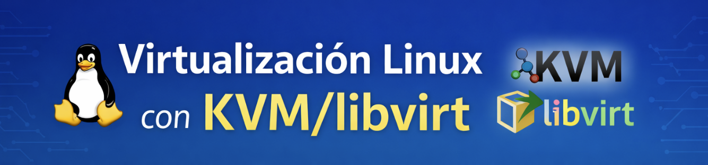

* Repositorio del curso: [https://github.com/josedom24/curso_kvm_ow/blob/main/curso2](https://github.com/josedom24/curso_kvm_ow/blob/main/curso2)

El segundo curso está pensado para quienes ya conocen los fundamentos y desean **profundizar en la virtualización usando herramientas de línea de comandos**.

En este curso se trabaja, entre otros aspectos:

* Gestión avanzada de máquinas virtuales con `virsh`
* Definición y modificación de dominios mediante XML
* Redes virtuales avanzadas
* Gestión de almacenamiento con libvirt
* Automatización y administración más cercana a entornos de servidor

Este enfoque resulta especialmente útil para **administradores de sistemas**, laboratorios avanzados o escenarios donde no se dispone de entorno gráfico.

## Contenidos

1. Introducción a la virtualización
	* [¿Qué es la virtualización?](/pledin/cursos/kvm2/contenido/pledin/cursos/kvm2/contenido/modulo1/virtualizacion/)
	* [Tipos de virtualización](/pledin/cursos/kvm2/contenido/modulo1/tipos/)
	* [Introducción a QEMU/KVM](/pledin/cursos/kvm2/contenido/modulo1/qemu-kvm/)
	* [Introducción a libvirt](/pledin/cursos/kvm2/contenido/modulo1/libvirt/)
	* [Introducción a LXC](/pledin/cursos/kvm2/contenido/modulo1/lxc/)

2. Instalación de QEMU/KVM + libvirt
	* [Preparación del escenario de instalación](/pledin/cursos/kvm2/contenido/modulo2/escenario/)
	* [Instalación de QEMU/KVM + libvirt](/pledin/cursos/kvm2/contenido/modulo2/instalacion/)
	* [Conexión local no privilegiada a libvirt](/pledin/cursos/kvm2/contenido/modulo2/session/)
	* [Conexión local privilegiada a libvirt](/pledin/cursos/kvm2/contenido/modulo2/system/)
	* [Conexión remota a libvirt](/pledin/cursos/kvm2/contenido/modulo2/remoto/)

3. Creación de máquinas virtuales desde la línea de comandos
	* [Creación de máquinas virtuales con virt-install](/pledin/cursos/kvm2/contenido/modulo3/virt-install/)
	* [Características de las máquinas virtuales](/pledin/cursos/kvm2/contenido/modulo3/caracteristicas/)
	* [Gestión de máquinas virtuales con virsh](/pledin/cursos/kvm2/contenido/modulo3/gestion/)
	* [Definición XML de una máquina virtual](/pledin/cursos/kvm2/contenido/modulo3/xml/)
	* [Modificación de la definición de una máquina virtual](/pledin/cursos/kvm2/contenido/modulo3/modificacion/)

4. Creación de máquinas virtuales con virt-manager
	* [Primeros pasos con virt-manager](/pledin/cursos/kvm2/contenido/modulo4/instalacion/)
	* [Creación de máquinas virtuales Linux](/pledin/cursos/kvm2/contenido/modulo4/linux/)
	* [Gestión de máquinas virtuales](/pledin/cursos/kvm2/contenido/modulo4/gestion/)
	* [Detalles de las máquinas virtuales](/pledin/cursos/kvm2/contenido/modulo4/detalles/)
	* [Creación de máquinas virtuales Windows](/pledin/cursos/kvm2/contenido/modulo4/windows/)
	* Acceso a las máquinas virtuales desde el exterior

5. Gestión del  almacenamiento en QEMU/KVM + libvirt
	* [Introducción al almacenamiento](/pledin/cursos/kvm2/contenido/modulo5/almacenamiento/)
	* [Introducción al almacenamiento en QEMU/KVM + libvirt](/pledin/cursos/kvm2/contenido/modulo5/introduccion/)
	* [Gestión de Pools de Almacenamiento](/pledin/cursos/kvm2/contenido/modulo5/pool/)
	* [Gestión de volúmenes de almacenamiento con libvirt](/pledin/cursos/kvm2/contenido/modulo5/volumen1/)
	* [Gestión de volúmenes de almacenamiento con herramientas específicas](/pledin/cursos/kvm2/contenido/modulo5/volumen2/)
	* [Trabajar con volúmenes en las máquinas virtuales](/pledin/cursos/kvm2/contenido/modulo5/volumen-vm/)

6. Clonación e instantáneas de maquinas virtuales
	* [Clonación de máquinas virtuales](/pledin/cursos/kvm2/contenido/modulo6/clonacion/)
	* [Plantillas de máquinas virtuales](/pledin/cursos/kvm2/contenido/modulo6/template/)	
	* [Clonación completa a partir de plantillas](/pledin/cursos/kvm2/contenido/modulo6/completa/)
	* [Clonación enlazada a partir de plantillas](/pledin/cursos/kvm2/contenido/modulo6/ligera/)
	* [Instantáneas de máquinas virtuales](/pledin/cursos/kvm2/contenido/modulo6/snapshot/)
	
7. Gestión de redes en QEMU/KVM + libvirt
	* [Introducción a la gestión de redes en QEMU/KVM + libvirt](/pledin/cursos/kvm2/contenido/modulo7/introduccion/)
	* [Definición de Redes Virtuales (Privadas) en libvirt](/pledin/cursos/kvm2/contenido/modulo7/definicion/) 
	* [Gestión de Redes Virtuales](/pledin/cursos/kvm2/contenido/modulo7/virtuales/)
	* [Creación de un Puente Externo con Linux Bridge](/pledin/cursos/kvm2/contenido/modulo7/bridge/)
	* [Gestión de Redes Puentes (Públicas)](/pledin/cursos/kvm2/contenido/modulo7/puentes/)
	* [Configuración de red en las máquinas virtuales](/pledin/cursos/kvm2/contenido/modulo7/configuracion/)
	
8. Trabajando con contenedores LXC
	* [Introducción a Linux Containers (LXC)](/pledin/cursos/kvm2/contenido/modulo8/introduccion/)
	* [Creación y gestión de contenedores LXC](/pledin/cursos/kvm2/contenido/modulo8/creacion/)
	* [Configuración de contenedores LXC](/pledin/cursos/kvm2/contenido/modulo8/configuracion/)
	* [Redes en LXC](/pledin/cursos/kvm2/contenido/modulo8/redes/)
	* [Almacenamiento en LXC](/pledin/cursos/kvm2/contenido/modulo8/almacenamiento/)
	* [Introducción a LXD](/pledin/cursos/kvm2/contenido/modulo8/lxd/)
