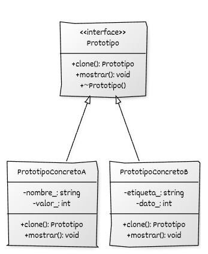

## Estructura general

La implementación del **Prototype** se basa en:

* Una **jerarquía de Prototipos** que declara  e implementa la operación de clonación (por ejemplo, `clone()`).
* Uso de **polimorfismo dinámico** para clonar objetos a través del tipo base, sin referirse a las clases concretas.

## Componentes del patrón y responsabilidades

* **Prototipo (interfaz o clase base):** declara la operación `clone()` y actúa como tipo base a través del cual se solicita la clonación.
* **Prototipos concretos:** implementan `clone()` y crean una nueva instancia del mismo tipo concreto, incluyendo la duplicación del estado que consideren necesaria.
* **Código cliente:** mantiene una referencia al prototipo a través de su tipo base e invoca `clone()` para obtener nuevas instancias.


## Diagrama UML



## Ejemplo genérico

```cpp
#include <iostream>
#include <memory>
#include <string>

// ----------------------------------------
// Interfaz base del prototipo
// ----------------------------------------
class Prototipo {
public:
    virtual ~Prototipo() = default;

    // Método de clonación
    virtual std::unique_ptr<Prototipo> clone() const = 0;

    virtual void mostrar() const = 0;
};

// ----------------------------------------
// Prototipo concreto A (copia superficial)
// ----------------------------------------
class PrototipoConcretoA : public Prototipo {
public:
    PrototipoConcretoA(std::string nombre, int valor)
        : nombre_(std::move(nombre)), valor_(valor) {}

    std::unique_ptr<Prototipo> clone() const override {
        return std::make_unique<PrototipoConcretoA>(*this); //Copia superficial, sin recursos compartidos
    }

    void mostrar() const override {
        std::cout << "PrototipoConcretoA { nombre = " << nombre_
                  << ", valor = " << valor_ << " }\n";
    }

private:
    std::string nombre_;
    int valor_;
};

// ----------------------------------------
// Prototipo concreto B (copia profunda)
// ----------------------------------------
class PrototipoConcretoB : public Prototipo {
public:
    PrototipoConcretoB(std::string etiqueta, std::unique_ptr<int> dato)
        : etiqueta_(std::move(etiqueta)), dato_(std::move(dato)) {}

    // Clonación profunda: duplicamos el recurso dinámico
    std::unique_ptr<Prototipo> clone() const override {
        return std::make_unique<PrototipoConcretoB>(
            etiqueta_, std::make_unique<int>(*dato_));
    }

    void mostrar() const override {
        std::cout << "PrototipoConcretoB { etiqueta = " << etiqueta_
                  << ", dato = " << *dato_ << " }\n";
    }

private:
    std::string etiqueta_;
    std::unique_ptr<int> dato_; // requiere copia profunda
};

// ----------------------------------------
// Función cliente
// ----------------------------------------
void cliente(const Prototipo& prototipo) {
    auto copia = prototipo.clone();
    copia->mostrar();
}

int main() {
    PrototipoConcretoA protA("Ejemplo A", 42);
    PrototipoConcretoB protB("Ejemplo B", std::make_unique<int>(100));

    cliente(protA);
    cliente(protB);

    return 0;
}
```

## Puntos clave del ejemplo

* El método `clone()` encapsula completamente el proceso de copia, permitiendo que cada clase concrete copia superficial o profunda según sus necesidades.
* El uso de **`std::unique_ptr`** garantiza la gestión automática de los objetos clonados.
* El cliente trabaja exclusivamente con la **interfaz del prototipo**, sin conocer cómo se implementa la clonación.
* La separación entre **instancia original** y **clon creado** permite configurar prototipos previamente y generar copias rápidas y seguras desde ellos.
* El patrón evita duplicar lógica compleja de inicialización y permite extender el sistema añadiendo nuevos prototipos sin modificar el código existente.

