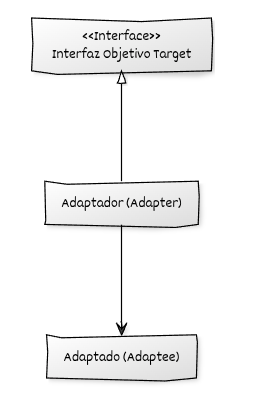

## Estructura general

La implementación del **Adapter** se basa en:

* Una clase existente **Adaptee** con una interfaz distinta a la esperada por el cliente.
* Una **jerarquía de Target**, definida a partir de una interfaz que declara las operaciones utilizadas por el código cliente. Las clase **Adapter** implementa la interfaz **Target**.
* Uso de **polimorfismo dinámico** para utilizar el **Adapter** a través de **Target**.

## Componentes del patrón y responsabilidades

* **Target (interfaz objetivo):** declara la interfaz con la que opera el código cliente.
* **Adaptee (clase adaptada):** proporciona la funcionalidad existente con una interfaz no compatible con Target.
* **Adapter (adaptador):** implementa Target, mantiene un Adaptee por composición y traduce las operaciones de Target a llamadas sobre Adaptee.
* **Código cliente:** utiliza objetos a través de la interfaz Target.


## Diagrama UML



## Ejemplo genérico

```cpp
#include <iostream>
#include <memory>

// ----------------------------------------
// Interfaz objetivo (Target)
// ----------------------------------------
class InterfazObjetivo {
public:
    virtual ~InterfazObjetivo() = default;
    virtual void operacion() const = 0;
};

// ----------------------------------------
// Clase adaptada (Adaptee) con una interfaz incompatible
// ----------------------------------------
class Adaptado {
public:
    void operacion_especifica() const {
        std::cout << "Ejecutando operacion_especifica del Adaptado.\n";
    }
};

// ----------------------------------------
// Adaptador (Adapter)
// ----------------------------------------
class Adaptador : public InterfazObjetivo {
public:
    explicit Adaptador(std::unique_ptr<Adaptado> adaptado)
        : adaptado_(std::move(adaptado)) {}

    void operacion() const override {
        // Traducción de la llamada
        adaptado_->operacion_especifica();
    }

private:
    // El adaptador posee al objeto adaptado en este ejemplo
    std::unique_ptr<Adaptado> adaptado_;
};

// ----------------------------------------
// Código cliente
// ----------------------------------------
void cliente(const InterfazObjetivo& objetivo) {
    objetivo.operacion();
}

int main() {
    auto adaptado = std::make_unique<Adaptado>();
    auto adaptador = std::make_unique<Adaptador>(std::move(adaptado));

    cliente(*adaptador);

    return 0;
}
```

## Puntos clave del ejemplo

* La interfaz objetivo define lo que el cliente espera sin conocer detalles del adaptado.
* El adaptador implementa la interfaz objetivo y encapsula un objeto adaptado mediante composición.
* La llamada del cliente se traduce directamente en una llamada compatible con el adaptado.
* El cliente permanece completamente desacoplado de la implementación real, reforzando la extensibilidad y el principio *Open/Closed*.
* El uso de `std::unique_ptr` garantiza que la propiedad del objeto adaptado quede claramente definida y se gestione de forma automática mediante RAII.
