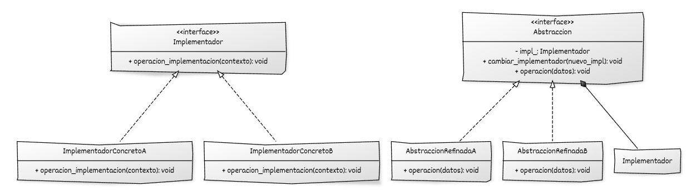

## Estructura general

La implementación del **Bridge** se basa en:

* Una **jerarquía de Abstracciones** que define la interfaz utilizada por el código cliente.
* Una **jerarquía de Implementadores** que define las operaciones de bajo nivel.
* Uso de **polimorfismo dinámico** para sustituir implementadores sin modificar la abstracción.


## Componentes del patrón y responsabilidades

* **Implementador (interfaz base):** declara las operaciones de bajo nivel que serán utilizadas por la abstracción.
* **Implementadores concretos:** implementan las operaciones definidas por el implementador base y proporcionan distintas variantes de implementación.
* **Abstracción (interfaz o clase base):** define la interfaz de alto nivel utilizada por el cliente y mantiene un implementador por composición.
* **Abstracciones refinadas:** extienden la abstracción base y reutilizan el implementador para delegar las operaciones de bajo nivel.
* **Código cliente:** utiliza objetos a través de la interfaz de la abstracción.


## Diagrama UML



## Ejemplo genérico

```cpp
#include <iostream>
#include <memory>
#include <string>

// ----------------------------------------
// Interfaz del Implementador
// ----------------------------------------
class Implementador {
public:
    virtual ~Implementador() = default;

    // Operación de bajo nivel que la abstracción utilizará
    virtual void operacion_implementacion(const std::string& contexto) const = 0;
};

// Implementador concreto A
class ImplementadorConcretoA : public Implementador {
public:
    void operacion_implementacion(const std::string& contexto) const override {
        std::cout << "[Implementador A] Procesando contexto: " << contexto << "\n";
    }
};

// Implementador concreto B
class ImplementadorConcretoB : public Implementador {
public:
    void operacion_implementacion(const std::string& contexto) const override {
        std::cout << "[Implementador B] Manejo alternativo de: " << contexto << "\n";
    }
};

// ----------------------------------------
// Abstracción
// ----------------------------------------
class Abstraccion {
protected:
    std::unique_ptr<Implementador> impl_;  // Bridge

public:
    explicit Abstraccion(std::unique_ptr<Implementador> impl)
        : impl_(std::move(impl)) {}

    virtual ~Abstraccion() = default;

    // Permite cambiar la implementación en tiempo de ejecución, si se desea
    void cambiar_implementador(std::unique_ptr<Implementador> nuevo_impl) {
        impl_ = std::move(nuevo_impl);
    }

    // Operación de alto nivel
    virtual void operacion(const std::string& datos) const = 0;
};

// Abstracción refinada A
class AbstraccionRefinadaA : public Abstraccion {
public:
    using Abstraccion::Abstraccion; // hereda el constructor

    void operacion(const std::string& datos) const override {
        std::cout << "[Abstracción A] Preparando datos...\n";
        std::string contexto = "A:" + datos;
        impl_->operacion_implementacion(contexto);
    }
};

// Abstracción refinada B
class AbstraccionRefinadaB : public Abstraccion {
public:
    using Abstraccion::Abstraccion; // hereda el constructor

    void operacion(const std::string& datos) const override {
        std::cout << "[Abstracción B] Validando y transformando datos...\n";
        std::string contexto = "B<" + datos + ">";
        impl_->operacion_implementacion(contexto);
    }
};

// ----------------------------------------
// Código cliente
// ----------------------------------------
int main() {
    // Abstracción A con Implementador A
    AbstraccionRefinadaA objetoA{
        std::make_unique<ImplementadorConcretoA>()
    };
    objetoA.operacion("petición 1");

    // Abstracción B con Implementador B
    AbstraccionRefinadaB objetoB{
        std::make_unique<ImplementadorConcretoB>()
    };
    objetoB.operacion("petición 2");

    // Cambiar implementación en tiempo de ejecución
    objetoB.cambiar_implementador(std::make_unique<ImplementadorConcretoA>());
    objetoB.operacion("petición 3 (reconfigurada)");

    return 0;
}
```

## Puntos claves del ejemplo

* `Implementador` y `Abstraccion` son **jerarquías independientes**.
* Las abstracciones refinadas (`AbstraccionRefinadaA/B`) no necesitan saber qué implementación concreta se usa.
* Los implementadores concretos (`ImplementadorConcretoA/B`) no saben qué tipo de abstracción los utiliza.
* El cliente puede **combinar libremente** cualquier abstracción refinada con cualquier implementador concreto.
* El método `cambiar_implementador` muestra cómo se puede **reconfigurar el puente en tiempo de ejecución**.


