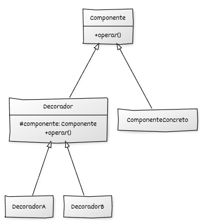

## Estructura general

La implementación del **Decorator** se basa en:

* Una **jerarquía de Componentes** que define las operaciones comunes de los componentes.
* Una **jerarquía de Decoradores** que definen nuevas operaciones.
* Uso de **polimorfismo dinámico** para tratar componentes y decoradores a través de la interfaz Componente.

## Componentes del patrón y responsabilidades

* **Componente (interfaz o clase base):** declara las operaciones comunes que pueden ejecutar tanto los componentes base como los decoradores.
* **Componente concreto:** implementa las operaciones definidas por el componente base y representa el objeto que puede ser decorado.
* **Decorador (clase base):** implementa la interfaz del componente y mantiene un componente por composición al que delega las operaciones.
* **Decoradores concretos:** heredan del decorador base y añaden comportamiento alrededor de la delegación al componente envuelto.
* **Código cliente:** utiliza objetos a través de la interfaz del componente y construye dinámicamente la cadena de decoradores.

## Diagrama UML



## Ejemplo genérico

```cpp
#include <iostream>
#include <memory>

// ----------------------------------------
// Interfaz base del componente
// ----------------------------------------
class Componente {
public:
    virtual ~Componente() = default;
    virtual void operar() const = 0;
};

// ----------------------------------------
// Componente concreto
// ----------------------------------------
class ComponenteConcreto : public Componente {
public:
    void operar() const override {
        std::cout << "Operación del componente base.\n";
    }
};

// ----------------------------------------
// Clase base del decorador
// ----------------------------------------
class Decorador : public Componente {
protected:
    std::unique_ptr<Componente> componente_;

public:
    explicit Decorador(std::unique_ptr<Componente> componente)
        : componente_(std::move(componente)) {}

    void operar() const override {
        // Delegación al componente envuelto
        componente_->operar();
    }
};

// ----------------------------------------
// Decorador concreto A
// ----------------------------------------
class DecoradorA : public Decorador {
public:
    explicit DecoradorA(std::unique_ptr<Componente> componente)
        : Decorador(std::move(componente)) {}

    void operar() const override {
        std::cout << "[DecoradorA] Antes de operar.\n";
        Decorador::operar();
        std::cout << "[DecoradorA] Después de operar.\n";
    }
};

// ----------------------------------------
// Decorador concreto B
// ----------------------------------------
class DecoradorB : public Decorador {
public:
    explicit DecoradorB(std::unique_ptr<Componente> componente)
        : Decorador(std::move(componente)) {}

    void operar() const override {
        std::cout << "[DecoradorB] <<Extendiendo comportamiento>>\n";
        Decorador::operar();
    }
};

// ----------------------------------------
// Código cliente
// ----------------------------------------
int main() {
    // Componente base
    std::unique_ptr<Componente> componente =
        std::make_unique<ComponenteConcreto>();

    // Decoramos progresivamente
    componente = std::make_unique<DecoradorA>(std::move(componente));
    componente = std::make_unique<DecoradorB>(std::move(componente));

    // Uso final: el cliente no sabe que hay decoradores
    componente->operar();

    return 0;
}
```

## Puntos clave del ejemplo

* El decorador **no altera** el comportamiento del componente base: solo lo **extiende**.
* Las responsabilidades adicionales pueden **encadenarse** dinámicamente.
* `std::unique_ptr` garantiza una **gestión segura y automática del ciclo de vida** de toda la cadena.
* No se requiere modificar ninguna clase existente para añadir un nuevo comportamiento: basta con crear un nuevo decorador.
* El cliente siempre trabaja con la **interfaz común**, cumpliendo el principio *Programar a una interfaz, no a una implementación*.
* La llamada a `Decorador::operar()` invoca explícitamente la **implementación de la clase base del decorador**, permitiendo delegar la operación al componente envuelto y extender su comportamiento sin recursión ni duplicación de código.
