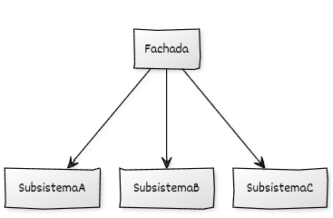

## Estructura general

La implementación del **Facade** se basa en:

* Uno o varios **Subsistemas** que exponen operaciones de bajo nivel.
* Una **clase Fachada** que define las operaciones de uso para el cliente.
* La **Fachada mantiene los subsistemas por composición** (como miembros, referencias o punteros) y realiza llamadas coordinadas a sus operaciones.

## Componentes del patrón y responsabilidades

* **Subsistemas:** proporcionan las operaciones internas que utiliza la fachada para realizar el trabajo.
* **Fachada:** expone operaciones de alto nivel y coordina llamadas a los subsistemas.
* **Código cliente:** utiliza la fachada para invocar las operaciones del sistema.

## Diagrama UML



## Ejemplo genérico

```cpp
#include <iostream>
#include <string>

// ----------------------------------------
// Subsistemas internos
// ----------------------------------------

class SubsistemaA {
public:
    void inicializar() const {
        std::cout << "[A] Inicializando recursos...\n";
    }
    void procesar() const {
        std::cout << "[A] Procesando datos.\n";
    }
};

class SubsistemaB {
public:
    void cargar_configuracion() const {
        std::cout << "[B] Cargando configuración.\n";
    }
    void validar() const {
        std::cout << "[B] Validando parámetros.\n";
    }
};

class SubsistemaC {
public:
    void ejecutar_tarea() const {
        std::cout << "[C] Ejecutando tarea principal.\n";
    }
    void limpiar() const {
        std::cout << "[C] Limpiando recursos.\n";
    }
};

// ----------------------------------------
// Clase Fachada
// ----------------------------------------

class FachadaSistema {
private:
    SubsistemaA a_;
    SubsistemaB b_;
    SubsistemaC c_;

public:
    FachadaSistema() = default;

    // Operación de alto nivel
    void operacion_principal() const {
        std::cout << "=== Iniciando operación principal ===\n";
        a_.inicializar();
        b_.cargar_configuracion();
        b_.validar();
        a_.procesar();
        c_.ejecutar_tarea();
        c_.limpiar();
        std::cout << "=== Operación completada ===\n";
    }

    // Otra operación simplificada
    void operacion_rapida() const {
        std::cout << "=== Operación rápida ===\n";
        a_.procesar();
        c_.ejecutar_tarea();
    }
};

// ----------------------------------------
// Código cliente
// ----------------------------------------

int main() {
    FachadaSistema sistema;

    sistema.operacion_principal();
    std::cout << "\n";
    sistema.operacion_rapida();

    return 0;
}
```

## Puntos clave del ejemplo

* La clase `FachadaSistema` encapsula completamente la interacción entre múltiples subsistemas (`SubsistemaA`, `SubsistemaB`, `SubsistemaC`).
* Los subsistemas **no exponen detalles innecesarios** al cliente: solo la fachada coordina su uso.
* La interfaz de la fachada ofrece métodos de **alto nivel**, fáciles de entender y usar.
* Si los subsistemas cambian internamente, el cliente no necesita ser modificado mientras la fachada mantenga su API.
* El patrón mejora la **modularidad**, disminuye el acoplamiento y aumenta la legibilidad de las operaciones complejas.
