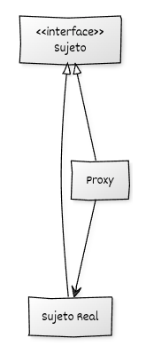

## Estructura general

La implementación del **Proxy** se basa en:

* Una **jerarquía de Sujetos**, definida a partir de una interfaz o clase base, con dos implementaciones concretas: el **Sujeto real** y el **Proxy**.
* Uso de **polimorfismo dinámico** para utilizar indistintamente el proxy o el sujeto real a través de Sujeto.

## Componentes del patrón y responsabilidades

* **Sujeto (interfaz común):** declara las operaciones que comparten el proxy y el objeto real.
* **Sujeto real (objeto real):** implementa las operaciones definidas por Sujeto.
* **Proxy:** implementa Sujeto, mantiene un objeto real por composición y decide la delegación de las operaciones hacia el sujeto real.
* **Código cliente:** utiliza objetos a través de la interfaz Sujeto.

## Diagrama UML



## Ejemplo genérico

```cpp
#include <iostream>
#include <memory>
#include <string>

// ----------------------------------------
// Interfaz común (Sujeto)
// ----------------------------------------
class ISujeto {
public:
    virtual ~ISujeto() = default;
    virtual void realizar_operacion(const std::string& usuario) = 0;
};

// ----------------------------------------
// Objeto Real
// ----------------------------------------
class ObjetoReal : public ISujeto {
public:
    void realizar_operacion(const std::string& usuario) override {
        std::cout << "ObjetoReal: ejecutando operación para '"
                  << usuario << "'.\n";
    }
};

// ----------------------------------------
// Proxy
// ----------------------------------------
class Proxy : public ISujeto {
private:
    // Ahora el proxy depende de la abstracción, no del tipo concreto
    std::unique_ptr<ISujeto> sujeto_real_;

    bool comprobar_acceso(const std::string& usuario) const {
        std::cout << "Proxy: comprobando acceso para '"
                  << usuario << "'...\n";
        return usuario == "admin";
    }

    void registrar_acceso(const std::string& usuario) const {
        std::cout << "Proxy: registrando uso del servicio por '"
                  << usuario << "'.\n";
    }

    // Factoría interna para crear el sujeto real (sigue siendo ObjetoReal aquí,
    // pero el resto del proxy no depende de su tipo)
    static std::unique_ptr<ISujeto> crear_sujeto_real() {
        return std::make_unique<ObjetoReal>();
    }

public:
    void realizar_operacion(const std::string& usuario) override {
        if (!sujeto_real_) {
            std::cout << "Proxy: inicializando ObjetoReal bajo demanda...\n";
            sujeto_real_ = crear_sujeto_real();
        }

        if (comprobar_acceso(usuario)) {
            registrar_acceso(usuario);
            sujeto_real_->realizar_operacion(usuario);
        } else {
            std::cout << "Proxy: acceso denegado a '"
                      << usuario << "'.\n";
        }
    }
};

// ----------------------------------------
// Código cliente
// ----------------------------------------
void cliente(ISujeto& servicio, const std::string& usuario) {
    std::cout << "Cliente: intentando usar el servicio como '"
              << usuario << "'.\n";
    servicio.realizar_operacion(usuario);
    std::cout << "----------------------------------------\n";
}

// ----------------------------------------
// main
// ----------------------------------------
int main() {
    Proxy servicio_proxy;

    cliente(servicio_proxy, "invitado");
    cliente(servicio_proxy, "admin");

    return 0;
}
```

## Puntos clave del ejemplo

* **El cliente nunca conoce el ObjetoReal**: solo usa `ISujeto`.
* El **proxy controla el acceso**, registra las actividades y crea el objeto real solo cuando es necesario.
* El uso de **`std::unique_ptr`** garantiza una gestión de recursos clara y segura.
* El patrón permite añadir capacidades extra (logs, permisos, caché…) sin modificar la clase del objeto real.
* Ejemplo híbrido: Virtual Proxy (lazy), Protection Proxy (acceso) y Logging (registro)

