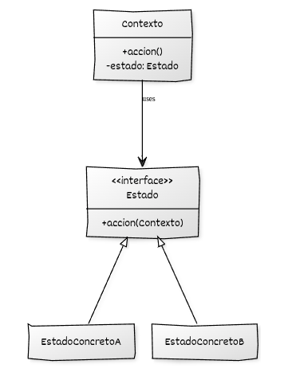

## Estructura general

La implementación del **State** se basa en:

* Una **jerarquía de Estados** que declara e implementa las operaciones dependientes del estado.
* Una clase **Contexto** que expone las operaciones al código cliente y delega su ejecución en el estado activo.
* Uso de **polimorfismo dinámico** para ejecutar el comportamiento a través de la interfaz Estado.

## Componentes del patrón y responsabilidades

* **Estado (interfaz o clase base):** declara las operaciones cuyo comportamiento depende del estado y que serán invocadas por el contexto.
* **Estados concretos:** implementan el comportamiento específico de cada estado y pueden solicitar un cambio de estado al contexto.
* **Contexto:** mantiene el estado activo por composición, delega en él las operaciones expuestas al cliente y realiza la transición sustituyendo el objeto Estado activo por otra instancia de Estado.
* **Código cliente:** utiliza el contexto a través de su interfaz pública.

## Diagrama UML



## Ejemplo genérico

```cpp
#include <iostream>
#include <memory>

// ----------------------------------------
// Declaraciones anticipadas
// ----------------------------------------
class Estado;

// ----------------------------------------
// Contexto (solo declaración de métodos)
// ----------------------------------------
class Contexto {
public:
    explicit Contexto(std::unique_ptr<Estado> estado_inicial);

    void cambiar_estado(std::unique_ptr<Estado> nuevo_estado);
    void accion();

private:
    std::unique_ptr<Estado> estado;
};

// ----------------------------------------
// Interfaz base del estado
// ----------------------------------------
class Estado {
public:
    virtual ~Estado() = default;
    virtual void accion(Contexto& contexto) = 0;
};

// ----------------------------------------
// Estado concreto A
// ----------------------------------------
class EstadoConcretoA : public Estado {
public:
    void accion(Contexto& contexto) override;
};

// ----------------------------------------
// Estado concreto B
// ----------------------------------------
class EstadoConcretoB : public Estado {
public:
    void accion(Contexto& contexto) override;
};

// ----------------------------------------
// Implementación de Contexto
// ----------------------------------------
Contexto::Contexto(std::unique_ptr<Estado> estado_inicial)
    : estado(std::move(estado_inicial)) {}

void Contexto::cambiar_estado(std::unique_ptr<Estado> nuevo_estado) {
    estado = std::move(nuevo_estado);
}

void Contexto::accion() {
    estado->accion(*this);
}

// ----------------------------------------
// Implementaciones de estados
// ----------------------------------------
void EstadoConcretoA::accion(Contexto& contexto) {
    std::cout << "Estado A: ejecutando acción...\n";
    std::cout << "Transición de A → B.\n";
    contexto.cambiar_estado(std::make_unique<EstadoConcretoB>());
}

void EstadoConcretoB::accion(Contexto& contexto) {
    std::cout << "Estado B: ejecutando acción...\n";
    std::cout << "Transición de B → A.\n";
    contexto.cambiar_estado(std::make_unique<EstadoConcretoA>());
}

// ----------------------------------------
// Cliente
// ----------------------------------------
int main() {
    Contexto contexto(std::make_unique<EstadoConcretoA>());

    contexto.accion(); // A → B
    contexto.accion(); // B → A
    contexto.accion(); // A → B
}

```

## Puntos clave del ejemplo

* Se utiliza una declaración anticipada de `Estado` porque `Contexto` necesita almacenar un `std::unique_ptr<Estado>` antes de que la clase `Estado` esté completamente definida, evitando así una dependencia circular entre ambas clases.
* El estado actual se almacena como `std::unique_ptr<Estado>`, lo que encapsula completamente su ciclo de vida.
* Cada estado define su comportamiento particular y las posibles transiciones.
* El contexto desconoce los detalles internos de cada estado y solo delega operaciones.
* Las clases de estado manejan explícitamente las transiciones, eliminando condicionales externos.
* El diseño es totalmente extensible: basta con añadir nuevas clases de estado sin modificar la estructura del contexto.


