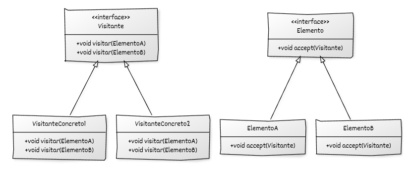

## Estructura general

La implementación del **Visitor** se basa en:

* Una **jerarquía de Elementos** que declara e implementa una operación `accept(Visitante&)`.
* Una **jerarquía de Visitantes** que declara e implementan una operación `visit(...)` por cada tipo concreto de elemento.
* Uso de **polimorfismo dinámico** para tratar elementos y visitantes a través de sus interfaces base.

## Componentes del patrón y responsabilidades

* **Elemento (interfaz o clase base):** declara `accept(Visitante&)` como punto de entrada para aplicar un visitante.
* **Elementos concretos:** implementan `accept` e invocan el método `visit` (**doble despacho**) correspondiente sobre el visitante recibido.
* **Visitante (interfaz o clase base):** declara una operación `visit` por cada tipo concreto de elemento.
* **Visitantes concretos:** implementan las operaciones `visit` definidas por la interfaz de visitante.
* **Código cliente:** construye la estructura de elementos y aplica visitantes invocando `accept` sobre los elementos.

## Diagrama UML



## Ejemplo genérico en C++

```cpp
#include <iostream>
#include <memory>
#include <vector>

// ----------------------------------------
// Interfaz base del Visitante
// ----------------------------------------
class ElementoA;
class ElementoB;

class Visitante {
public:
    virtual ~Visitante() = default;
    virtual void visitar(ElementoA& elem) = 0;
    virtual void visitar(ElementoB& elem) = 0;
};

// ----------------------------------------
// Interfaz base del Elemento
// ----------------------------------------
class Elemento {
public:
    virtual ~Elemento() = default;
    virtual void accept(Visitante& v) = 0;
};

// ----------------------------------------
// Elementos concretos
// ----------------------------------------
class ElementoA : public Elemento {
public:
    void accept(Visitante& v) override {
        v.visitar(*this); // doble despacho
    }

    void accion_especifica_A() const {
        std::cout << "Acción específica de ElementoA.\n";
    }
};

class ElementoB : public Elemento {
public:
    void accept(Visitante& v) override {
        v.visitar(*this); // doble despacho
    }

    void accion_especifica_B() const {
        std::cout << "Acción específica de ElementoB.\n";
    }
};

// ----------------------------------------
// Visitantes concretos
// ----------------------------------------
class VisitanteConcreto1 : public Visitante {
public:
    void visitar(ElementoA& elem) override {
        std::cout << "VisitanteConcreto1 procesa ElementoA → ";
        elem.accion_especifica_A();
    }

    void visitar(ElementoB& elem) override {
        std::cout << "VisitanteConcreto1 procesa ElementoB → ";
        elem.accion_especifica_B();
    }
};

class VisitanteConcreto2 : public Visitante {
public:
    void visitar(ElementoA& elem) override {
        std::cout << "VisitanteConcreto2 analiza ElementoA.\n";
    }

    void visitar(ElementoB& elem) override {
        std::cout << "VisitanteConcreto2 analiza ElementoB.\n";
    }
};

// ----------------------------------------
// Código cliente
// ----------------------------------------
int main() {
    std::vector<std::unique_ptr<Elemento>> elementos;
    elementos.push_back(std::make_unique<ElementoA>());
    elementos.push_back(std::make_unique<ElementoB>());

    VisitanteConcreto1 v1;
    VisitanteConcreto2 v2;

    std::cout << "--- Aplicando VisitanteConcreto1 ---\n";
    for (auto& e : elementos) {
        e->accept(v1);
    }

    std::cout << "\n--- Aplicando VisitanteConcreto2 ---\n";
    for (auto& e : elementos) {
        e->accept(v2);
    }

    return 0;
}
```

## Puntos clave del ejemplo

* El método `accept` implementa la primera parte del doble despacho llamando al método `visitar` correspondiente.
* Cada `visitar(ElementoX&)` constituye la segunda parte del doble despacho.
* Para añadir una nueva operación, basta con crear un nuevo visitante sin modificar las clases `ElementoA` y `ElementoB`.
* Para añadir un nuevo tipo de elemento, se debe modificar la interfaz del visitante (trade-off del patrón).
* El uso de `std::unique_ptr` y contenedores estándar permite almacenar elementos polimórficos de forma segura.
* La lógica de negocio está completamente separada de la estructura de datos.

Si quieres, puedo añadir una sección final con **qué no hemos modificado**, en el estilo que usas para Factory Method.
