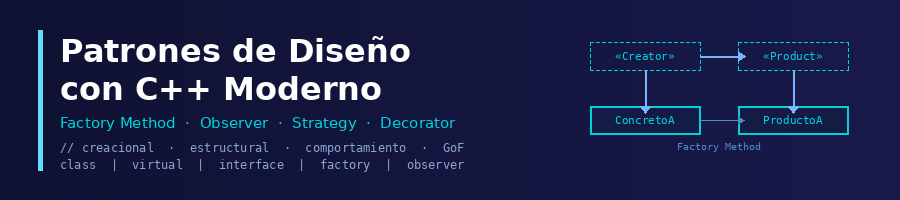

## ¿Qué son los patrones de diseño?

Los **patrones de diseño** son soluciones generales, probadas y reutilizables para problemas recurrentes en el diseño de software orientado a objetos. No son fragmentos de código concretos, sino **estructuras conceptuales** que indican cómo organizar clases, objetos y responsabilidades para resolver eficazmente un determinado tipo de problema.

**C++ moderno** es uno de los mejores lenguajes para aprender e implementar patrones de diseño: ofrece control total sobre la memoria, soporte nativo para el polimorfismo dinámico, punteros inteligentes, lambdas y `std::function`, que permiten aplicar los patrones de forma idiomática y segura.

## ¿Qué aprenderás en este curso?

Este curso aborda los patrones de diseño con C++ desde los fundamentos hasta su implementación práctica:

* Los principios **SOLID** como base del diseño orientado a objetos
* **Patrones creacionales**: Factory Method, Abstract Factory, Builder, Prototype
* **Patrones estructurales**: Adapter, Bridge, Composite, Decorator, Facade, Proxy
* **Patrones de comportamiento**: Chain of Responsibility, Mediator, Memento, Observer, State, Visitor
* Patrones clásicos y sus **alternativas modernas en C++**: Singleton, Strategy, Command, Template Method

## Repositorio

* [Ejercicios y ejemplos](https://github.com/josedom24/ejercicios_curso_patrones_cpp)

## Curso

1. Principios SOLID y patrones de diseño

    * [Principios básicos de diseño](/pledin/cursos/patrones_cpp/contenido/modulo01/basicos/)
    * [SOLID: Principios de diseño orientado a objetos](/pledin/cursos/patrones_cpp/contenido/modulo01/solid/)
    * [Patrones de diseño](/pledin/cursos/patrones_cpp/contenido/modulo01/patrones/)
    * [Conceptos de C++ Moderno para Patrones de Diseño](/pledin/cursos/patrones_cpp/contenido/modulo01/c++/)

2. Patrones Creacionales

    * [Patrón Factory Method](/pledin/cursos/patrones_cpp/contenido/modulo02/factory_method/)
    * [Implementación de Factory Method con C++](/pledin/cursos/patrones_cpp/contenido/modulo02/factory_method2/)
    * [Ejemplo: Sistema de registros](/pledin/cursos/patrones_cpp/contenido/modulo02/factory_method3/)
    * [Abstract Factory](/pledin/cursos/patrones_cpp/contenido/modulo02/abstract_factory/)
    * [Implementación de Abstract Factory con C++](/pledin/cursos/patrones_cpp/contenido/modulo02/abstract_factory2/)
    * [Ejemplo: Interfaz gráfica multiplataforma](/pledin/cursos/patrones_cpp/contenido/modulo02/abstract_factory3/)
    * [Patrón Builder](/pledin/cursos/patrones_cpp/contenido/modulo02/builder/)
    * [Implementación del patrón Builder con C++ moderno](/pledin/cursos/patrones_cpp/contenido/modulo02/builder2/)
    * [Ejemplo: Construcción de solicitudes HTTP](/pledin/cursos/patrones_cpp/contenido/modulo02/builder3/)
    * [Patrón Prototype](/pledin/cursos/patrones_cpp/contenido/modulo02/prototype/)
    * [Implementación de Prototype en C++](/pledin/cursos/patrones_cpp/contenido/modulo02/prototype2/)
    * [Ejemplo: Editor de formas gráficas](/pledin/cursos/patrones_cpp/contenido/modulo02/prototype3/)

3. Patrones Estructurales

    * [Patrón Adapter](/pledin/cursos/patrones_cpp/contenido/modulo03/adapter/)
    * [Implementación de Adapter con C++ moderno](/pledin/cursos/patrones_cpp/contenido/modulo03/adapter2/)
    * [Ejemplo: Integración de una API de pagos antigua](/pledin/cursos/patrones_cpp/contenido/modulo03/adapter3/)
    * [Patrón Bridge](/pledin/cursos/patrones_cpp/contenido/modulo03/bridge/)
    * [Implementación de Bridge con C++](/pledin/cursos/patrones_cpp/contenido/modulo03/bridge2/)
    * [Ejemplo: Sistema de notificaciones con múltiples canales](/pledin/cursos/patrones_cpp/contenido/modulo03/bridge3/)
    * [Patrón Composite](/pledin/cursos/patrones_cpp/contenido/modulo03/composite/)
    * [Implementación de Composite en C++](/pledin/cursos/patrones_cpp/contenido/modulo03/composite2/)
    * [Ejemplo: Sistema de archivos](/pledin/cursos/patrones_cpp/contenido/modulo03/composite3/)
    * [Patrón Decorator](/pledin/cursos/patrones_cpp/contenido/modulo03/decorator/)
    * [Implementación de Decorator con C++](/pledin/cursos/patrones_cpp/contenido/modulo03/decorator2/)
    * [Ejemplo: Generador de Markdown](/pledin/cursos/patrones_cpp/contenido/modulo03/decorator3/)
    * [Patrón Facade](/pledin/cursos/patrones_cpp/contenido/modulo03/facade/)
    * [Implementación de Facade con C++](/pledin/cursos/patrones_cpp/contenido/modulo03/facade2/)
    * [Ejemplo: Sistema de gestión de tareas](/pledin/cursos/patrones_cpp/contenido/modulo03/facade3/)
    * [Patrón Proxy](/pledin/cursos/patrones_cpp/contenido/modulo03/proxy/)
    * [Implementación de Proxy con C++](/pledin/cursos/patrones_cpp/contenido/modulo03/proxy2/)
    * [Ejemplo: Acceso controlado a un servicio de datos](/pledin/cursos/patrones_cpp/contenido/modulo03/proxy3/)

4. Patrones de Comportamiento

    * [Patrón Chain of Responsibility](/pledin/cursos/patrones_cpp/contenido/modulo04/chainofresponsibility/)
    * [Implementación de Chain of Responsibility con C++](/pledin/cursos/patrones_cpp/contenido/modulo04/chainofresponsibility2/)
    * [Ejemplo: Sistema de validación de solicitudes](/pledin/cursos/patrones_cpp/contenido/modulo04/chainofresponsibility3/)
    * [Patrón Mediator](/pledin/cursos/patrones_cpp/contenido/modulo04/mediator/)
    * [Implementación de Mediator con C++](/pledin/cursos/patrones_cpp/contenido/modulo04/mediator2/)
    * [Ejemplo: Sistema de chat entre usuarios](/pledin/cursos/patrones_cpp/contenido/modulo04/mediator3/)
    * [Patrón Memento](/pledin/cursos/patrones_cpp/contenido/modulo04/memento/)
    * [Implementación de Memento con C++](/pledin/cursos/patrones_cpp/contenido/modulo04/memento2/)
    * [Ejemplo: Editor de texto con historial (undo)](/pledin/cursos/patrones_cpp/contenido/modulo04/memento3/)
    * [Patrón Observer](/pledin/cursos/patrones_cpp/contenido/modulo04/observer/)
    * [Implementación de Observer con C++](/pledin/cursos/patrones_cpp/contenido/modulo04/observer2/)
    * [Ejemplo: Sistema de monitoreo de temperatura](/pledin/cursos/patrones_cpp/contenido/modulo04/observer3/)
    * [Patrón State](/pledin/cursos/patrones_cpp/contenido/modulo04/state/)
    * [Implementación de State con C++](/pledin/cursos/patrones_cpp/contenido/modulo04/state2/)
    * [Ejemplo: Estados de un reproductor multimedia](/pledin/cursos/patrones_cpp/contenido/modulo04/state3/)
    * [Patrón Visitor](/pledin/cursos/patrones_cpp/contenido/modulo04/visitor/)
    * [Implementación de Visitor con C++](/pledin/cursos/patrones_cpp/contenido/modulo04/visitor2/)
    * [Ejemplo: Sistema de procesamiento de documentos](/pledin/cursos/patrones_cpp/contenido/modulo04/visitor3/)

5. Patrones clásicos y alternativas modernas en C++

    * [Por qué algunos patrones se simplifican en C++ moderno](/pledin/cursos/patrones_cpp/contenido/modulo05/introduccion/)
    * [Patrón Singleton](/pledin/cursos/patrones_cpp/contenido/modulo05/singleton/)
    * [Ejemplo: Logger global del sistema](/pledin/cursos/patrones_cpp/contenido/modulo05/singleton2/)
    * [Patrón Strategy](/pledin/cursos/patrones_cpp/contenido/modulo05/strategy/)
    * [Ejemplo: Sistema de cálculo flexible](/pledin/cursos/patrones_cpp/contenido/modulo05/strategy2/)
    * [Patrón Command](/pledin/cursos/patrones_cpp/contenido/modulo05/command/)
    * [Ejemplo: Sistema de control remoto](/pledin/cursos/patrones_cpp/contenido/modulo05/command2/)
    * [Patrón Template Method](/pledin/cursos/patrones_cpp/contenido/modulo05/templatemethod/)
    * [Ejemplo: Proceso de documentos](/pledin/cursos/patrones_cpp/contenido/modulo05/templatemethod2/)
