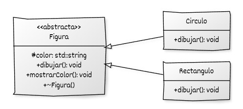

## Introducción al diseño orientado a interfaces

En apartados anteriores se estudió el **polimorfismo dinámico**, que permite que un mismo método se comporte de manera diferente según el tipo real del objeto.
En esta sección profundizaremos en el **diseño polimórfico orientado a interfaces**, un enfoque que aprovecha el polimorfismo para desacoplar la definición de un comportamiento (*qué se hace*) de su implementación concreta (*cómo se hace*).

El objetivo es aprender a **definir contratos abstractos** que las clases concretas deben cumplir, garantizando coherencia y extensibilidad del sistema sin comprometer la seguridad o la claridad del código.


## Clases abstractas

En programación orientada a objetos, una **clase abstracta** define una **interfaz común** que describe un conjunto de operaciones que las clases derivadas deben implementar.
Se utiliza para representar conceptos generales que **no tienen sentido por sí solos**, sino únicamente a través de sus especializaciones.

En C++, una clase se considera **abstracta** cuando contiene al menos una **función miembro virtual pura**, es decir, una función declarada con el sufijo `= 0`.
Este tipo de función no tiene implementación en la clase base y actúa como un **contrato** que las clases derivadas están obligadas a cumplir.
La presencia de una función virtual pura hace que la clase **no pueda instanciarse directamente**.

```cpp
#include <iostream>
#include <memory>
#include <vector>

// Clase base abstracta
class Figura {
protected:
    std::string color;

public:
    Figura(const std::string& c = "negro") : color(c) {}

    virtual void dibujar() const = 0;  // Método virtual puro
    virtual ~Figura() = default;

    void mostrarColor() const {
        std::cout << "Color: " << color << "\n";
    }
};

// Clases derivadas concretas
class Circulo : public Figura {
public:
    using Figura::Figura;  // Hereda constructor

    void dibujar() const override {
        std::cout << "Dibujando un círculo (" << color << ")\n";
    }
};

class Rectangulo : public Figura {
public:
    using Figura::Figura;

    void dibujar() const override {
        std::cout << "Dibujando un rectángulo (" << color << ")\n";
    }
};

int main() {
    std::vector<std::unique_ptr<Figura>> figuras;

    figuras.push_back(std::make_unique<Circulo>("rojo"));
    figuras.push_back(std::make_unique<Rectangulo>("azul"));

    for (const auto& figura : figuras) {
        figura->dibujar();
        figura->mostrarColor();
    }
}
```

* La clase `Figura` **no proporciona una implementación** del método `dibujar()`.
  Al declararlo como `virtual void dibujar() const = 0;`, se convierte en un **método virtual puro**, lo que hace que `Figura` sea una **clase abstracta**.

* Las clases derivadas (`Circulo` y `Rectangulo`) **deben implementar el método** `dibujar()` para poder instanciarse.
  Si no lo hicieran, también serían abstractas.

* El **destructor virtual** (`virtual ~Figura() = default;`) asegura que, al destruir un objeto derivado a través de un puntero a `Figura`, se ejecute correctamente el destructor del tipo derivado, evitando fugas de recursos.

* Aunque `Figura` no puede instanciarse directamente, **sirve como base común** para definir comportamientos compartidos, como el método `mostrarColor()`, y para agrupar objetos que comparten la misma interfaz.


## UML




En el siguiente apartado analizaremos cómo **una clase abstracta que solo contiene métodos virtuales puros** se convierte en una **interfaz pura**, utilizada para definir contratos de comportamiento totalmente desacoplados de su implementación.

