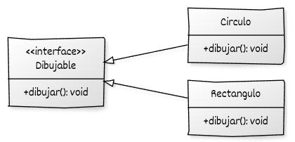

En el apartado anterior se ha visto cómo una **clase abstracta** puede definir una interfaz común que obliga a sus derivadas a implementar ciertos comportamientos.
En este punto damos un paso más: analizaremos el caso en el que una clase abstracta **no proporciona ninguna implementación**, sino únicamente **la definición del conjunto de operaciones que deben ofrecer sus derivadas**.

Este tipo de clase se denomina **interfaz pura** (*pure interface*) y se utiliza para establecer **contratos de comportamiento**: especifica *qué* debe hacer una familia de clases, pero no *cómo* hacerlo.

## Interfaz pura

En C++ no existe un tipo especial denominado `interface` como en otros lenguajes (Java, C#). Sin embargo, puede representarse de forma natural mediante una **clase abstracta que solo contiene métodos virtuales puros** y, opcionalmente, un destructor virtual.

Una interfaz pura se caracteriza por cumplir estas condiciones:

1. **Contiene exclusivamente funciones miembro virtuales puras**, declaradas con `= 0`.
2. **No mantiene estado propio** (no tiene atributos de datos).
3. **No proporciona implementación funcional** (solo define la forma de la interfaz).
4. **Su propósito es definir un contrato**, que las clases concretas deben cumplir al implementarla.

Diseñar a partir de interfaces favorece varios principios fundamentales del diseño orientado a objetos:

* **Desacoplamiento:** el código cliente depende de una interfaz estable, no de una clase concreta.
* **Extensibilidad:** nuevas implementaciones pueden añadirse sin modificar el código existente (*Principio abierto/cerrado – OCP*).
* **Sustitución segura:** cualquier clase que implemente la interfaz puede sustituir a otra sin alterar el comportamiento (*Principio de sustitución de Liskov – LSP*).
* **Testabilidad:** las dependencias pueden simularse fácilmente mediante objetos ficticios (*mocks*).


Veamos un ejemplo: El siguiente programa define una interfaz pura `Dibujable` y dos clases que la implementan. Una función genérica `renderizar()` opera sobre la interfaz sin conocer los tipos concretos de los objetos.

```cpp
#include <iostream>
#include <memory>
#include <vector>

// Interfaz pura
class Dibujable {
public:
    virtual void dibujar() const = 0;  // Solo declara el contrato
    virtual ~Dibujable() = default;
};

// Clases concretas que implementan la interfaz
class Circulo : public Dibujable {
public:
    void dibujar() const override {
        std::cout << "Dibujando un círculo\n";
    }
};

class Rectangulo : public Dibujable {
public:
    void dibujar() const override {
        std::cout << "Dibujando un rectángulo\n";
    }
};

// Función que opera sobre la interfaz
void renderizar(const std::vector<std::unique_ptr<Dibujable>>& objetos) {
    for (const auto& obj : objetos)
        obj->dibujar();  // Llamada polimórfica
}

int main() {
    std::vector<std::unique_ptr<Dibujable>> objetos;

    objetos.push_back(std::make_unique<Circulo>());
    objetos.push_back(std::make_unique<Rectangulo>());

    renderizar(objetos);
}

```


* **Definición de la interfaz:**: `Dibujable` declara el método virtual puro `dibujar()` y un destructor virtual. No mantiene estado ni implementación, por lo que representa únicamente la **forma del contrato**.
* **Implementaciones concretas:**: `Circulo` y `Rectangulo` implementan el método `dibujar()` definido en la interfaz. Si una de ellas omitiera esta función, seguiría siendo abstracta y no podría instanciarse.
* **Uso de punteros inteligentes:**: Los objetos se almacenan mediante `std::unique_ptr<Dibujable>`, lo que permite gestionar automáticamente su ciclo de vida. Esto habilita el uso polimórfico sin preocuparse por la liberación manual de memoria.
* **Polimorfismo en acción:**: La función `renderizar()` opera sobre la interfaz `Dibujable`.
   Cada llamada a `obj->dibujar()` se resuelve dinámicamente según el tipo real del objeto (`Circulo` o `Rectangulo`), sin que la función tenga que conocerlo.


## UML

