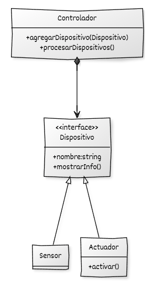

El propósito de este módulo es integrar los conocimientos adquiridos a lo largo del curso en un **proyecto práctico**, aplicando los principios de diseño y las herramientas modernas del lenguaje C++.

El proyecto consistirá en el desarrollo de un **sistema de dispositivos inteligentes**, formado por distintos tipos de objetos que interactúan entre sí mediante relaciones de composición, herencia y polimorfismo, gestionados de forma segura a través de **punteros inteligentes** y el **principio RAII**.

## Objetivo general

Construir un pequeño sistema modular que simule la interacción entre **sensores**, **actuadores** y un **controlador central**, aplicando técnicas modernas de programación orientada a objetos.

El proyecto tiene un alcance didáctico, enfocado en la **estructura y el diseño del código**, no en la funcionalidad real de los dispositivos.

## Requisitos funcionales

El sistema debe cumplir los siguientes requisitos:

1. **Jerarquía de clases polimórfica**

   * Todos los dispositivos derivan de una clase base común `Dispositivo`.
   * Cada tipo de dispositivo redefine su comportamiento según su función.

2. **Lecturas opcionales**

   * Los sensores pueden realizar una lectura que a veces falle, representada mediante `std::optional<double>`.

3. **Acciones configurables**

   * Los actuadores ejecutan una acción definida dinámicamente mediante una función o *lambda*, utilizando `std::function<void()>`.

4. **Gestión automática de memoria**

   * Los dispositivos se almacenan en el controlador usando `std::unique_ptr`, garantizando la liberación automática de recursos.

5. **Procesamiento genérico de eventos**

   * Los resultados o eventos del sistema podrán representarse mediante `std::variant` y procesarse con `std::visit`.

## Arquitectura del sistema

El sistema se estructura en torno a cuatro clases principales:

| Clase           | Descripción                                        | Conceptos aplicados                                    |
| --------------- | -------------------------------------------------- | ------------------------------------------------------ |
| **Dispositivo** | Clase base abstracta que define la interfaz común. | Herencia, encapsulación, método virtual puro.          |
| **Sensor**      | Clase derivada que simula la lectura de valores.   | Polimorfismo, `std::optional`, RAII.                   |
| **Actuador**    | Clase derivada que ejecuta acciones configurables. | Inyección de comportamiento, lambdas, `std::function`. |
| **Controlador** | Clase que gestiona una colección de dispositivos.  | Composición, punteros inteligentes, RAII.              |

## Diagrama UML general

El siguiente diagrama UML muestra las relaciones entre las clases principales:

* La clase `Dispositivo` define la interfaz común para todos los dispositivos.
* `Sensor` y `Actuador` derivan de `Dispositivo` y proporcionan implementaciones específicas.
* `Controlador` mantiene una colección de punteros inteligentes a `Dispositivo`, gestionando su ciclo de vida.

## Tecnologías y características aplicadas

El desarrollo de este sistema permitirá poner en práctica los principales conceptos de la programación orientada a objetos moderna en C++:

| Concepto                                                   | Aplicación en el proyecto                                                    |
| ---------------------------------------------------------- | ---------------------------------------------------------------------------- |
| **Encapsulación**                                          | Cada clase controla su propio estado y comportamiento.                       |
| **Herencia y polimorfismo**                                | Permiten tratar sensores y actuadores de forma uniforme.                     |
| **Composición**                                            | El controlador contiene y gestiona los dispositivos.                         |
| **RAII**                                                   | La adquisición y liberación de recursos se realiza automáticamente.          |
| **Punteros inteligentes**                                  | `std::unique_ptr` y `std::shared_ptr` aseguran la gestión segura de memoria. |
| **Lambdas y `std::function`**                              | Permiten definir comportamientos dinámicos en tiempo de ejecución.           |
| **Plantillas genéricas (`std::optional`, `std::variant`)** | Representan lecturas opcionales y eventos heterogéneos.                      |

## Flujo general de desarrollo

En los apartados siguientes, construiremos el sistema de manera progresiva:

1. **Diseñaremos la jerarquía de clases** (`Dispositivo`, `Sensor`, `Actuador`).
2. **Implementaremos la clase `Controlador`** que gestiona los dispositivos mediante composición y punteros inteligentes.
3. **Añadiremos el manejo de eventos genéricos** mediante `std::variant` y `std::visit`.
4. **Integraremos todas las piezas en un programa principal** funcional y mantenible.
5. **Analizaremos el diseño resultante**, destacando los principios aplicados y posibles mejoras.

