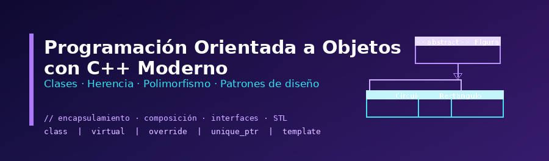

## ¿Qué es la Programación Orientada a Objetos?

La **Programación Orientada a Objetos** (POO) es el paradigma dominante en el desarrollo de software moderno. Organizar el código en torno a **clases y objetos** permite modelar problemas del mundo real de forma natural, reutilizar código de manera eficiente y construir sistemas que escalan y evolucionan con facilidad.

**C++ moderno** es uno de los mejores lenguajes para aprender POO en profundidad: ofrece control total sobre la memoria, soporte nativo para los pilares del paradigma y herramientas avanzadas como punteros inteligentes, plantillas de clase y la STL.

## ¿Qué aprenderás en este curso?

Este curso aborda la POO con C++ desde los fundamentos hasta técnicas avanzadas de diseño:

* Los cuatro pilares: **encapsulamiento**, **herencia**, **polimorfismo** y abstracción
* Gestión de memoria dinámica con **punteros inteligentes** y el patrón RAII
* Relaciones entre clases: dependencia, asociación, agregación y composición
* Diseño polimórfico con **clases abstractas** e interfaces puras
* Abstracción del comportamiento con lambdas, functores y `std::function`
* **Plantillas de clase** y programación genérica aplicada a la STL
* Proyecto final: sistema de dispositivos inteligentes

## Repositorio

* [Ejercicios y ejemplos](https://github.com/josedom24/ejercicios_curso_poo_cpp_moderno)

## Curso

1. Introducción a la Programación Orientada a Objetos

    * [¿Qué es la programación orientada a objetos?](/pledin/cursos/poo_cpp_moderno/contenido/modulo01/poo/)
    * [Los pilares de la programación orientada a objetos](/pledin/cursos/poo_cpp_moderno/contenido/modulo01/pilares/)

2. Fundamentos básicos de programación orientada a objetos

    * [Clases y objetos](/pledin/cursos/poo_cpp_moderno/contenido/modulo02/clases/)
    * [Miembros de instancia: atributos y métodos](/pledin/cursos/poo_cpp_moderno/contenido/modulo02/miembros/)
    * [Encapsulamiento y modificadores de acceso (`public`, `private`, `protected`)](/pledin/cursos/poo_cpp_moderno/contenido/modulo02/acceso/)
    * [Constructores y destructores](/pledin/cursos/poo_cpp_moderno/contenido/modulo02/constructor/)
    * [Inicialización de objetos](/pledin/cursos/poo_cpp_moderno/contenido/modulo02/objetos/)
    * [Métodos y objetos constantes](/pledin/cursos/poo_cpp_moderno/contenido/modulo02/constantes/)
    * [Inicialización de atributos con listas de inicialización](/pledin/cursos/poo_cpp_moderno/contenido/modulo02/inicializacion/)
    * [Métodos getter y setter](/pledin/cursos/poo_cpp_moderno/contenido/modulo02/getters/)
    * [Polimorfismo estático: sobrecarga de métodos](/pledin/cursos/poo_cpp_moderno/contenido/modulo02/sobrecarga/)
    * [Atributos y métodos estáticos](/pledin/cursos/poo_cpp_moderno/contenido/modulo02/estatico/)
    * [Ejercicios sobre clases y objetos](/pledin/cursos/poo_cpp_moderno/contenido/modulo02/ejercicios/)

3. Gestión de memoria dinámica

    * [Introducción a la gestión de recursos en C++ moderno](/pledin/cursos/poo_cpp_moderno/contenido/modulo03/introduccion/)
    * [Gestión manual de memoria dinámica](/pledin/cursos/poo_cpp_moderno/contenido/modulo03/memoria/)
    * [Propiedad de recursos y patrón RAII](/pledin/cursos/poo_cpp_moderno/contenido/modulo03/raii/)
    * [Gestión de memoria con punteros inteligentes](/pledin/cursos/poo_cpp_moderno/contenido/modulo03/inteligentes/)
    * [Clases y punteros inteligentes](/pledin/cursos/poo_cpp_moderno/contenido/modulo03/clases/)
    * [Ejercicios sobre gestión de memoria dinámica](/pledin/cursos/poo_cpp_moderno/contenido/modulo03/ejercicios/)

4. Relaciones entre clases

    * [Introducción a las relaciones entre clases](/pledin/cursos/poo_cpp_moderno/contenido/modulo04/introduccion/)
    * [Dependencia entre clases](/pledin/cursos/poo_cpp_moderno/contenido/modulo04/dependencia/)
    * [Asociaciones entre clases](/pledin/cursos/poo_cpp_moderno/contenido/modulo04/asociacion/)
    * [Agregación entre clases](/pledin/cursos/poo_cpp_moderno/contenido/modulo04/agregacion/)
    * [Composición entre clases](/pledin/cursos/poo_cpp_moderno/contenido/modulo04/composicion/)
    * [Ejercicios sobre relaciones de clases](/pledin/cursos/poo_cpp_moderno/contenido/modulo04/ejercicio1/)
    * [Herencia: clases base y derivadas](/pledin/cursos/poo_cpp_moderno/contenido/modulo04/herencia/)
    * [Herencia y polimorfismo dinámico](/pledin/cursos/poo_cpp_moderno/contenido/modulo04/polimorfismo/)
    * [Conversión segura de tipos polimórficos con `dynamic_cast`](/pledin/cursos/poo_cpp_moderno/contenido/modulo04/cast/)
    * [Conversiones implícitas y punteros base](/pledin/cursos/poo_cpp_moderno/contenido/modulo04/conversiones/)
    * [Ejercicios sobre herencia y polimorfismo](/pledin/cursos/poo_cpp_moderno/contenido/modulo04/ejercicio2/)

5. Fundamentos avanzados de programación orientada a objetos

    * [Copia de objetos: superficiales y profundas](/pledin/cursos/poo_cpp_moderno/contenido/modulo05/copy/)
    * [Movimiento de objetos](/pledin/cursos/poo_cpp_moderno/contenido/modulo05/move/)
    * [Control de creación, copia y movimiento de objetos](/pledin/cursos/poo_cpp_moderno/contenido/modulo05/creacion/)
    * [Clonación de objetos](/pledin/cursos/poo_cpp_moderno/contenido/modulo05/clonacion/)
    * [Sobrecarga de operadores](/pledin/cursos/poo_cpp_moderno/contenido/modulo05/operadores/)
    * [Fluidez de métodos](/pledin/cursos/poo_cpp_moderno/contenido/modulo05/fluidez/)
    * [Ejercicios sobre conceptos avanzados de programación orientada a objetos](/pledin/cursos/poo_cpp_moderno/contenido/modulo05/ejercicios/)

6. Interfaces y diseño polimórfico

    * [Clases abstractas y métodos virtuales puros](/pledin/cursos/poo_cpp_moderno/contenido/modulo06/abstracta/)
    * [Interfaces puras y diseño orientado a contratos](/pledin/cursos/poo_cpp_moderno/contenido/modulo06/interface/)
    * [El problema de devolver tipos concretos y objetos polimórficos](/pledin/cursos/poo_cpp_moderno/contenido/modulo06/concretos/)
    * [Devolución de interfaces mediante punteros inteligentes](/pledin/cursos/poo_cpp_moderno/contenido/modulo06/devolucion/)
    * [Ejercicios sobre interfaces y diseño polimórfico](/pledin/cursos/poo_cpp_moderno/contenido/modulo06/ejercicios/)

7. Abstracción del comportamiento

    * [Comportamiento intercambiable y bajo acoplamiento](/pledin/cursos/poo_cpp_moderno/contenido/modulo07/comportamiento/)
    * [Delegación de comportamiento mediante interfaces](/pledin/cursos/poo_cpp_moderno/contenido/modulo07/delegacion/)
    * [Representación de acciones con funciones lambdas](/pledin/cursos/poo_cpp_moderno/contenido/modulo07/lambda/)
    * [Uso de `std::function` para encapsular comportamiento configurable](/pledin/cursos/poo_cpp_moderno/contenido/modulo07/function/)
    * [Functores y clases con `operator()`](/pledin/cursos/poo_cpp_moderno/contenido/modulo07/functor/)
    * [Inyección de comportamiento mediante composición](/pledin/cursos/poo_cpp_moderno/contenido/modulo07/composicion/)
    * [Ejercicios sobre abstracción de comportamiento](/pledin/cursos/poo_cpp_moderno/contenido/modulo07/ejercicios/)

8. Plantillas de clases y programación genérica

    * [Introducción a las plantillas de clases](/pledin/cursos/poo_cpp_moderno/contenido/modulo08/plantillas/)
    * [Clases genéricas con uno o varios parámetros de tipo](/pledin/cursos/poo_cpp_moderno/contenido/modulo08/parametros/)
    * [Especialización de plantillas de clase](/pledin/cursos/poo_cpp_moderno/contenido/modulo08/especializacion/)
    * [Las plantillas de clase y la STL](/pledin/cursos/poo_cpp_moderno/contenido/modulo08/stl/)
    * [Plantilla de clase: `std::optional`](/pledin/cursos/poo_cpp_moderno/contenido/modulo08/optional/)
    * [Plantillas de clase: `std::variant` y `std::visit`](/pledin/cursos/poo_cpp_moderno/contenido/modulo08/variant/)
    * [Ejercicios sobre programación genérica](/pledin/cursos/poo_cpp_moderno/contenido/modulo08/ejercicios/)

9. Proyecto final: Sistema de dispositivos inteligentes

    * [Planteamiento general del proyecto](/pledin/cursos/poo_cpp_moderno/contenido/modulo09/planteamiento/)
    * [Clases base y derivadas: diseño de la jerarquía de dispositivos](/pledin/cursos/poo_cpp_moderno/contenido/modulo09/jerarquia/)
    * [Implementación del controlador del sistema](/pledin/cursos/poo_cpp_moderno/contenido/modulo09/controlador/)
    * [Manejo de eventos genéricos mediante std::variant y std::visit](/pledin/cursos/poo_cpp_moderno/contenido/modulo09/eventos/)
    * [Integración en un programa principal](/pledin/cursos/poo_cpp_moderno/contenido/modulo09/main/)
