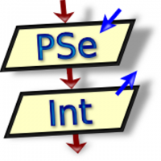

Un algoritmo es un conjunto de acciones que especifican la secuencia de operaciones realizar, en orden, para resolver un problema. El pseudocódigo, nos permite una aproximación del algoritmo al lenguaje natural y por tanto un a redacción rápida del mismo. En este curso se presenta los fundamentos para analizar problemas y resolverlos a través de pseudocódigo.

Los siguientes contenidos forman parte de un curso que he impartido para [OpenWebinars](https://openwebinars.net/cursos/introduccion-programacion/) en mayo de 2018.

Puedes obtener todo el contenido del curso en el repositorio [GitHub](https://github.com/josedom24/curso_programacion).
Todas las observaciones, mejoras y sugerencias son bienvenidas.

## Unidades

0. [Introducción al curso](curso/u0/u0.pdf)

    **Introducción a la programación**

1. [Resolución de problemas](curso/u01)
2. [Análisis del problema](curso/u02)
3. [Diseño de algoritmos](curso/u03)

    **Entorno de trabajo: PSeInt**

4. [Introducción a PSeInt](curso/u04)

    **Pseudocódigo: Introducción**

5. [Estructura del algoritmo](curso/u05)
6. [Tipos de datos simples](curso/u06)
7. [Variables](curso/u07)
8. [Operadores y expresiones](curso/u08)
9. [Asignación de variables](curso/u09)
10. [Entrada y salida de información](curso/u10)
11. [Otras instrucciones](curso/u11)
12. [Funciones matemáticas](curso/u12)
13. [Funciones de cadenas de texto](curso/u13)
14. [Nuestro primer pseudocódigo completo](curso/u14)
15. [Ejecución paso a paso](curso/u15)
16. [Ejercicios estructura secuencial](curso/u16)

    **Pseudocódigo: Estructuras alternativas**

17. [Estructuras alternativas: Si](curso/u17)
18. [Estructuras alternativas: Segun](curso/u18)
19. [Ejercicios estructuras alternativas](curso/u19)

    **Pseudocódigo: Estructuras repetitivas**

20. [Estructuras repetitivas: Mientras](curso/u20)
21. [Estructuras repetitivas: Repetir-Hasta Que](curso/u21)
22. [Estructuras repetitivas: Para](curso/u22)
23. [Uso específico de variables: contadores, acumuladores e indicadores](curso/u23)
24. [Ejercicios estructuras repetitivas](curso/u24)
25. [Ejercicios cadenas de caracteres](curso/u25)

    **Pseudocódigo: Arreglos**

26. [Estructuras de datos: Arreglos (array)](curso/u26)
27. [Arreglos unidimensionales: Vectores](curso/u27)
28. [Arreglos multidimensionales: Tablas](curso/u28)
29. [Ejercicios de arreglos](curso/u29)

    **Pseudocódigo: Programación estructurada**

30. [Programación estructurada](curso/u30)
31. [Funciones y procedimientos](curso/u31)
32. [Funciones recursivas](curso/u32)
33. [Ejercicios de funciones](curso/u33)
34. [Más ejercicios](curso/u34)

    **Lenguajes de Programación**

35. [Introducción a los lenguajes de programación](curso/u35)
36. [Programas traductores](curso/u36)
37. [Compilación y ejecución de un lenguaje compilado: C++](curso/u37)
38. [Compilación e interpretación de un programa Java](curso/u38)
39. [Ejecución de programas interpretados con Python](curso/u39)
