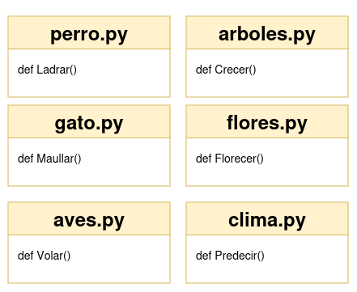
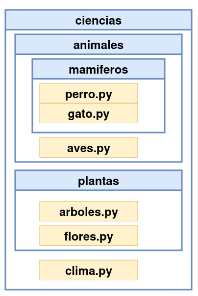

## Paso 1

Imagina que tu equipo ha escrito una gran cantidad de funciones en Python y decide agruparlas en módulos separados. Cada módulo contiene una función específica. En nuestro ejemplo, estos módulos nos van a permitir trabajar con elementos de las ciencias naturales: animales, plantas, clima, ... Uno de esos módulos es el siguiente:

```
#! /usr/bin/env python3

""" módulo: perro """

def Ladrar():
    return "¡Guau!"

if __name__ == "__main__":
    print("Yo prefiero ser un módulo")
```

Este es el contenido del archivo `perro.py`, y se asume que el resto de los módulos tienen una estructura similar, donde la función principal del módulo simplemente muestra un mensaje relacionado con el elemento con el que estamos trabajando.




## Paso 2

El equipo se da cuenta de que estos módulos forman una jerarquía natural, por lo que colocarlos en una estructura plana no es ideal. Después de discutir, se acuerda una estructura en forma de árbol, donde los módulos se agrupan de acuerdo con sus relaciones mutuas.

La estructura jerárquica propuesta es:

* **Grupo `animales`**: contiene el subgrupo `mamiferos` y el módulo `aves`.
* **Grupo `mamifero`**: contiene los módulos `perro` y `gato`.
* **Grupo `plantas`**: contiene los módulos `arboles` y `flores`.
* **Grupo `ciencia`**: contiene los subgrupos `animales`, `plantas` y el módulo `clima`.



Este esquema refleja la relación entre los módulos y su agrupación, similar a una estructura de directorios. El siguiente paso será construir un árbol que siga esta jerarquía.

## Paso 3

Actualmente, la estructura de módulos ha tomado la forma de un árbol, que sigue las relaciones entre los módulos. Aunque esta estructura está casi lista para ser un paquete en Python, todavía falta un detalle para que sea funcional.

```
ciencia
├── animales
│   ├── mamiferos
│   │   ├── perro.py
│   │   └── gato.py
│   └── aves.py
├── plantas
│   ├── arboles.py
│   └── flores.py
└── clima.py
```

Si asumimos que el directorio raíz del paquete se llama `ciencia`, puedes usar la siguiente convención de nomenclatura para acceder a las funciones dentro de los módulos del paquete:

* La función `Ladrar` del módulo `perro` se accedería como:  
  `ciencia.animales.mamiferos.perro.Ladrar()`

* La función `Crecer` del módulo `Arboles` se accedería como:  
  `ciencia.plantas.arboles.Crecer()`

Esto refleja cómo los módulos y submódulos se agrupan jerárquicamente dentro del paquete.

## Paso 4

Ahora es necesario responder dos preguntas clave:

1. **¿Cómo transformar esta estructura en un paquete real de Python?**
2. **¿Dónde colocar esta estructura para que Python pueda acceder a ella?**

La respuesta a la primera pregunta es que, al igual que los módulos, los paquetes también pueden requerir inicialización. Para esto, se utiliza un archivo especial llamado `__init__.py`, que debe estar presente en el directorio del módulo del paquete.

El archivo `__init__.py` se ejecuta cuando se importa cualquier módulo dentro del paquete. Aunque no siempre es necesario incluir código en este archivo (puede estar vacío si no se requiere inicialización), su presencia es obligatoria para que Python trate la carpeta como un paquete en lugar de un conjunto de archivos sin estructura.

