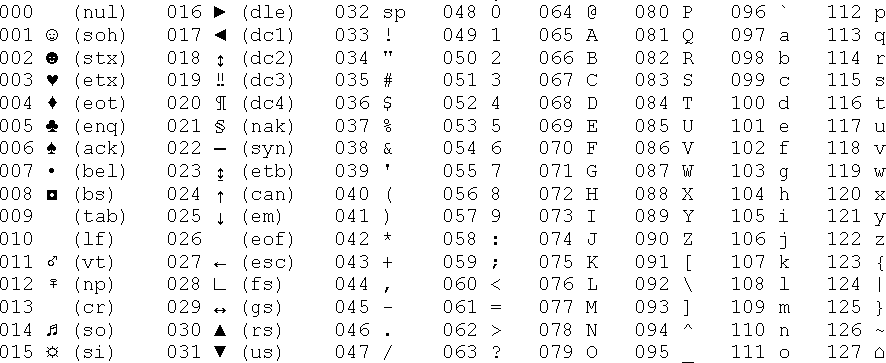

Cuando estamos aprendiendo Python, desarrollamos muchos programas que procesan datos numéricos. Sin embargo, muchos de los datos que los ordenadores gestionan diariamente no son números, sino texto: nombres, apellidos, direcciones, ... Estos datos también necesitan ser almacenados, procesados y transformados por los ordenadores. Pero, ¿cómo lo hacen?...

Los ordenadores no entienden directamente los caracteres como los humanos. En su lugar, **cada carácter que vemos en una pantalla es almacenado como un número**. Esta conversión es esencial, ya que **los números son lo único que los ordenadores pueden procesar eficientemente**. De esta forma, **cada carácter tiene un valor numérico único**, y algunos de estos valores representan caracteres invisibles para los humanos pero fundamentales para el sistema, como los espacios en blanco o los saltos de línea, que ayudan a controlar dispositivos de entrada y salida.

## El estándar universal: ASCII

Dado que cada ordenador podría usar diferentes códigos para los caracteres, se necesitó un estándar universal que permitiera la interoperabilidad entre dispositivos. Así nació el código **ASCII** (American Standard Code for Information Interchange), un sistema de codificación que asigna números a caracteres específicos. Casi todos los dispositivos modernos, como ordenadores, teléfonos móviles y tabletas, utilizan ASCII para gestionar caracteres.

**Este estándar permite representar hasta 256 caracteres, aunque los primeros 128 son los más utilizados**. Por ejemplo, el espacio tiene el código 32, la letra "a" minúscula tiene el código 97, y la letra "A" mayúscula tiene el código 65. 

Uno de los aspectos más interesantes de la tabla ASCII es que **las letras están organizadas en el mismo orden que el alfabeto latino**.

## I18N: Internacionalización

El alfabeto latino no es suficiente para cubrir las necesidades de todos los idiomas del mundo. De hecho, los usuarios que emplean este alfabeto son una minoría global. Ante la diversidad de lenguajes y alfabetos, fue necesario desarrollar algo más flexible que el estándar **ASCII** para permitir que el software se adapte a cualquier idioma, un proceso conocido como **internacionalización**, o **I18N**.

El término "I18N" es una abreviatura donde la "I" representa la primera letra de "internacionalización", la "N" la última, y el número 18 corresponde a la cantidad de letras entre ellas. Aunque parece una broma lingüística, este término se usa oficialmente en la industria del software para describir el proceso de adaptar programas a distintos idiomas y culturas.

## Evolución de ASCII

El estándar ASCII utiliza 8 bits para representar cada carácter, lo que proporciona 256 posibles combinaciones. De estas, los primeros 128 puntos de código se destinan al alfabeto latino, tanto en mayúsculas como en minúsculas. Pero los 128 caracteres restantes no son suficientes para abarcar los múltiples alfabetos del mundo.

Para resolver este problema, se introdujo el concepto de **puntos de código**. Un punto de código es simplemente un número asignado a un carácter. En el estándar ASCII, por ejemplo, el punto de código 32 representa un espacio.

Dado que ASCII solo puede representar 256 caracteres, surgió la idea de **páginas de códigos**. Una página de códigos es un estándar que utiliza los 128 puntos de código superiores para representar caracteres específicos de un idioma o grupo de idiomas. Esto significa que un mismo punto de código puede representar diferentes caracteres dependiendo de la página de códigos utilizada.

Por ejemplo, el punto de código 200 representa la letra **Č** (utilizada en lenguas eslavas) en la página de códigos ISO/IEC 8859-2, pero la letra cirílica **Ш** en la página de códigos ISO/IEC 8859-5. Como resultado, para interpretar correctamente un carácter, es esencial conocer la página de códigos que se está utilizando.

El uso de páginas de códigos trae consigo una complicación: los puntos de código pueden ser ambiguos. El mismo número puede representar caracteres diferentes según la página de códigos, lo que añade complejidad al procesamiento y la interpretación de texto en diferentes idiomas.

## Unicode

Las páginas de códigos fueron una solución temporal para la internacionalización (I18N) en la industria informática, pero pronto se evidenció la necesidad de una solución más permanente y universal. La respuesta fue el estándar **Unicode**.

**Unicode** es un sistema que asigna caracteres únicos (letras, ideogramas, símbolos, etc.) a más de un millón de puntos de código, lo que lo hace extremadamente flexible y expansivo. Los primeros 128 puntos de código de Unicode coinciden con los de **ASCII**, y los primeros 256 coinciden con la página de códigos **ISO/IEC 8859-1**, diseñada para idiomas europeos occidentales.

Sin embargo, Unicode no establece cómo se deben almacenar estos caracteres en la memoria o en archivos; simplemente define los caracteres y los asigna a **planos**, que son grupos de caracteres con un origen o naturaleza similar. Existen varias formas de codificar los caracteres:

### UCS-4: La Codificación Básica

Uno de los estándares más generales para implementar Unicode es **UCS-4** (Universal Character Set). Este sistema utiliza 32 bits (o cuatro bytes) para almacenar cada carácter, representando el número único de un punto de código Unicode. Aunque UCS-4 garantiza que cada carácter esté codificado de manera única, su principal desventaja es que cuadruplica el tamaño de los textos en comparación con ASCII, lo que lo hace ineficiente para muchos usos prácticos.

Un archivo UCS-4 puede comenzar con un **BOM** (Byte Order Mark), que es un conjunto no imprimible de bits que indica el tipo de codificación en el archivo. Sin embargo, UCS-4 no es ampliamente utilizado debido a su ineficiencia.

### UTF-8: Una Solución Eficiente

**UTF-8** es una de las codificaciones más usadas para textos Unicode debido a su eficiencia. A diferencia de UCS-4, **UTF-8** ajusta el tamaño de almacenamiento en función de los bits necesarios para representar un carácter:

* Los caracteres latinos y los caracteres estándar de ASCII utilizan solo 8 bits.
* Los caracteres no latinos ocupan 16 bits.
* Los ideogramas de China, Japón y Corea (CJK) ocupan 24 bits.

Esta flexibilidad permite que los textos en UTF-8 sean mucho más compactos que los codificados en UCS-4. Aunque UTF-8 no requiere el uso de un **BOM**, algunas herramientas lo reconocen y muchos editores lo añaden al guardar archivos.

## Python y Unicode

**Python 3** es completamente compatible con Unicode y **UTF-8**, lo que significa que permite el uso de caracteres Unicode para nombrar variables, realizar entradas y salidas, y manipular textos en cualquier idioma. Esta capacidad hace que Python sea una herramienta totalmente internacionalizada, facilitando el desarrollo de aplicaciones multilingües y globales.

