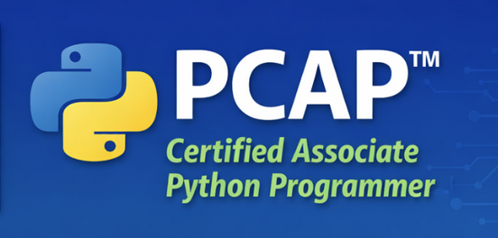

## Certificaciones PCEP y PCAP

Las certificaciones **PCEP** y **PCAP** forman parte del itinerario oficial de certificación en Python y están ampliamente reconocidas como una forma sólida de validar conocimientos en este lenguaje.

### PCAP – Certified Associate Python Programmer

La certificación **PCAP** da un paso más y está dirigida a programadores con cierta experiencia previa en Python. En este nivel se profundiza en aspectos como:

* Programación estructurada y modular
* Colecciones y estructuras de datos avanzadas
* Manejo de excepciones
* Programación orientada a objetos
* Uso más avanzado de funciones y módulos
* Buenas prácticas en Python

Superar esta certificación demuestra una **comprensión sólida y práctica del lenguaje**, adecuada para entornos profesionales o académicos más exigentes. 

## Repositorios

* Repositorio del curso: [https://github.com/josedom24/python_pcep_pcap/tree/main/PCAP](https://github.com/josedom24/python_pcep_pcap/tree/main/PCAP)
* Repositorio de ejercicios: [https://github.com/josedom24/ejercicios_python_pcap](https://github.com/josedom24/ejercicios_python_pcap)

## Curso

1. Introducción a los módulos en Python
    * [¿Qué es un módulo en Python?](/pledin/cursos/python_pcap/contenido/seccion01/clase1/)
    * [Importación de módulos](/pledin/cursos/python_pcap/contenido/seccion01/clase2/)
    * [Módulos y namespaces](/pledin/cursos/python_pcap/contenido/seccion01/clase3/)
    * [Importación de entidades de un módulo](/pledin/cursos/python_pcap/contenido/seccion01/clase4/)
    * [Importación de todas las entidades de un módulo](/pledin/cursos/python_pcap/contenido/seccion01/clase5/)
2. Módulos estándares en Python
    * [La función dir()](/pledin/cursos/python_pcap/contenido/seccion02/clase1/)
    * [El módulo math](/pledin/cursos/python_pcap/contenido/seccion02/clase2/)
    * [El módulo random](/pledin/cursos/python_pcap/contenido/seccion02/clase3/)
    * [El módulo platform](/pledin/cursos/python_pcap/contenido/seccion02/clase4/)
3. Módulos y paquetes
    * [¿Qué es un paquete en Python?](/pledin/cursos/python_pcap/contenido/seccion03/clase1/)
    * [Nuestro primer módulo (1ª parte)](/pledin/cursos/python_pcap/contenido/seccion03/clase2/)
    * [Nuestro primer módulo (2ª parte)](/pledin/cursos/python_pcap/contenido/seccion03/clase3/)
    * [Nuestro primer paquete (1ª parte)](/pledin/cursos/python_pcap/contenido/seccion03/clase4/) 
    * [Nuestro primer paquete (2ª parte)](/pledin/cursos/python_pcap/contenido/seccion03/clase5/) 
4. Instalador de paquetes PIP
    * [El ecosistema de paquetes de Python](/pledin/cursos/python_pcap/contenido/seccion04/clase1/)
    * [Instalación de pip](/pledin/cursos/python_pcap/contenido/seccion04/clase2/)
    * [Cómo usar pip](/pledin/cursos/python_pcap/contenido/seccion04/clase3/)
    * [Ejemplo de uso de pip](/pledin/cursos/python_pcap/contenido/seccion04/clase4/)
    * [Test intermedio: comprueba lo que has aprendido](/pledin/cursos/python_pcap/contenido/seccion04/test/)
    * [Prueba intermedia](/pledin/cursos/python_pcap/contenido/seccion04/prueba/)
5. Cadenas de caracteres
    * [Codificación de caracteres en Python](/pledin/cursos/python_pcap/contenido/seccion05/clase1/)
    * [Introducción a las cadenas de caracteres](/pledin/cursos/python_pcap/contenido/seccion05/clase2/)
    * [Funciones que trabajan con cadenas de caracteres](/pledin/cursos/python_pcap/contenido/seccion05/clase3/)
    * [Las cadenas son inmutables](/pledin/cursos/python_pcap/contenido/seccion05/clase4/)
    * [Métodos de las cadenas de caracteres (1ª parte)](/pledin/cursos/python_pcap/contenido/seccion05/clase5/)
    * [Métodos de las cadenas de caracteres (2ª parte)](/pledin/cursos/python_pcap/contenido/seccion05/clase6/)
    * [LABORATORIO: Tu propio split](/pledin/cursos/python_pcap/contenido/seccion05/clase7/)
    * [Comparación de cadenas](/pledin/cursos/python_pcap/contenido/seccion05/clase8/)
    * [Ordenación de cadenas](/pledin/cursos/python_pcap/contenido/seccion05/clase9/)
    * [Conversión entre cadenas y números](/pledin/cursos/python_pcap/contenido/seccion05/clase10/)
    * [LABORATORIO: Un display LED](/pledin/cursos/python_pcap/contenido/seccion05/clase11/)
6. Ejemplos de programas trabajando con cadenas de caracteres
    * [Ejemplo 1: El cifrado César](/pledin/cursos/python_pcap/contenido/seccion06/clase1/)
    * [Ejemplo 2: El procesador de números](/pledin/cursos/python_pcap/contenido/seccion06/clase2/)
    * [Ejemplo 3: El validador IBAN](/pledin/cursos/python_pcap/contenido/seccion06/clase3/)
    * [LABORATORIO: Mejorando el cifrado César](/pledin/cursos/python_pcap/contenido/seccion06/clase4/)
    * [LABORATORIO: Palíndromos](/pledin/cursos/python_pcap/contenido/seccion06/clase5/)
    * [LABORATORIO: Anagramas](/pledin/cursos/python_pcap/contenido/seccion06/clase6/)
    * [LABORATORIO: El dígito de la vida](/pledin/cursos/python_pcap/contenido/seccion06/clase7/)
    * [LABORATORIO: ¡Encuentra una palabra!](/pledin/cursos/python_pcap/contenido/seccion06/clase8/)
    * [LABORATORIO: Sudoku](/pledin/cursos/python_pcap/contenido/seccion06/clase9/)
7. Excepciones: Gestionando errores de programación
    * [Introducción a las excepciones](/pledin/cursos/python_pcap/contenido/seccion07/clase1/)
    * [Manejo de excepciones](/pledin/cursos/python_pcap/contenido/seccion07/clase2/)
    * [Jerarquía de excepciones](/pledin/cursos/python_pcap/contenido/seccion07/clase3/)
    * [Propagación de excepciones](/pledin/cursos/python_pcap/contenido/seccion07/clase4/)
    * [La instrucción assert](/pledin/cursos/python_pcap/contenido/seccion07/clase5/)
    * [Excepciones integradas](/pledin/cursos/python_pcap/contenido/seccion07/clase6/)
    * [LABORATORIO: Leer enteros de forma segura](/pledin/cursos/python_pcap/contenido/seccion07/clase7/)
    * [Test intermedio: comprueba lo que has aprendido](/pledin/cursos/python_pcap/contenido/seccion07/test/)
    * [Prueba intermedia](/pledin/cursos/python_pcap/contenido/seccion07/prueba/)
8. Introducción a la Programación Orientada a Objetos
    * [Introducción a la programación orientada a objetos](/pledin/cursos/python_pcap/contenido/seccion08/clase1/)
    * [Programación orientada a objetos en Python](/pledin/cursos/python_pcap/contenido/seccion08/clase2/)
    * [Pila: Enfoque procedimental](/pledin/cursos/python_pcap/contenido/seccion08/clase3/)
    * [Pila: Programación orientada a objetos](/pledin/cursos/python_pcap/contenido/seccion08/clase4/)
    * [Pila: Creación de varios objetos](/pledin/cursos/python_pcap/contenido/seccion08/clase5/)
    * [Pila: Herencia de clases](/pledin/cursos/python_pcap/contenido/seccion08/clase6/)
    * [LABORATORIO: Pila Contadora](/pledin/cursos/python_pcap/contenido/seccion08/clase7/)
    * [LABORATORIO: Colas alias FIFO](/pledin/cursos/python_pcap/contenido/seccion08/clase8/)
    * [LABORATORIO: Colas alias FIFO: parte 2](/pledin/cursos/python_pcap/contenido/seccion08/clase9/)
9. Propiedades y métodos
    * [Propiedades de instancia](/pledin/cursos/python_pcap/contenido/seccion09/clase1/)
    * [Propiedades de clase](/pledin/cursos/python_pcap/contenido/seccion09/clase2/)
    * [Comprobando la existencia de una propiedad](/pledin/cursos/python_pcap/contenido/seccion09/clase3/)
    * [Métodos de instancia](/pledin/cursos/python_pcap/contenido/seccion09/clase4/)
    * [Propiedades comunes en clases y objetos](/pledin/cursos/python_pcap/contenido/seccion09/clase5/)
    * [Explorando y modificando las clases y objetos](/pledin/cursos/python_pcap/contenido/seccion09/clase6/)
    * [Representación de los objetos](/pledin/cursos/python_pcap/contenido/seccion09/clase7/)
    * [LABORATORIO: La clase Timer](/pledin/cursos/python_pcap/contenido/seccion09/clase8/)
    * [LABORATORIO: Días de la semana](/pledin/cursos/python_pcap/contenido/seccion09/clase9/)
    * [LABORATORIO: Puntos en un plano](/pledin/cursos/python_pcap/contenido/seccion09/clase10/)
    * [LABORATORIO: Triángulo](/pledin/cursos/python_pcap/contenido/seccion09/clase11/)
10. Herencia de clases
    * [Herencia de clases en Python](/pledin/cursos/python_pcap/contenido/seccion10/clase1/)
    * [Relación entre superclase y subclase](/pledin/cursos/python_pcap/contenido/seccion10/clase2/)
    * [Relación entre objetos y clases](/pledin/cursos/python_pcap/contenido/seccion10/clase3/)
    * [Trabajando con propiedades y métodos heredados](/pledin/cursos/python_pcap/contenido/seccion10/clase4/)
    * [Herencia múltiple](/pledin/cursos/python_pcap/contenido/seccion10/clase5/)
    * [Polimorfismo](/pledin/cursos/python_pcap/contenido/seccion10/clase6/)
    * [Cómo construir una jerarquía de clases](/pledin/cursos/python_pcap/contenido/seccion10/clase7/)
    * [Composición](/pledin/cursos/python_pcap/contenido/seccion10/clase8/)
    * [Herencia simple frente a herencia múltiple](/pledin/cursos/python_pcap/contenido/seccion10/clase9/)
11. Las excepciones en profundidad
    * [El bloque else y finally en las excepciones](/pledin/cursos/python_pcap/contenido/seccion11/clase1/)
    * [Las excepciones son clases](/pledin/cursos/python_pcap/contenido/seccion11/clase2/)
    * [Creación de nuevas excepciones](/pledin/cursos/python_pcap/contenido/seccion11/clase3/)
    * [Test intermedio: comprueba lo que has aprendido](/pledin/cursos/python_pcap/contenido/seccion11/test/)
    * [Prueba intermedia](/pledin/cursos/python_pcap/contenido/seccion11/prueba/)
12. Generadores, iteradores y cierres
    * [Generadores e iteradores](/pledin/cursos/python_pcap/contenido/seccion12/clase1/)
    * [La instrucción yield](/pledin/cursos/python_pcap/contenido/seccion12/clase2/)
    * [Ejemplos de generadores](/pledin/cursos/python_pcap/contenido/seccion12/clase3/)
    * [Introducción a las listas por compresión](/pledin/cursos/python_pcap/contenido/seccion12/clase4/)
    * [Funciones lambda](/pledin/cursos/python_pcap/contenido/seccion12/clase5/)
    * [Usos de funciones lambdas](/pledin/cursos/python_pcap/contenido/seccion12/clase6/)
    * [Introducción a los cierres](/pledin/cursos/python_pcap/contenido/seccion12/clase7/)
13. Trabajando con archivos
    * [Trabajando con archivos](/pledin/cursos/python_pcap/contenido/seccion13/clase1/)
    * [Manejo de archivos](/pledin/cursos/python_pcap/contenido/seccion13/clase2/)
    * [Abriendo y cerrando los archivos](/pledin/cursos/python_pcap/contenido/seccion13/clase3/)
    * [Lectura de archivos de texto](/pledin/cursos/python_pcap/contenido/seccion13/clase4/)
    * [Escritura en archivos de texto](/pledin/cursos/python_pcap/contenido/seccion13/clase5/)
    * [Trabajando con archivos binarios](/pledin/cursos/python_pcap/contenido/seccion13/clase6/)
    * [Ejemplo: como copiar archivos](/pledin/cursos/python_pcap/contenido/seccion13/clase7/)
    * [LABORATORIO: Histograma de frecuencia de caracteres](/pledin/cursos/python_pcap/contenido/seccion13/clase8/)
    * [LABORATORIO: Histograma de frecuencia de caracteres ordenados](/pledin/cursos/python_pcap/contenido/seccion13/clase9/)
    * [LABORATORIO: Evaluando los resultados de los estudiantes](/pledin/cursos/python_pcap/contenido/seccion13/clase10/)
14. Módulos de sistema: os, datetime, calendar
    * [El módulo os](/pledin/cursos/python_pcap/contenido/seccion14/clase1/)
    * [LABORATORIO: El módulo os](/pledin/cursos/python_pcap/contenido/seccion14/clase2/)
    * [El módulo datetime](/pledin/cursos/python_pcap/contenido/seccion14/clase3/)
    * [El módulo time](/pledin/cursos/python_pcap/contenido/seccion14/clase4/)
    * [El módulo datetime en profundidad](/pledin/cursos/python_pcap/contenido/seccion14/clase5/)
    * [Operaciones con fechas y horas](/pledin/cursos/python_pcap/contenido/seccion14/clase6/)
    * [LABORATORIO: Los módulos datetime y time](/pledin/cursos/python_pcap/contenido/seccion14/clase7/)
    * [El módulo calendar](/pledin/cursos/python_pcap/contenido/seccion14/clase8/)
    * [Clases para crear calendarios](/pledin/cursos/python_pcap/contenido/seccion14/clase9/)