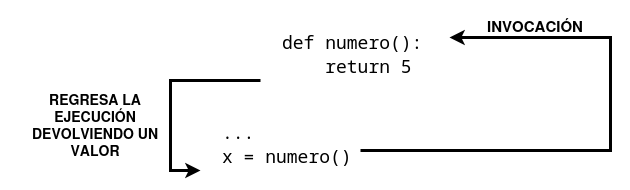

Todas las funciones presentadas anteriormente tienen algún tipo de **efecto**: por ejemplo, escriben en pantalla.
Además de producir un efecto, las funciones puedes **devolver valores**.

Para lograr que las funciones devuelvan un valor (pero no solo para ese propósito) se utiliza la instrucción **return** (regresar o retornar).

### return sin una expresión

Podemos usar sólo la palabra reservada `return`, sin ninguna expresión. Esto provoca la **terminación inmediata de la ejecución de la función, y un retorno instantáneo (de ahí el nombre) al punto de invocación**.

Hay que indicar que si una función no está destinada a producir un resultado, **emplear la instrucción `return` no es obligatorio**, se ejecutará implícitamente al final de la función.

De cualquier manera, se puede emplear para terminar las actividades de una función, antes de que el control llegue a la última línea de la función.

Veamos un ejemplo:
```
def happy_new_year(wishes = True):
    print("Tres...")
    print("Dos...")
    print("Uno...")
    if not wishes:
        return
   
    print("¡Feliz año nuevo!")
```

Cuando se invoca sin ningún argumento: `happy_new_year()`. La función mostrará:
```
Tres...
Dos...
Uno...
¡Feliz año nuevo!
```

Sin embrago si mandamos el argumento de esta manera: `happy_new_year(False)`, se modificará el comportamiento de la función: la instrucción `return` provocará su terminación justo antes de ejecutar el ultimo `print()` y la salida será:

```
Tres...
Dos...
Uno...
```

### return con una expresión

La segunda variante de `return` nos permite devolver una valor que será el resultado de evaluar una expresión (recuerda que una expresión puede ser simplemente un literal o una variable):

Veamos un ejemplo sencillo:

```
def numero():
    return 5
```

Al usar el `return` ocurren dos cosas:

* Provoca la **terminación inmediata de la ejecución** de la función (nada nuevo en comparación con la primer variante).
* Además, la función evaluará el valor de la expresión y lo devolverá como el resultado de la función.
* Podemos decir que **el tipo de dato de la función es igual al tipo de datos del valor devuelto**.
    * Ejemplo:
    ```
    type(numero())
    <class 'int'>
    ```

Ahora podemos llamar a la función de la siguiente manera:

```
x = numero()
print("La función numero ha devuelto su resultado. Es:", x)
```

El fragmento de código escribe el siguiente texto en la consola: `La función numero ha devuelto su resultado. Es: 5`.



El valor devuelto por la función se guarda en la variable `x`. Con el valor devuelto podemos hacer varias cosas:

1. Se puede asignar a una variable, como hemos visto.
2. Podemos usarlo en una expresión más compleja, donde la invocación de la función representa el valor devuelto, y el tipo de la función es el mismo que el tipo de datos del valor devuelto.
3. También puede ignorarse por completo y perderse sin dejar rastro.

Veamos un ejemplo de esto último:

```
def numero():
    print("'Modo aburrimiento' ON.")
    return 123

print("¡Esta lección es interesante!")
numero()
print("Esta lección es aburrida...")
```

El programa produce el siguiente resultado:

```
¡Esta lección es interesante!
'Modo aburrimiento' ON.
Esta lección es aburrida...
```

## El valor None

El valor `None` no representa ningún valor, en realidad lo podríamos traducir como **ningún valor**. Por lo tanto, no debe usarse dentro de ninguna expresión.

Por ejemplo, un fragmento de código como el siguiente:

```
print(None + 2)
```

Causará un error de tiempo de ejecución: `TypeError: unsupported operand type(s) for +: 'NoneType' and 'int'`.

Solo existen dos tipos de circunstancias en las que `None` se puede usar de manera segura:

* Cuando se le asigna a una variable o se devuelve como el resultado de una función.
* Cuando se compara con una variable para diagnosticar su estado interno.

Ejemplo:

```
value = None
if value is None:
    print("Lo siento, no contienes ningún valor")
```

No olvides esto: **si una función no devuelve un cierto valor utilizando una cláusula de expresión `return`, se asume que devuelve implícitamente `None`**.

Vamos a probarlo:

```
def strange_function(n):
    if(n % 2 == 0):
        return True
```

Es obvio que la función `strangeFunction` retorna `True` cuando su argumento es par.

¿Qué es lo que retorna de otra manera?

Podemos usar el siguiente código para verificarlo:
```
print(strange_function(2))
print(strange_function(1))
```
La salida será:

```
True
None
```

Si la función sólo provoca un efecto y no devuelve ningún valor, el valor que devuelve es `None`. Sin embargo, si la función debe devolver un valor y en alguna circunstancia devuelve `None` puede significar que la función tiene algún error interno.