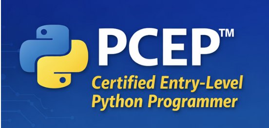

## Certificaciones PCEP y PCAP

Las certificaciones **PCEP** y **PCAP** forman parte del itinerario oficial de certificación en Python y están ampliamente reconocidas como una forma sólida de validar conocimientos en este lenguaje.

### PCEP – Certified Entry-Level Python Programmer

La certificación **PCEP** está orientada a personas que comienzan a programar en Python. Evalúa los **fundamentos del lenguaje**, tales como:

* Sintaxis básica y semántica
* Tipos de datos fundamentales
* Variables y operadores
* Control de flujo (`if`, bucles)
* Funciones básicas
* Manejo elemental de errores

Es una excelente puerta de entrada para quien quiere demostrar que domina los conceptos esenciales de Python y que está preparado para seguir avanzando.

## Repositorios

* Repositorio del curso: [https://github.com/josedom24/python_pcep_pcap/tree/main/PCEP](https://github.com/josedom24/python_pcep_pcap/tree/main/PCEP)
* Repositorio de ejercicios: [https://github.com/josedom24/ejercicios_python_pcep](https://github.com/josedom24/ejercicios_python_pcep)

## Curso

1. Introducción a Python y a la programación de ordenadores
    * [Introducción a la programación y a los lenguajes de programación](/pledin/cursos/python_pcep/contenido/seccion01/clase1/)
    * [Compilación e interpretación](/pledin/cursos/python_pcep/contenido/seccion01/clase2/)
    * [Introducción a Python](/pledin/cursos/python_pcep/contenido/seccion01/clase3/)
    * [Instalación de Python](/pledin/cursos/python_pcep/contenido/seccion01/clase4/)
    * [Escribir y ejecutar programas Python](/pledin/cursos/python_pcep/contenido/seccion01/clase5/)
    * [Nuestro primer programa en Python](/pledin/cursos/python_pcep/contenido/seccion01/clase6/)
    * [Test intermedio: comprueba lo que has aprendido](/pledin/cursos/python_pcep/contenido/seccion01/test/)
    * [Prueba intermedia](/pledin/cursos/python_pcep/contenido/seccion01/prueba/)
2. Nuestro primer programa
    * [Introducción a las funciones](/pledin/cursos/python_pcep/contenido/seccion02/clase1/)
    * [LABORATORIO - Trabajando con la función print()](/pledin/cursos/python_pcep/contenido/seccion02/clase2/)
    * [Ejecución secuencial de instrucciones](/pledin/cursos/python_pcep/contenido/seccion02/clase3/)
    * [Más argumentos de la función print()](/pledin/cursos/python_pcep/contenido/seccion02/clase4/)
    * [LABORATORIO - La función print() y sus argumentos](/pledin/cursos/python_pcep/contenido/seccion02/clase5/)
    * [LABORATORIO - Dando forma a la salida](/pledin/cursos/python_pcep/contenido/seccion02/clase6/)
3. Literales y tipos de datos
    * [Literales y tipos de datos](/pledin/cursos/python_pcep/contenido/seccion03/clase1/)
    * [Literales numéricos](/pledin/cursos/python_pcep/contenido/seccion03/clase2/)
    * [Literales cadenas de caracteres y booleanos](/pledin/cursos/python_pcep/contenido/seccion03/clase3/)
    * [LABORATORIO - Literales de Python - Cadenas](/pledin/cursos/python_pcep/contenido/seccion03/clase4/)
4. Operadores básicos
    * [Introducción a los operadores y expresiones](/pledin/cursos/python_pcep/contenido/seccion04/clase1/)
    * [Operadores básicos](/pledin/cursos/python_pcep/contenido/seccion04/clase2/)
    * [Prioridad de operadores](/pledin/cursos/python_pcep/contenido/seccion04/clase3/)
5. Variables
    * [Introducción a las variables](/pledin/cursos/python_pcep/contenido/seccion05/clase1/)
    * [Trabajando con variables](/pledin/cursos/python_pcep/contenido/seccion05/clase2/)
    * [LABORATORIO - Variables](/pledin/cursos/python_pcep/contenido/seccion05/clase3/)
    * [LABORATORIO - Variables: un convertidor simple](/pledin/cursos/python_pcep/contenido/seccion05/clase4/)
    * [LABORATORIO - Operadores y expresiones](/pledin/cursos/python_pcep/contenido/seccion05/clase5/)
    * [Comentarios](/pledin/cursos/python_pcep/contenido/seccion05/clase6/)
    * [LABORATORIO - Comentarios](/pledin/cursos/python_pcep/contenido/seccion05/clase7/)
6. Entrada y salida básica
    * [La función input()](/pledin/cursos/python_pcep/contenido/seccion06/clase1/)
    * [Conversión de datos (casting)](/pledin/cursos/python_pcep/contenido/seccion06/clase2/)
    * [Operadores de cadena](/pledin/cursos/python_pcep/contenido/seccion06/clase3/)
    * [LABORATORIO - Entradas y salidas simples](/pledin/cursos/python_pcep/contenido/seccion06/clase4/)
    * [LABORATORIO - Operadores y expresiones](/pledin/cursos/python_pcep/contenido/seccion06/clase5/)
    * [LABORATORIO - Cálculo de horas](/pledin/cursos/python_pcep/contenido/seccion06/clase6/)
    * [LABORATORIO - Ejercicios estructura secuencial](/pledin/cursos/python_pcep/contenido/seccion06/clase7/)
    * [Test intermedio: comprueba lo que has aprendido](/pledin/cursos/python_pcep/contenido/seccion06/test/)
    * [Prueba intermedia](/pledin/cursos/python_pcep/contenido/seccion06/prueba/)
7. Estructura alternativa
    * [Operadores de comparación](/pledin/cursos/python_pcep/contenido/seccion07/clase1/)
    * [LABORATORIO ‒ Preguntas y Respuestas](/pledin/cursos/python_pcep/contenido/seccion07/clase2/)
    * [Estructuras alternativas](/pledin/cursos/python_pcep/contenido/seccion07/clase3/)
    * [Ejemplos de estructuras alternativas](/pledin/cursos/python_pcep/contenido/seccion07/clase4/)
    * [LABORATORIO - Operadores de comparación y ejecución condicional](/pledin/cursos/python_pcep/contenido/seccion07/clase5/)
    * [LABORATORIO - Fundamentos de la instrucción if-else](/pledin/cursos/python_pcep/contenido/seccion07/clase6/)
    * [LABORATORIO - Fundamentos de la instrucción if-elif-else](/pledin/cursos/python_pcep/contenido/seccion07/clase7/)
    * [LABORATORIO - Ejercicios estructura alternativa](/pledin/cursos/python_pcep/contenido/seccion07/clase8/)
8. Estructura repetitiva
    * [Bucle while](/pledin/cursos/python_pcep/contenido/seccion08/clase1/)
    * [LABORATORIO - Adivina el número secreto](/pledin/cursos/python_pcep/contenido/seccion08/clase2/)
    * [Bucle for](/pledin/cursos/python_pcep/contenido/seccion08/clase3/)
    * [LABORATORIO - Fundamentos del bucle for: contador](/pledin/cursos/python_pcep/contenido/seccion08/clase4/)
    * [Las instrucciones break y continue](/pledin/cursos/python_pcep/contenido/seccion08/clase5/)
    * [LABORATORIO - La instrucción break](/pledin/cursos/python_pcep/contenido/seccion08/clase6/)
    * [LABORATORIO - La instrucción continue](/pledin/cursos/python_pcep/contenido/seccion08/clase7/)
    * [El bloque else en las instrucciones while y for](/pledin/cursos/python_pcep/contenido/seccion08/clase8/)
    * [LABORATORIO - Fundamentos del bucle while](/pledin/cursos/python_pcep/contenido/seccion08/clase9/)
    * [LABORATORIO - La hipótesis de Collatz](/pledin/cursos/python_pcep/contenido/seccion08/clase10/)
    * [LABORATORIO - Ejercicios estructura repetitiva](/pledin/cursos/python_pcep/contenido/seccion08/clase11/)
9. Operaciones lógicas y de bits en Python
    * [Expresiones lógicas](/pledin/cursos/python_pcep/contenido/seccion09/clase1/)
    * [Operadores a nivel de bits](/pledin/cursos/python_pcep/contenido/seccion09/clase2/)
    * [Uso de los operadores a nivel de bits](/pledin/cursos/python_pcep/contenido/seccion09/clase3/)
10. Introducción a las listas
    * [Introducción a las listas](/pledin/cursos/python_pcep/contenido/seccion10/clase1/)
    * [Operaciones básicas sobre las listas](/pledin/cursos/python_pcep/contenido/seccion10/clase2/)
    * [LABORATORIO - Los fundamentos de las listas](/pledin/cursos/python_pcep/contenido/seccion10/clase3/)
    * [Introducción a los métodos. Añadir elementos a las listas](/pledin/cursos/python_pcep/contenido/seccion10/clase4/)
    * [Recorrido de listas](/pledin/cursos/python_pcep/contenido/seccion10/clase5/)
    * [Intercambiando elementos en las listas](/pledin/cursos/python_pcep/contenido/seccion10/clase6/)
    * [LABORATORIO - Los fundamentos de las listas: los Beatles](/pledin/cursos/python_pcep/contenido/seccion10/clase7/)
11. Operaciones con listas
    * [La listas son mutables](/pledin/cursos/python_pcep/contenido/seccion11/clase1/)
    * [Operación de rebanada de listas](/pledin/cursos/python_pcep/contenido/seccion11/clase2/)
    * [Operadores de pertenencia](/pledin/cursos/python_pcep/contenido/seccion11/clase3/)
    * [Programas de ejemplo de uso de listas](/pledin/cursos/python_pcep/contenido/seccion11/clase4/)
    * [LABORATORIO - Operaciones con listas: conceptos básicos](/pledin/cursos/python_pcep/contenido/seccion11/clase5/)
    * [Ordenación de una lista por el algoritmo burbuja](/pledin/cursos/python_pcep/contenido/seccion11/clase6/)
    * [El ordenamiento burbuja en Python](/pledin/cursos/python_pcep/contenido/seccion11/clase7/)
12. Listas multidimensionales
    * [Compresión de listas](/pledin/cursos/python_pcep/contenido/seccion12/clase1/)
    * [Listas de dos dimensiones](/pledin/cursos/python_pcep/contenido/seccion12/clase2/)
    * [Ejemplo con listas de dos dimensiones](/pledin/cursos/python_pcep/contenido/seccion12/clase3/)
    * [Listas multidimensionales](/pledin/cursos/python_pcep/contenido/seccion12/clase4/)
    * [LABORATORIO - Ejercicios con listas](/pledin/cursos/python_pcep/contenido/seccion12/clase5/)
    * [Test intermedio: comprueba lo que has aprendido](/pledin/cursos/python_pcep/contenido/seccion12/test/)
    * [Prueba intermedia](/pledin/cursos/python_pcep/contenido/seccion12/prueba/)
13. Introducción a las funciones
    * [Introducción a las funciones](/pledin/cursos/python_pcep/contenido/seccion13/clase1/)
    * [Tu primera función](/pledin/cursos/python_pcep/contenido/seccion13/clase2/)
    * [Funciones parametrizadas](/pledin/cursos/python_pcep/contenido/seccion13/clase3/)
    * [Paso de parámetros](/pledin/cursos/python_pcep/contenido/seccion13/clase4/)
    * [Efectos y resultados de una función](/pledin/cursos/python_pcep/contenido/seccion13/clase5/)
    * [Listas y funciones](/pledin/cursos/python_pcep/contenido/seccion13/clase6/)
    * [LABORATORIO - Año bisiesto](/pledin/cursos/python_pcep/contenido/seccion13/clase7/)
    * [LABORATORIO - Cuántos días](/pledin/cursos/python_pcep/contenido/seccion13/clase8/)
    * [LABORATORIO - Día del año](/pledin/cursos/python_pcep/contenido/seccion13/clase9/)
    * [LABORATORIO - Números primos](/pledin/cursos/python_pcep/contenido/seccion13/clase10/)
    * [LABORATORIO - Conversión del consumo de combustible](/pledin/cursos/python_pcep/contenido/seccion13/clase11/)
    * [Ámbito de variables y funciones](/pledin/cursos/python_pcep/contenido/seccion13/clase12/)
    * [La palabra reservada global](/pledin/cursos/python_pcep/contenido/seccion13/clase13/)
14. Ejemplos de funciones
    * [Ejemplo 1: Cálculo del IMC](/pledin/cursos/python_pcep/contenido/seccion14/clase1/)
    * [Ejemplo 2: Triángulos](/pledin/cursos/python_pcep/contenido/seccion14/clase2/)
    * [Ejemplo 3: Factoriales](/pledin/cursos/python_pcep/contenido/seccion14/clase3/)
    * [Ejemplo 4: Números Fibonacci](/pledin/cursos/python_pcep/contenido/seccion14/clase4/)
    * [Ejemplo 5: Recursividad](/pledin/cursos/python_pcep/contenido/seccion14/clase5/)
15. Tuplas y diccionarios
    * [Tipos de datos secuencias y mutabilidad](/pledin/cursos/python_pcep/contenido/seccion15/clase1/)
    * [Tuplas](/pledin/cursos/python_pcep/contenido/seccion15/clase2/)
    * [Diccionarios](/pledin/cursos/python_pcep/contenido/seccion15/clase3/)
    * [Métodos de diccionarios](/pledin/cursos/python_pcep/contenido/seccion15/clase4/)
    * [Ejemplo con tuplas y diccionarios](/pledin/cursos/python_pcep/contenido/seccion15/clase5/)
    * [LABORATORIO - Ejercicios con diccionarios](/pledin/cursos/python_pcep/contenido/seccion15/clase6/)
16. Excepciones
    * [Errores en la programación](/pledin/cursos/python_pcep/contenido/seccion16/clase1/)
    * [Excepciones en Python](/pledin/cursos/python_pcep/contenido/seccion16/clase2/)
    * [Pruebas de ejecución](/pledin/cursos/python_pcep/contenido/seccion16/clase3/)
    * [Ejemplo de depuración de código](/pledin/cursos/python_pcep/contenido/seccion16/clase4/)
    * [Test intermedio: comprueba lo que has aprendido](/pledin/cursos/python_pcep/contenido/seccion16/test/)
    * [Prueba intermedia](/pledin/cursos/python_pcep/contenido/seccion16/prueba/)
17. Examen final de curso
    * [Proyecto Final: Juego de tres en raya](/pledin/cursos/python_pcep/contenido/seccion17/proyecto/)
    * [Prueba Final](/pledin/cursos/python_pcep/contenido/seccion17/prueba/)