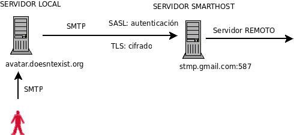
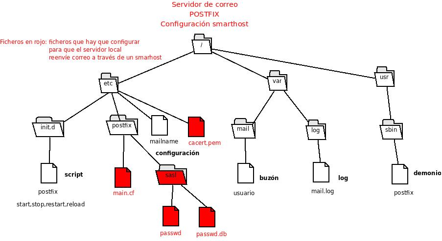

## Figura: cliente, Avatar, gmail

  

En la figura anterior se observa que el usuario envía correo vía SMTP usando Avatar como servidor de correo local.

Avatar recibirá el mensaje. Si el destinatario es de un dominio externo, y está definido en la lista de dominios a reenviar, no buscará el servidor de correo remoto directamente, sino que por el contrario dirigirá el mensaje al servidor smarthost.

En esta situación nuestro servidor local actuará de cliente SMTP.

En los ejercicios, nuestro servidor smarthost será gmail. Gmail pide autenticación a los usuarios (SASL) y ofrece un canal seguro mediante TLS.

En los siguientes apartados configuraremos Postfix para lograr este objetivo.

## Figura: Sistema de archivos

Para tener una visión global de los [ficheros](../doc/Ficheros.md) a configurar, usa esta figura, destacándose en rojo aquellos que serán objeto de modificaciones.

  

* Configuración: sigue los pasos indicados en el ejercicio de este apartado [Ejercicio: configuración](../doc/Ejercicio_Configuracion.md); solución a los casos 3 y 5").
    
## Sobre SASL y TLS

### SASL
    
* SASL son las siglas de Simple Autenticación and Security Layer, un método para añadir soporte para la autenticación a protocolos basados en la conexión que ha sido estandarizado por la IETF (Internet Engineering Task Force). Se usa en servidores para manejar las peticiones de autenticación de los clientes. Para ello, el protocolo incluye un comando para identificar y autenticar un usuario contra un servidor y para, opcionalmente, negociar la protección de las subsiguientes interacciones del protocolo. Si se negocia su uso, una capa de seguridad es añadida entre el protocolo y la conexión.  
* Podemos encontrar información detallada de SASL en la página web [https://www.ietf.org/mailman/listinfo/sasl](https://www.ietf.org/mailman/listinfo/sasl)  
* A tener en cuenta en la configuración (apartado [Ejercicio: configuración](../doc/Ejercicio_Configuracion.md) de [ficheros](../doc/Ficheros.md); solución a los casos 3 y 5”_):
    * Para que nuestro servidor Postfix reenvíe el correo a través de gmail debe autenticarse ante él. Gmail usa autenticación, y en concreto emplea los métodos PLAIN o LOGIN (Puedes verificarlo configurando una cuenta de gmail en Evolution y en la pestaña de “_Envío de correo”_ pulsar el botón de “_Comprobar tipos soportados_”)
    * Estos métodos transmiten identificaciones y claves en forma prácticamente plana, es necesario emplear bien una conexión sobre SSL o bien TLS que es otra extensión a SMTP.
    * **Importante**: Debes comprobar que tienes instalado el paquete `libsasl2-modules`, el cual contiene la librería con los diferentes métodos de autenticación (nonymous, crammd5, digest5, md5, login, plain,etc). Estas librerías deben estar instaladas en `/usr/lib/sasl2`.
    * **Interesante**: La utilidad `saslfinger` te permitirá verificar la configuración de Postfix y SASL. Descarga: `wget http://postfix.state-of-mind.de/patrick.koetter/saslfinger/saslfinger-1.0.3.tar.gz`.

        Se muestra un ejemplo de la salidad del comando `saslfinger -c` (se recomienda su lectura y prestar atención a las librerías en `/usr/lib/sasl2`):
            
            saslfinger - postfix Cyrus sasl configuration Tue Apr 20 22:01:12 BST 2010  
            version: 1.0.2  
            mode: client-side SMTP AUTH  
              
            -- basics --  
            Postfix: 2.5.5  
            System: Debian GNU/Linux 5.0 \n \l  
              
            -- smtp is linked to --  
            libsasl2.so.2 => /usr/lib/libsasl2.so.2 (0xb7d98000)  
              
            -- active SMTP AUTH and TLS parameters for smtp --  
            relayhost = [smtp.gmail.com]:587  
            smtp_sasl_auth_enable = yes  
            smtp_sasl_password_maps = hash:/etc/postfix/sasl/passwd  
            smtp_sasl_security_options = noanonymous  
            smtp_tls_CAfile = /etc/postfix/cacert.pem  
            smtp_tls_session_cache_database = btree:${data_directory}/smtp_scache  
            smtp_use_tls = yes  
              
              
            -- listing of /usr/lib/sasl2 --  
            total 680  
            drwxr-xr-x 2 root root 4096 2010-04-20 18:51 .  
            drwxr-xr-x 42 root root 12288 2010-04-20 18:39 ..  
            -rw-r--r-- 1 root root 13476 2009-05-24 11:20 libanonymous.a  
            -rw-r--r-- 1 root root 855 2009-05-24 11:20 libanonymous.la  
            -rw-r--r-- 1 root root 13016 2009-05-24 11:20 libanonymous.so  
            -rw-r--r-- 1 root root 13016 2009-05-24 11:20 libanonymous.so.2  
            -rw-r--r-- 1 root root 13016 2009-05-24 11:20 libanonymous.so.2.0.22  
            -rw-r--r-- 1 root root 15814 2009-05-24 11:20 libcrammd5.a  
            -rw-r--r-- 1 root root 841 2009-05-24 11:20 libcrammd5.la  
            -rw-r--r-- 1 root root 15352 2009-05-24 11:20 libcrammd5.so  
            -rw-r--r-- 1 root root 15352 2009-05-24 11:20 libcrammd5.so.2  
            -rw-r--r-- 1 root root 15352 2009-05-24 11:20 libcrammd5.so.2.0.22  
            -rw-r--r-- 1 root root 46420 2009-05-24 11:20 libdigestmd5.a  
            -rw-r--r-- 1 root root 864 2009-05-24 11:20 libdigestmd5.la  
            -rw-r--r-- 1 root root 43500 2009-05-24 11:20 libdigestmd5.so  
            -rw-r--r-- 1 root root 43500 2009-05-24 11:20 libdigestmd5.so.2  
            -rw-r--r-- 1 root root 43500 2009-05-24 11:20 libdigestmd5.so.2.0.22  
            -rw-r--r-- 1 root root 13650 2009-05-24 11:20 liblogin.a  
            -rw-r--r-- 1 root root 835 2009-05-24 11:20 liblogin.la  
            -rw-r--r-- 1 root root 13460 2009-05-24 11:20 liblogin.so  
            -rw-r--r-- 1 root root 13460 2009-05-24 11:20 liblogin.so.2  
            -rw-r--r-- 1 root root 13460 2009-05-24 11:20 liblogin.so.2.0.22  
            -rw-r--r-- 1 root root 29076 2009-05-24 11:20 libntlm.a  
            -rw-r--r-- 1 root root 829 2009-05-24 11:20 libntlm.la  
            -rw-r--r-- 1 root root 28532 2009-05-24 11:20 libntlm.so  
            -rw-r--r-- 1 root root 28532 2009-05-24 11:20 libntlm.so.2  
            -rw-r--r-- 1 root root 28532 2009-05-24 11:20 libntlm.so.2.0.22  
            -rw-r--r-- 1 root root 13970 2009-05-24 11:20 libplain.a  
            -rw-r--r-- 1 root root 835 2009-05-24 11:20 libplain.la  
            -rw-r--r-- 1 root root 14036 2009-05-24 11:20 libplain.so  
            -rw-r--r-- 1 root root 14036 2009-05-24 11:20 libplain.so.2  
            -rw-r--r-- 1 root root 14036 2009-05-24 11:20 libplain.so.2.0.22  
            -rw-r--r-- 1 root root 21710 2009-05-24 11:20 libsasldb.a  
            -rw-r--r-- 1 root root 866 2009-05-24 11:20 libsasldb.la  
            -rw-r--r-- 1 root root 18080 2009-05-24 11:20 libsasldb.so  
            -rw-r--r-- 1 root root 18080 2009-05-24 11:20 libsasldb.so.2  
            -rw-r--r-- 1 root root 18080 2009-05-24 11:20 libsasldb.so.2.0.22  
              
              
            -- permissions for /etc/postfix/sasl/passwd --  
            -rw------- 1 root root 51 2010-04-19 09:29 /etc/postfix/sasl/passwd  
              
            -- permissions for /etc/postfix/sasl/passwd.db --  
            -rw-r--r-- 1 root root 12288 2010-04-19 09:33 /etc/postfix/sasl/passwd.db  
          
            /etc/postfix/sasl/passwd.db is up to date.  
              
            -- active services in /etc/postfix/master.cf --  
            # service type private unpriv chroot wakeup maxproc command + args  
            # (yes) (yes) (yes) (never) (100)  
            smtp inet n - - - - smtpd  
            pickup fifo n - - 60 1 pickup  
            cleanup unix n - - - 0 cleanup  
            qmgr fifo n - n 300 1 qmgr  
            tlsmgr unix - - - 1000? 1 tlsmgr  
            rewrite unix - - - - - trivial-rewrite  
            bounce unix - - - - 0 bounce  
            defer unix - - - - 0 bounce  
            trace unix - - - - 0 bounce  
            verify unix - - - - 1 verify  
            flush unix n - - 1000? 0 flush  
            proxymap unix - - n - - proxymap  
            proxywrite unix - - n - 1 proxymap  
            smtp unix - - - - - smtp  
            relay unix - - - - - smtp  
            -o smtp_fallback_relay=  
            showq unix n - - - - showq  
            error unix - - - - - error  
            retry unix - - - - - error  
            discard unix - - - - - discard  
            local unix - n n - - local  
            virtual unix - n n - - virtual  
            lmtp unix - - - - - lmtp  
            anvil unix - - - - 1 anvil  
            scache unix - - - - 1 scache  
            maildrop unix - n n - - pipe  
            flags=DRhu user=vmail argv=/usr/bin/maildrop -d ${recipient}  
            uucp unix - n n - - pipeflags=Fqhu user=uucp argv=uux -r -n -z -a$sender - $nexthop!rmail ($recipient)  
            ifmail unix - n n - - pipe  
            flags=F user=ftn argv=/usr/lib/ifmail/ifmail -r $nexthop ($recipient)  
            bsmtp unix - n n - - pipe  
            flags=Fq. user=bsmtp argv=/usr/lib/bsmtp/bsmtp -t$nexthop -f$sender $recipient  
            scalemail-backend unix - n n - 2 pipe  
            flags=R user=scalemail argv=/usr/lib/scalemail/bin/scalemail-store ${nexthop} ${user} ${extension}  
            mailman unix - n n - - pipe  
            flags=FR user=list argv=/usr/lib/mailman/bin/postfix-to-mailman.py  
            ${nexthop} ${user}  
              
            -- mechanisms on [smtp.gmail.com]:587 --  
              
              
            -- end of saslfinger output --  
              

### TLS
    
* Por defecto, toda comunicación en Internet se hace sin ningún tipo de encriptación y sin una autenticación fiable. Esto significa que cualquiera con acceso físico a la línea de datos por la que viaja un paquete puede espiar dicha comunicación. Aún peor, es posible redirigir o alterar esa comunicación para que la información que se desea mandar se pierda y nadie se dé cuenta.
* De cara a solventar estos problemas de seguridad, Netscape, Inc. introdujo el protocolo SSL (Secure Sockets Layer), que ha ido evolucionando en el protocolo estandarizado TLS (Transportation Layer Security). Ofrece tanto encriptación de la comunicación (frenando las escuchas) como autenticación fuerte (asegurando que ambas partes de una comunicación son correctamente identificadas y que la comunicación no puede ser alterada).
* Postfix/TLS no implementa el protocolo TLS por sí mismo, sino que usa el paquete OpenSSL para esta tarea. En la página de OpenSSL, [www.openssl.org](http://www.openssl.org/), pueden encontrarse enlaces a documentación que profundiza en el protocolo y sus características.
* Comprueba con `dpkg -l openssl` que tienes instalado el paquete.
