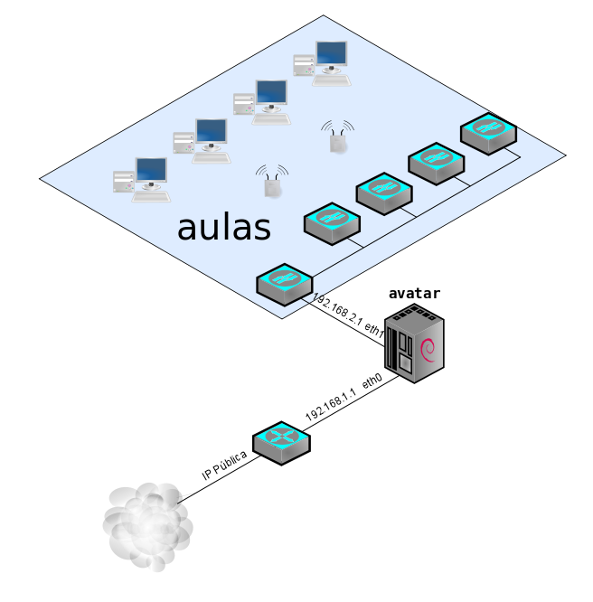

Por centrarnos en algún caso concreto, hemos pensado que sería una buena idea orientar el curso a simular el esquema de red que nos podemos encontrar en cualquier instituto e instalar y administrar un servidor para ofrecer todos los servicios necesarios en en centro. Esto se puede hacer de diversas maneras, incluso es bastante habitual que parte de los servicios estén en equipos externos (hosting por ejemplo). En nuestro caso vamos a suponer que el servidor, que vamos a llamar avatar, ofrecerá servicios a Internet (web y correo) y a la intranet (DNS, DHCP, Proxy, ...), por lo tanto será necesario que nuestro equipo tenga al menos dos interfaces de red, una que nos dará acceso a Internet y otra donde se conectarán los clientes de nuestra red. Ya que vamos a ofrecer servicios a Internet sería necesario un esquema de red con una zona para alojar los servidores, lo que se denomina una Zona Desmilitarizada (DMZ), aunque en este caso, simplemente por no complicar el curso, vamos a utilizar un solo equipo como tanto para el cortafuegos y NAT, servidor de cara a Internet y servidor de la Intranet. Un esquema de red de este tipo sería algo como:

* eth0: Será la interfaz de red que nos da acceso a Internet, normalmente la empresa proveedora de servicios de internet (ISP) nos suministran un router que hace de pasarela con Internet, en este caso la eth0 tendrá una dirección de red privada. Otra alternativa que podemos encontrar es que la ISP nos dé la posibilidad de conectarnos mediante un módem o cable-módem, en este caso la eth0 tendrá la dirección IP pública.
* eth1: Será la interfaz que nos permita conectar los clientes al servidor. La configuración más usual es conectar un switch o conmutador a esta interfaz de donde se conecta la estructura de red para el acceso de los clientes (por ejemplo, un switch por aula, un switch por ciclo, puntos de acceso, ...)
* El sistema operativo que instalaremos en nuestro servidor será Debian GNU/Linux en su versión estable, actualmente 5.0 (Lenny). Si alguien desea utilizar otra distribución de GNU/Linux deberá asumir que puede haber pequeñas diferencias en las configuraciones, que deberá solventar él/ella mismo/a. 

