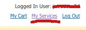
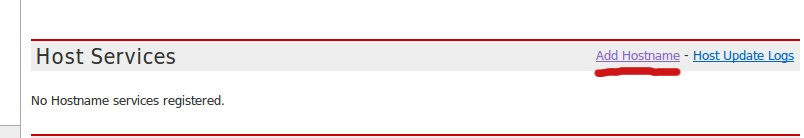
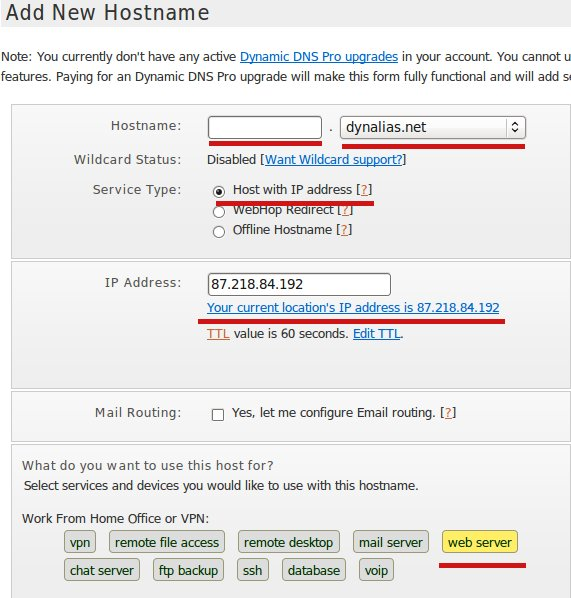
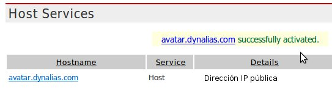

El objetivo final de las dos primeras unidades, es configurar y administrar de manera básica nuestro servidor avatar, y montar un servidor web con una plataforma educativa moodle accesible desde Internet.

Llegados a este punto tenemos el servidor avatar instalado y conectado a Internet, el router configurado para hacer NAT y la aplicación moodle funcionando sobre el sistema LAMP, ¿qué nos falta? pues la configuración de un servidor DNS externo con un nombre de dominio dirigido en todo momento a nuestra dirección IP pública. Dependiendo del tipo de acceso a Internet que tengamos y si tenemos o no previamente un nombre de dominio registrado pueden darse los siguientes casos:

* Tenemos dirección IP pública estática y un nombre de dominio registrado y apuntando a nuestra dirección IP pública: Este es el caso ideal y no necesitaríamos configurar nada.
* Tenemos dirección IP pública estática y no tenemos un nombre de dominio registrado: Recomendamos utilizar `dyndns.com` o cualquier servicio similar que nos permita almacenar un registro DNS gratuito.
* Tenemos una dirección IP dinámica y un nombre de dominio registrado: Utilizamos la aplicación que nos proporcione la empresa en la que tenemos registrado el dominio para actualizar el registro DNS cada vez que cambie la dirección IP
* Tenemos dirección IP dinámica y no tenemos registrado un nombre de dominio: Seguramente el caso más habitual, entonces recomendamos utilizar `dyndns.com`, que es un servicio gratuito de gestión de nombres de dominios, aunque puede utilizarse cualquier otro si así se prefiere.

Para tener un nombre de dominio gratuito para realizar esta práctica os sugerimos que utilices los servicios de dyndns, que, entre otros servicios, nos ofrece nombres de dominios gratuitos, para ello sigue los siguientes pasos:

1. Registra y activa una nueva cuenta.
2. Después de hacer login, tienes que ir a la opción "My Services".

    

3. A continuación añadimos un nuevo nombre de dominio en la opción "Add Hostname":

    

4. A continuación elige el nombre del dominio y el del subdominio, entre la lista de opciones que hay). El tipo de servicio será "Host with IP address", y en el cuadro de texto IP Address escribe tu IP pública actual (que la encontrarás en la línea de abajo"). Indica que vas a poner un servidor web y añade al carro. Te sale una factura (no te preocupes que es de 0 $), le das a "Siguiente" y activas el servicio.

    

    Nosotros hemos creado la dirección `avatar.dynalias.net`

    

## ¿Y si tengo una IP dinámica?

La mayoría de los servicios ADSL que tenemos contratado usan dhcp para asignarnos una dirección IP a nuestro router. Cuando apagamos y encendemos de nuevo el router obtenemos otra dirección IP y debemos actualizar el DNS externo de dyndns para que al acceder a nuestro nombre de dominio se acceda a la IP correcta. Para ello vamos a utilizar un servicio en nuestro servidor avatar, que al cambiar nuestra IP pública actulice el servidor DNS dyndns automáticamente. El servicio se llama `ddclient`.

Para instalar `ddclient`:

    avatar:~# apt-get install ddclient

El propio sistema de instalación de paquetes de Debian te preguntará los parámetros de configuración. A continuación se ponen unos valores de ejemplo figurados.

* **servidor?** `www.dyndns.org`
* **host?** `avatar.dynalias.com`
* **usuario?** dnsuser
* **clave?** miclave
* **interface?** no hace falta indicarla

El archivo de configuración lo encontramos en `/etc/ddclient.conf`

Nos tenemos que asegurar que la directiva use tenga el valor web, para que se obtenga la IP pública, por lo tanto modificamos el fichero de configuración y nos aseguramos que esté la siguiente línea:

    use=web

Si modificamos el archivo de configuración, recuerda reiniciar el servicio:

    avatar:~# /etc/init.d/ddclient restart

Y eso es todo, cada cierto tiempo, tu demonio ddclient se conectará al servidor y le indicará tu nueva IP, así que no importa que cambie.

## Configuración de dyndns en el router

Hay algunos modelos de router que incluyen su propio cliente de dyndns, por lo que no es necesario instalar el paquete ddclient en avatar sino configurar este cliente para dyndns en el propio router.

## ¿Qué ocurre si desde nuestro cliente accedemos a nuestro nombre de dominio?

En el punto del curso donde nos encontramos, tenemos el siguiente problema: si accedemos a `avatar.dynalias.org` desde nuestro cliente, éste obtendrá dirección IP pública del DNS y no la dirección privada de nuestro servidor IP (192.168.2.1), por lo que no podrá acceder a avatar. Hay varias formas de solucionarlo, aunque la más conveniente se verá en la siguiente unidad, explicamos una solución para este momento: Trabajar con la resolución estática de nombres y modificar el fichero `/etc/hosts` de la siguiente manera:

    # nano /etc/hosts

    192.168.2.1 avatar.dynalias.com avatar

Además cuando hemos instalado moodle, hemos indicado durante la instalación la dirección URL base, está la debemos cambiar para que sea nuestro nuevo nombre de dominio. Para ello modificamos el archivo `config.php` de moodle y cambiamos la siguiente variable:

    $CFG->wwwroot = 'http://avatar.dynalias.com/plataforma';

Siendo "plataforma" el nombre del directorio donde se ha instalado moodle.