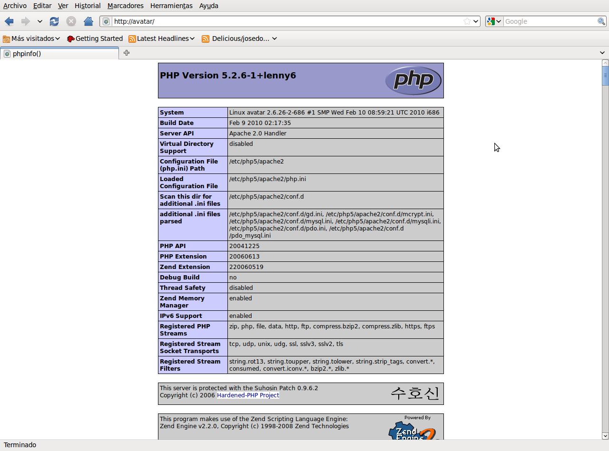
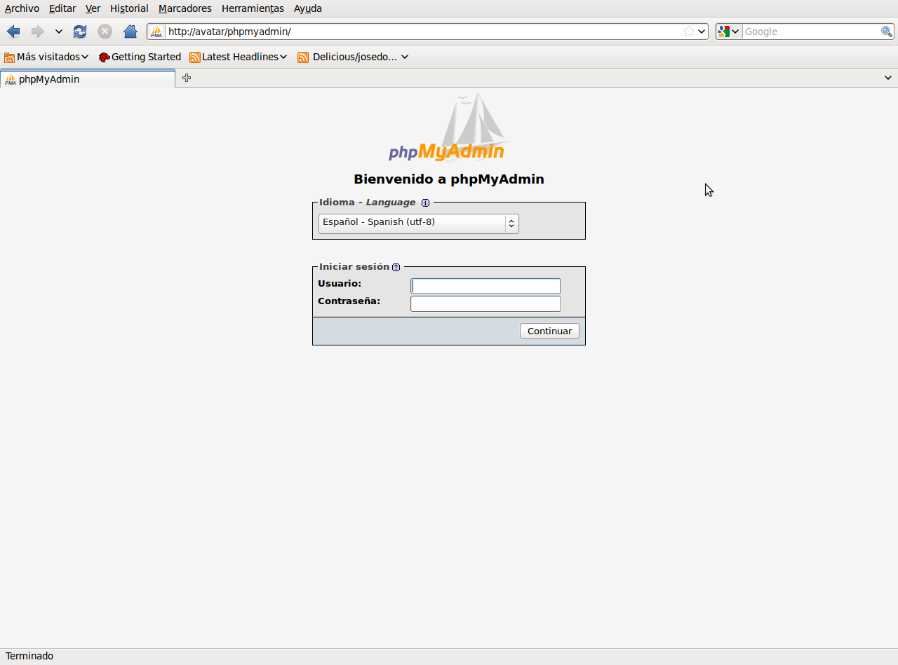

## Instalación de LAMP

Ahora vamos a instalar los paquetes necesarios para tener un entorno LAMP.  
  
### Apache  

    avatar:~# apt-get install apache2

### MySQL

    avatar:~# apt-get install mysql-common mysql-client mysql-server

Durante la instalación del servicio se nos pedirá la contraseña del usuario root del servidor mysql.  
  
### PHP5  

    avatar:~# apt-get install php5 libapache2-mod-php5 php5-mysql

Eso es todo, como gestor de la base de datos podemos utilizar `phpmyadmin`, que es una aplicación php que me permite acceder a todas las funciones de MySQL  

    avatar:~# apt-get install phpmyadmin

En la instalación del paquete `phpmyadmin` nos preguntará el servidor web que estamos utilizando, para realizar la configuración automática. En nuestro caso escogeremos la opción Apache2.  

Voila!, eso es todo.  

## Prueba de funcionamiento

Para probar el funcionamiento de Apache y PHP es habitual crear un documento crear un documento `index.php` en el directorio `/var/www` con el siguiente contenido (hay que borrar el archivo `index.html` que hay en `/var/www` para que no sea el que se visualice por defecto):  

    <html>
    <body>
       <? echo phpinfo(); ?>
    </body> 
    </html> 

Para acceder desde el navegador del cliente al servidor web vamos a utilizar el nombre del servidor (avatar) para ello hay que indicar en el fichero `/etc/hosts` la relación que hay entre su nombre y su dirección IP.

    # nano /etc/hosts

    192.168.2.1 avatar 

De esta manera, cuando en en navegador del cliente pongamos `http://avatar`, debe aparecer información sobre la versión PHP instalada.

Y si queremos acceder al gestor de la base de datos debemos acceder a `http://avatar/phpmyadmin`

