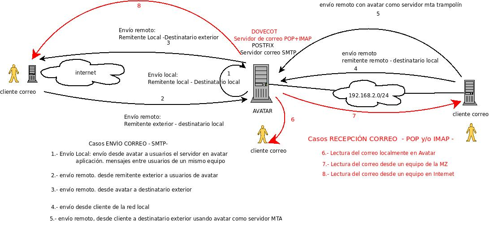
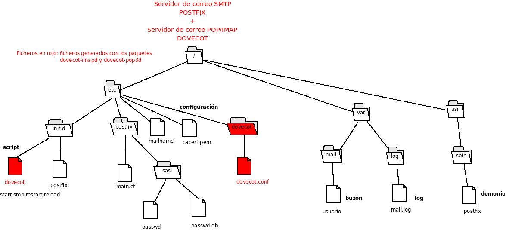
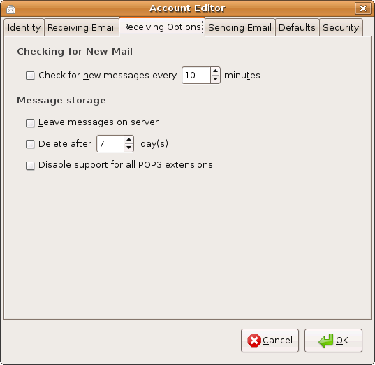
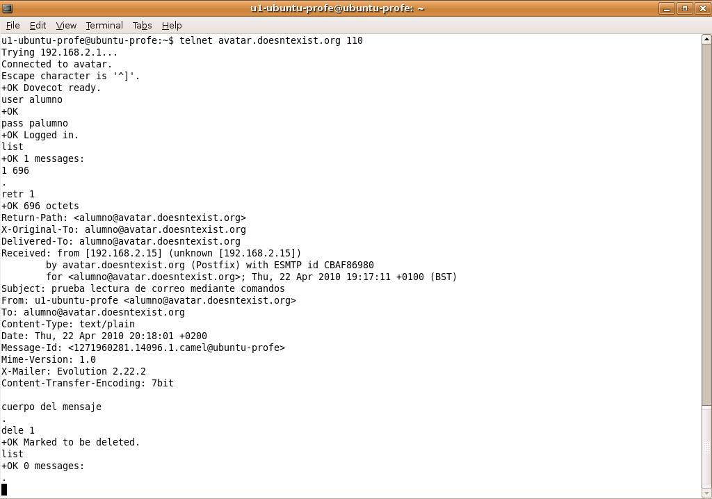

## Objetivo

Una vez conseguido el envío de correo a usuarios de nuestro dominio local (casos 1, 2 y 4) y a usuarios de otros dominios (casos 3 y 5 con ayuda del smarthost), nos queda pendiente la recepción del correo dirigido a usuarios de nuestro dominio `avatar.doesntexist.org`.

Leeremos el correo desde el propio servidor Avatar, siendo éste el **caso 6**, continuación haremos la lectura desde los equipos clientes de nuestra red (**caso 7**), y por último leeremos el correo desde fuera de nuestra red, desde Internet (**caso 8**). En definitiva, cuando se envíe un correo a un usuario de `avatar.doesntexist.org`, éste podrá acceder a su correo desde la propia red local (sentado frente a Avatar o en cualquier equipo de la red), e incluso desde otro puesto en Internet.

Los protocolos de lectura de correo a configurar son POP3 e IMAP. Conseguiremos este objetivo gracias a Dovecot, que además puede configurarse para un acceso cifrado, POP3s y IMAPs.

## Figura

  

## Sistema de archivos

  

## Instalación y configuración del servidor

El proceso de instalación está detallado en el fichero PDF (apartados 5 y 6). Léelo.  

Tanto en IMAP como POP es necesario autenticarse ante el servidor. El método a configurar es texto plano. Además debemos indicarle al servidor donde está el buzón de correo. Una vez realizada la instalación de ambos paquetes, dovecot-imapd y dovecot-pop3d, debes revisar el fichero de configuración /etc/dovecot/dovecot.conf y configurar las directivas:  

* `disable_plaintext_auth = no`: para permitir la autenticación en texto plano
* `ssl_disable = yes`: no usamos una conexión segura
* `mail_location = /var/mail/%u`: con %u indicamos que acceda al fichero del usuario autenticado.
* `auth default { mechanisms = plain login... }`: acceso mediante texto plano

No olvides reiniciar el servicio cuando hagas cambio en el fichero (`/etc/init.d/dovecot restart`).

## Caso 6: lectura desde Avatar

Podemos hacer uso de la utilidad `mail` para hacer una lectura del correo recibido. Antes debemos registrarnos en el sistema con nuestra cuenta de usuario.  

Otro modo de leer el correo es accediendo directamente al **buzón** (`less /var/mail/usuario.log`).  

Las 2 posibilidades anteriores se han visto en apartados anteriores.

Existe otra posibilidad: mediante **comandos** (se explica en el Caso 7).

## Caso 7: lectura desde un cliente de la red

Es la situación típica. Queremos dar servicio de correo a nuestros cliente de la red local. Ya hemos configurado Postfix y los clientes para el envío. Ahora toca leer nuestro correo. Usaremos un cliente gráfico, nuestro evolution, y después lo haremos modo comando.

### Configuración de Evolution
    
En el caso 4 se explicó la configuración de Evolution para el envío de correo. Se creó una cuenta de correo. Vuelve a editarla y selecciona la pestaña de “Envío” (en nuestra imagen “Sending email”.  
    
* Cuenta POP  

    
    
    
    
    Observa en la opciones que podemos dejar los mensajes en el servidor (por defecto, POP recoge los mensajes del servidor y los elimina).  

* Cuenta IMAP:

    

    Con IMAP, sin embargo, el correo es descargado, pero se mantiene una copia en el servidor (este comportamiento da mayor movilidad al usuario, ya que el correo es accesible desde cualquier equipo al tener siempre copia en el servidor).  

    **Pruebas**: Haz pruebas de envío de correos(casos 1, 2 ó 4) a la cuenta `alumno@avatar.doesntexist.org`, y lee el correo con los 2 protocolos, POP e IMAP. Comprueba que IMAP deja copia en el servidor y POP, si no está configurado para lo contrario, los elimina.

### Acceso modo comando
    
 
    
En la figura anterior se hace la lectura de los mensajes del usuario `alumno@avatar.doesntexist.org`.

1. La conexión se realiza con `telnet avatar.doesntexist.org 110` 8 (Acceso mediante POP). 
2. Una vez conectado, nos autenticamos con los comandos `user` y `pass`
3. Con `list` nos aparece la lista de mensajes (aparece un número de mensaje y el tamaño del mismo).
4. Para leer el contenido de un mensaje, debes usar el comando `retr` y el número del mensaje.
5. Este comando, `retr`, no borra el mensaje del servidor, por lo que debemos, si es así nuestra intención después de haberlo leído, lanzar el comando dele con el número de mensaje.  

## Caso 8: acceso desde Internet

Si queremos leer el correo desde fuera de nuestra red local, debemos configurar nuestro router para que reenvíe el tráfico POP y/o IMAP hacia nuestro servidor avatar (de la misma forma que hicimos con HTTP o SMTP). ¿Te atreves?