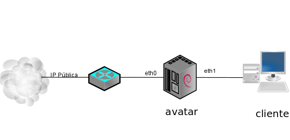

Siguiendo el esquema de red seleccionado:  
  

  

Vamos a configurar un servidor DHCP para repartir IP en la red 192.168.2.0/24 en nuestra red interna, para ello configura el servidor DHCP de avatar con las siguientes características:  
  
* Tiempo de concesión: 1 mes
* Rango de direcciones: 192.168.2.100 - 192.168.2.150
* Puerta de enlace: 192.168.2.1
* Servidores DNS: 8.8.8.8 y 8.8.4.4

Para comprobar que has realizado la tarea correctamente envía el contenido del fichero `/var/lib/dhcp3/dhcpd.leases` de avatar donde se pueden comprobar las direcciones IP que se han asignados.