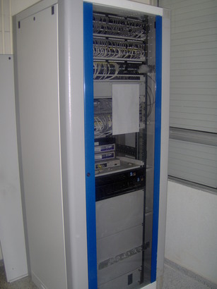
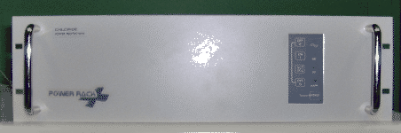
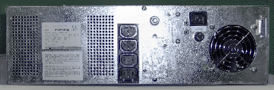
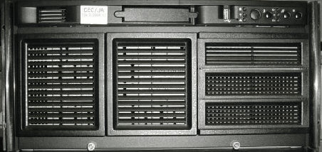
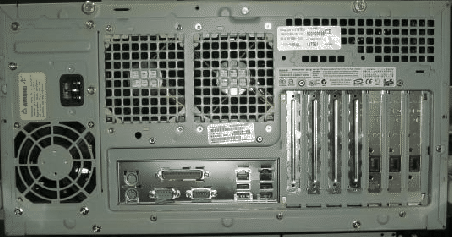
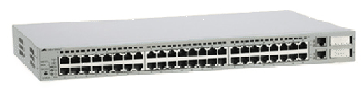
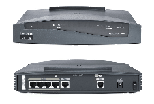
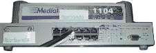
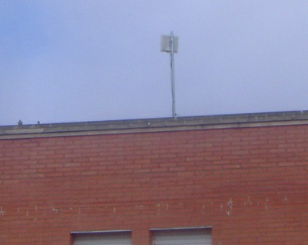

## Cableado troncal

Dispuesto a lo largo de todo el instituto en bandejas de PVC y encargado de conectar mediante cable de red todas las aulas con el armario de datos. Aunque un aula no sea TIC tiene una roseta que puede conectarla a la red TIC.  
## Armario de datos

Debe encontrarse en una habitación donde no haya tránsito de personas ya que contiene un equipamiento que provoca mucho calor y ruido. Se trata de un armario de más de metro y medio de alto que contiene los principales componentes para el funcionamiento de las comunicaciones y el software de todo el centro.  
  
  
  
El armario de datos del IES Gonzalo Nazareno se encuentra situado en el cuarto de ..., contiguo al departamento de Geografía e Historia  

## S.A.I.

Un SAI (en castellano ``Sistema de Alimentación Ininterrumpida'') es un dispositivo que, gracias a su baterí­a de gran tamaño y capacidad, puede proporcionar energí­a eléctrica tras un apagón a todos los dispositivos eléctricos conectados a él. Otra función que cumple es la de regular el flujo de electricidad, controlando las subidas y bajadas de tensión existentes en la red eléctrica.

Todos los componentes electrónicos del armario de datos deben estar conectados a este dispositivo.

Suele encontrarse en la parte baja del armario de datos por su peso y tiene el aspecto que aparece en la imagen siguiente.

  
  
  
  
## Servidor de seguridad o f0

Es un ordenador más potente que el resto de ordenadores de sobremesa del centro que se encarga principalmente de:

* Proteger el centro frente ataques externos.
* Guardar temporalmente las últimas páginas visitadas.
* Filtrar el contenido web.
* Servidor de nombres de dominio (DNS).
* Configuración automática de las redes del centro.
* Almacenar y servir las imágenes del sistema de instalación remota.

Suele encontrarse empotrado en la mitad del armario junto al servidor de contenidos.   

  

## Servidor de contenidos o c0

Es un ordenador más potente que el resto de ordenadores de sobremesa del centro que se encarga principalmente de:

* Almacenar y servir la Plataforma Educativa.
* Guardar temporalmente los paquetes y actualizaciones para los clientes.
* Servir aplicaciones de gestión del centro.
* Almacenar los directorios personales de cada usuario.
* Detectar y configurar las impresoras en red del centro (excepto en la subred alumnos).

Suele encontrarse empotrado' en la mitad del armario junto al servidor de seguridad.

## Switch principal

Un switch (en castellano conmutador) es un dispositivo de interconexión de redes de ordenadores. En nuestro caso los switches principales sirven para separar las subredes virtuales de alumnos, profesorado y gestión y conectar el resto de los equipos del centro a los servidores del armario de datos.

Dependiendo del número de equipos del centro, pueden existir uno o varios switches conectados entre sí­. Suele encontrarse en la parte alta del armario de datos encima de los servidores. Hay que diferenciarlo de los paneles de parcheo que suelen estar en la parte más alta del armario y sirven para que la conexión entre las aulas, los equipos y el switch principal sea más cómoda.  

## Router

Un router (en castellano enrutador o encaminador) es también un dispositivo de interconexión de redes de computadoras. En nuestro caso hace de enlace entre la Red Coorporativa de la Junta de Andalucí­a (R.C.J.A.) y la red interna de vuestro centro TIC. Es el dispositivo que permite la comunicación del centro con el exterior.  
  
  

## Dispositivos LMDS 

Además de los componentes ya mencionados, dependiendo del tipo de conexión que disponga el centro, podrán existir en el armario de datos algunos dispositivos complementarios para la conexión de la antena del sistema LMDS. Es una tecnologí­a de conexión ví­a radio que permite, gracias a su ancho de banda, el despliegue de servicios fijos de voz y acceso a Internet.  

  

## Antena

Localizada en la azotea del Instituto y conectada a los dispositivos LMDS.  

  
 
> Referencias:  
> Guía de Centros TIC (CGA) (http://www.juntadeandalucia.es/averroes/guadalinex/files/guia\_centros\_tic.pdf  
  
> Este documento se distribuye bajo una licencia Creative Commons Reconocimiento-NoComercial-CompartirIgual  
  
> Reconocimiento. Debe reconocer los créditos de la obra de la manera especificada por el autor o el licenciador.  
> No comercial. No puede utilizar esta obra para fines comerciales.  
> Compartir bajo la misma licencia. Si altera o transforma esta obra, o genera una obra derivada, sólo puede distribuir la obra generada bajo una licencia idéntica a ésta.  
  
> Para más información visitar: http://creativecommons.org/licenses/by-nc-sa/2.5/es/