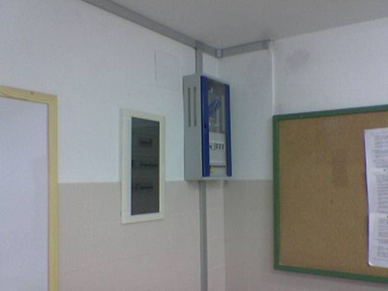
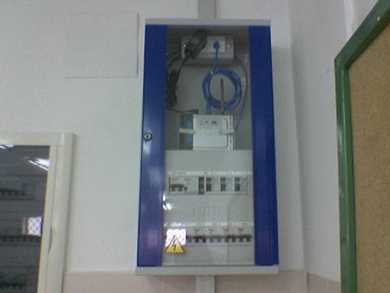
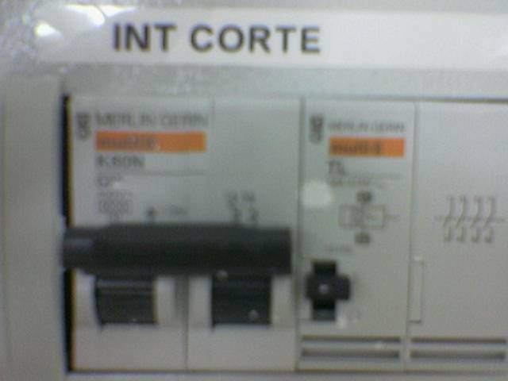
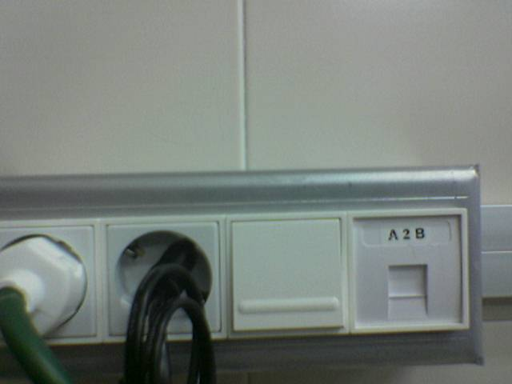
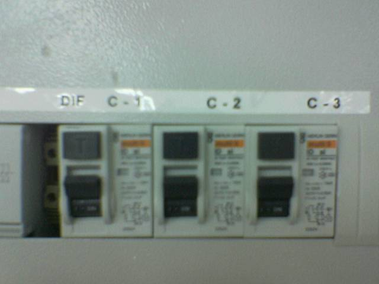
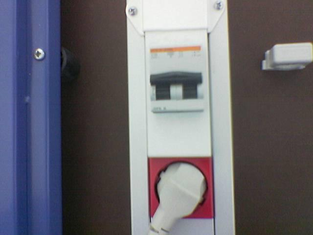
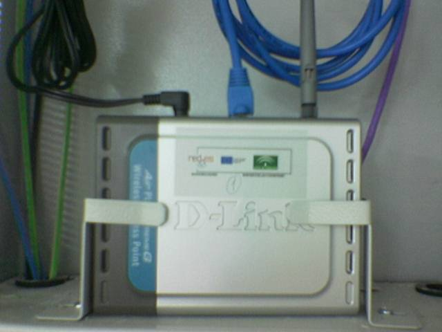

## Introducción

El objetivo de este documento es dar orientaciones básicas para utilizar las aulas TIC.

A continuación se muestran las orientaciones desglosadas en varios pasos.

## Antes de entrar en el aula

Para poder entrar en una aula TIC necesitamos una llave maestra de aulas TIC, tenemos dos llaves maestras: las que abren las puertas de madera y las que abren las puertas metálicas. En ocasiones, y en algunas clases TIC es posible que necesitemos la llave pequeña que abra el cajetín de los ordenadores para encender manualmente los ordenadores. Esto sería necesario si detectáramos que el encendido automático de los ordenadores (con las teclas Control + F12) no funcionaran en esa aula.

## Elementos del aula

Cuando entramos en un aula TIC nos vamos a encontrar varios elementos que controlan el suministro eléctrico, el punto de acceso Wireless, los ordenadores integrados en las mesas y sus periféricos

## Suministro eléctrico

El cuadro del suministro eléctrico se encuentra colgado en la pared y tiene un aspecto parecido al de la imagen. Según se acordó en claustro, el aula TIC debe ser abierta por el profesor, por lo tanto en ningún momento los alumnos se quedan slos en clase, por lo tanto este armario puede estar abierto.

Dentro del cuadro se encuentran los interruptores y diferenciales que controlan el suministro; y el punto de acceso Wireless (Red de datos inalámbrica).

Dentro del cuadro el interruptor de corte corta o suministra electricidad a todas las conexiones del aula. Hacia arriba esta encendido, hacia abajo esta apagado. Si no podemos subir el interruptor de corte es debido a que algún equipo esta cortocircuitando la instalación y hay una averia. Solo conseguiremos subirlo si desenchufamos ese equipo de la red.
Cuando un profesor termine de trabajar con los ordenadores, es su responsabilidad apagar el suministro eléctrico. El siguiente profesor que abra la clase se deberá encontrar este conector desconectado.

A su lado se encuentra el interruptor que se controla de forma externa mediante el pulsador para apagar y encender los monitores (los equipos siguen encendidos). El pulsador se encuentra cerca de la mesa del profesor.

Los diferenciales son dispositivos que cortan la corriente de forma automática cuando se produce una sobrecarga de la red o un cortocircuito. Cuando hay varios cada uno controla el suministro a un grupo de ordenadores y monitores. En la parte superior tienen un botón de prueba que al pulsarlo deben cortar la corriente eléctrica, en caso de no hacerlo algo funciona mal por dos posibles motivos:

* No hay suministro eléctrico, o bien el interruptor de corte esta bajado o bien no hay suministro externo.
* Hay suministro pero no corta la corriente. En este caso tenemos una averia grave, ya que si se produjera un cortocircuito no se cortaría la corriente eléctrica y no evitaría que alguien se pudiera electrocutar. En este caso debemos comunicarlo a mantenimiento.

En las mesas, por debajo, hay varios enchufes y dos diferenciales situados a cada uno de los lados. El enchufe de color rojo se utiliza para el monitor (cable blanco) y son controlados por el pulsador del profesor, los del otro lado se utilizan para el ordenador y los periféricos (cable negro). Junto a los enchufes hay diferenciales que funcionan de forma similar a los del cuadro.

Si un equipo no enciende debemos verificar que los enchufes estan conectados y los interruptores de los diferenciales miran hacia el botón.

## Red de datos. Acceso a Internet

En la parte superior se encuentra el punto de acceso inalámbrico. Si por algun motivo necesitamos reiniciar el aparato lo desenchufaremos de la corriente y pasados unos segundos lo volveremos a enchufar. Levantándolo podemos ver si esta encendido un led verde que indica que esta funcionando.

Debemos tener en cuenta que en ocasiones un grupo numeroso de alumno pueden hacer funcionar mal la red inalámbrica debido a que la red funciona a 2,4Gigahercios, y esta frecuencia es absorbida por el cuerpo humano.

Si por algún motivo queremos conectar un equipo adicional sin red inalámbrica tenemos acceso a un conector de red (recordar que debemos tener un cable de red). En la imagen lo podemos ver a la derecha del pulsador. Levantando la tapa aparece el conector.

> Referencias:
> Curso TIC IES Atalaya (http://www.juntadeandalucia.es/averroes/iesatalaya/indice.html)

> Este documento se distribuye bajo una licencia Creative Commons Reconocimiento-NoComercial-CompartirIgual

> Reconocimiento. Debe reconocer los créditos de la obra de la manera especificada por el autor o el licenciador.
> No comercial. No puede utilizar esta obra para fines comerciales.
> Compartir bajo la misma licencia. Si altera o transforma esta obra, o genera una obra derivada, sólo puede distribuir la obra generada bajo una licencia idéntica a ésta.

> Para más información visitar: http://creativecommons.org/licenses/by-nc-sa/2.5/es/