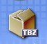

## Introducción  

Un **formato de fichero** es una manera particular de codificar información para almacenarla en un [fichero informático](http://es.wikipedia.org/w/index.php?title=Fichero_inform%C3%A1tico&action=edit).

Dado que una [unidad de disco](http://es.wikipedia.org/wiki/Unidad_de_disco), o de hecho cualquier [almacenamiento informático](http://es.wikipedia.org/wiki/Almacenamiento_inform%C3%A1tico), la computadora debe tener alguna manera de convertir la [información](http://es.wikipedia.org/wiki/Informaci%C3%B3n) a ceros y unos y viceversa. Hay diferentes tipos de formatos para diferentes tipos de información. Sin embargo, dentro de cada tipo de formato, por ejemplo documentos de un [procesador de texto](http://es.wikipedia.org/wiki/Procesador_de_texto), habrá normalmente varios formatos diferentes, a veces en competencia. sólo puede almacenar

## Formatos abiertos y cerrados

Tradicionalmente se han utilizado todo tipo de formatos cerrados propios de la empresa que desarrollaba un determinado programa. Esto provoca un serio problema de incompatibilidad a la vez de una gran dependencia del usuario de un determinado producto. El caso paradigmático es el de procesador de textos Ms Word, cuyo formato de fichero ".doc" se ha ido modificando paulatinamente para hacerlo cada vez más complejo e incompatible, dándose la paradoja que son incompatibles incluso diferentes versiones del mismo formato.  
  
En contraposición a esto existen formatos libres y estandarizados que cualquier programa puede utilizar de forma completa, como son los formatos html para páginas web o más recientemente los formatos OpenDocument para aplicaciones ofimáticas.  
  

## Formato de Ficheros de texto  

  

**DOC**

Fichero creado por el procesador de textos Ms Word. Se puede trabajar en OpenOffice pero puede cambiar el formato.

 

**SXW**

Fichero realizado por el procesador de textos OpenOffice 1.0. No se puede trabajar en Word.

  

**ODT**

Formato de procesador de textos estándar (OpenDocument), en Guadalinex v3 se genera mediante OpenOffice 2.0.  

  

**TXT**

Fichero de formato de texto plano. Generado por el bloc de notas de Windows o el gEdit de Guadalinex.

  

**PDF**

Formato estándar para intercambio de ficheros. Inicialmente propiedad de Adobe, pero hasta su versión 1.4 liberado bajo estándar ISO. Normalmente no se puede modificar y se suele leer en un navegador o visores de documentes como Acrobat Reader, evince, xpdf, gpdf, etc. Es usado para documentos profesionales y se puede generar directamente desde OpenOffice.

## Formato de Ficheros de Imágenes

  

**JPG JPEG**

Formato comprimido de mapa de bits muy extendido. Es un formato comprimido pues prescinde de los datos de color de la imagen que no están en el espectro visible.  

  

**GIF**

Usado especialmente con animaciones y gráficos con regiones transparentes. Suele tener poca calidad y fue un formato cerrado por lo que su utilización ha descendido en favor del PNG.  

  

**PNG**

Tiene similares características al GIF aunque se trata de un formato más evolucionado y de mayor calidad, con muy buenas ratios de compresión y soporte para multitransparencia. Posee una licencia libre y ha experimentado una gran difusión últimamente.  

  

**TIFF**

Se utiliza para almacenar imágenes sin pérdida de calidad, por lo que genera tamaños de archivo mayores que el resto pese a que incorpora un algoritmo de compresión.  

  

**SVG**

Para ilustraciones vectoriales.  

## Formato de Ficheros Comprimidos

  

**ZIP**

El formato zip es el más utilizado en el mundo de la informática. Una de las características más interesantes de este formato es que se puede leer fácilmente en cualquier sistema. Por ello, es una buena opción si queremos intercambiar ficheros entre Windows y Linux.  

  

**RAR**

Formato de archivo también muy extendido y generado en Windows por el programa WinRAR. Este formato también se puede abrir fácilmente en Guadalinex.  

  

**TAR**

El formato tar es únicamente de empaquetado, no de compresión. La aplicación para trabajar con este formato se denomina 'tar'. De la misma manera se llaman los ficheros que genera.  

  

**TAR.GZ**

**TGZ**

En el mundo UNIX es muy habitual combinar varios programas sencillos para realizar una tarea más compleja. Como acabamos de ver, un fichero 'tar' es un archivo que contiene otros muchos pero que no está comprimido. El complemento a la utilidad 'tar' es el programa 'gzip'. Esta aplicación nos permite comprimir un fichero. La combinación de los dos programas, nos permite pasar de un conjunto de fichero a un archivo comprimido que los contiene a todos. Los ficheros empaquetados con 'tar' y comprimidos con 'gzip' suelen tener un nombre de la forma 'nombre\_fichero.tar.gz' pero en algunas ocasiones se denominan como 'nombre\_fichero.tgz'.  

  

**Bzip2**  

La utilidad Bzip2 es similar en comportamiento a Gzip pero aporta una compresión más eficiente. De la misma forma que Gzip, Bzip2 se suele utilizar en conjunción con 'tar'. Los ficheros comprimidos con Bzip2 suelen tener la extensión '.bz2', por lo tanto, si lo utilizamos junto con 'tar' obtendremos un fichero de la forma 'nombre_fichero.tar.bz2'.  

## Formato de Ficheros de Vídeo

  

**AVI**

Formato de vídeo para Windows. Se puede utilizar en Guadalinex.  

  

**MPG**

**MPEG**

Formato estándar de vídeo. Desarrollado por un grupo de expertos para la representación de vídeo de alta calidad. Existen diferentes versiones en función de la complejidad de lo almacenado: MPEG-1, MPEG-2, etc.  

  

**MOV**

Archivos de vídeo de Apple computer.  

  

**RM**  

Archivos de vídeo de Real Player.  

## Formato de Ficheros de Audio

  

**MP3**

Formato de audio con gran capacidad de compresión y con pérdidas. Muy extendido y utilizado en dispositivos móviles.  

  

**WMA**

Formato de audio original de Windows Media Player.  

  

**OGG**

Formato de audio con gran capacidad de compresión y con pérdidas. Equivalente a mp3, pero de formato libre.

  

**WAV**

Formato de audio no comprimido. Utilizado en los CD de audio convencionales.  

## Formato de Ficheros de la Web  

**HTML**

**HTM**

Páginas web. Suelen estar acompañadas de las imágenes incluidas en la web.  

  

**SWF**

Animaciones creadas con el programa Flash de la empresa Adobe.  

> Este documento se distribuye bajo una licencia Creative Commons Reconocimiento-NoComercial-CompartirIgual  
  
> Reconocimiento. Debe reconocer los créditos de la obra de la manera especificada por el autor o el licenciador.  
> No comercial. No puede utilizar esta obra para fines comerciales.  
> Compartir bajo la misma licencia. Si altera o transforma esta obra, o genera una obra derivada, sólo puede distribuir la obra generada bajo una licencia idéntica a ésta.  
  
> Para más información visitar: http://creativecommons.org/licenses/by-nc-sa/2.5/es/