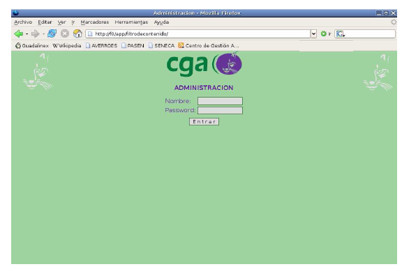
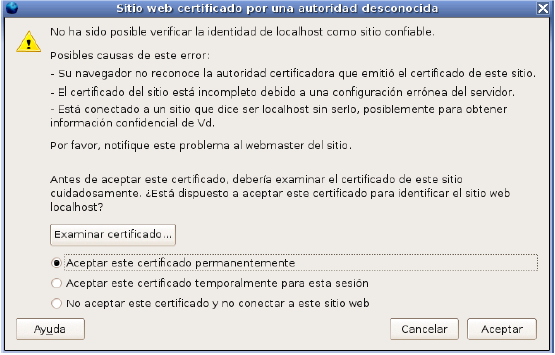
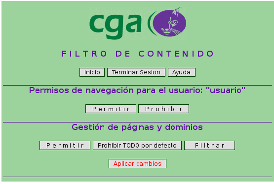
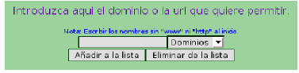
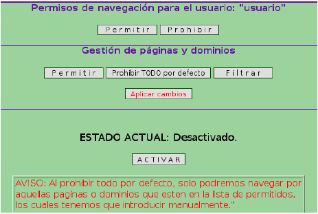
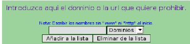

Existe una aplicación en el servidor de seguridad que le permite modi?carlo. Se accede desde el propio centro en la URL  

    http://f0/app/filtrodecontenido/  

El nombre de usuario y contraseña para acceder al filtro de contenido deben ser de profesor.  

  

Si tras pulsar en el enlace le sale alguna ventana emergente referente Certi?cados de Seguridad, simplemente pulse Aceptar y continúe.  

  

  
  
Existen básicamente dos opciones que se pueden manejar desde la aplicación.  

* Permitir o prohibir la navegación en el centro usando el login de usuario/usuario.
    Para ello pulse sobre la opción Permitir o Prohibir según su elección.  
* Gestionar páginas y dominios: Vd. puede impedir el acceso desde el centro a determinadas direcciones de páginas web o bien a un dominio completo (ej: http://www.terra.es). Existen tres opciones que se usarán según convenga:

1. Permitir: con esta opción puede permitir que se navegue por determinados dominios o páginas web. Esto es útil en el caso de querer navegar por determinadas direcciones que ya vienen prohibidas por defecto, o para el caso que quiera usar la opción de Prohibir TODO por defecto. Simplemente introduzca la página o dominio en la casilla correspondiente y pulse Añadir a la lista o Eliminar de la lista según convenga y pulse sobre Aplicar cambios.  

      

2. Prohibir TODO por defecto: con esta opción se impedirá por completo la navegación en el centro, salvo las páginas que estén en la lista de permitidos. Esto es útil si Vd. pre?ere impedir el acceso por defecto a Internet en el centro, salvo en las páginas que se determine con la opción 1. Elija la opción de Activar o Desactivar según convenga y pulse sobre Aplicar cambios.  

      

3. Filtrar: con esta opción Vd. puede introducir manualmente las páginas o los dominios sobre los que quiere impedir el acceso a Internet. Para ello pulse Añadir a la lista o Eliminar de la lista según convenga y pulse sobre Aplicar cambios.  

      
  
> Referencias:  
> Guía de Centros TIC (CGA) (http://www.juntadeandalucia.es/averroes/guadalinex/files/guia_centros_tic.pdf  
  
> Este documento se distribuye bajo una licencia Creative Commons Reconocimiento-NoComercial-CompartirIgual  
  
> Reconocimiento. Debe reconocer los créditos de la obra de la manera especificada por el autor o el licenciador.  
> No comercial. No puede utilizar esta obra para fines comerciales.  
Compartir bajo la misma licencia. Si altera o transforma esta obra, o genera una obra derivada, sólo puede distribuir la obra generada bajo una licencia idéntica a ésta.  
  
> Para más información visitar: http://creativecommons.org/licenses/by-nc-sa/2.5/es/