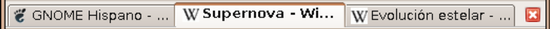
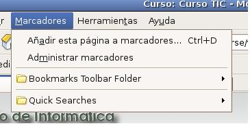
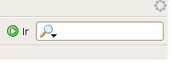
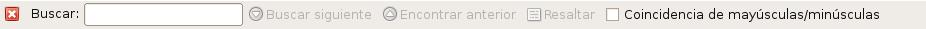
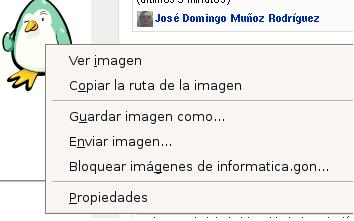
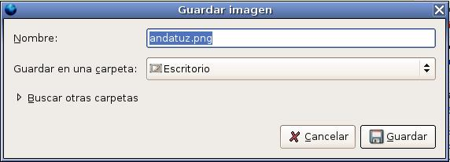

Veamos algunos aspectos importantes del navegador Firefox:  

## Navegación por pestañas

Consiste en poder abrir en una sola ventana del programa varias páginas a la vez, pudiendo ir de una a otra a través de sendas pestañas (o fichas). De este modo, la navegación resulta más cómoda y organizada y se consumen menos recursos en el equipo.

Para abrir una nueva pestaña escogemos la opción del menú: Archivo->Nueva pestaña. Otra forma muy cómoda de abrir un enlace en una pestaña, es pulsar el botón central del ratón (normalmente la rueda) sobre el enlace.

[

  
## Bloqueador de ventanas emergentes ([popups](http://es.wikipedia.org/wiki/Popup "Popup"))

Firefox incluye un bloqueador de ventanas emergentes integrado personalizable; por defecto, bloquea todas las ventanas emergentes que considere no solicitadas de cualquier página. Además, permite definir el nivel de protección ante las ventanas emergentes en cada caso.

## Marcadores

Firefox incluye la opción de almacenar sitios de la preferencia del usuario, lo que facilita la navegación de sitios visitados con frecuencia. 

*  Si queremos añadir la página que estamos visitando a la lista de marcadores, sólo debemos escoger la opción Marcadores->Añadir página a marcadores...

  

## Buscador

* Firefox incluye de serie un buscador integrado en la interfaz que hace búsquedas en [Google](http://mycroft.mozdev.org/quick/google.html "http://mycroft.mozdev.org/quick/google.html") y en otros buscadores localizados para el idioma de la traducción.

  

* Otro cosa que podemos hacer es buscar palabras en la página que estamos visitando, para ello elegimos la opción Editar-> Buscar en esta página...

  

## ¿Cómo guardar una imagen de una página WEB?  
  
En ocasiones podemos encontrar imágenes en la Web que nos interesa guardar en un fichero en nuestro disco duro . Para ello pulsamos con el botón derecho sobre la imagen y escogemos la opción Guardar imagen como...  

  
  
Posteriormente escogemos en la carpeta y el nombre del fichero donde lo vamos a guardar.  

  

  
> Este documento se distribuye bajo una licencia Creative Commons Reconocimiento-NoComercial-CompartirIgual  
  
> Reconocimiento. Debe reconocer los créditos de la obra de la manera especificada por el autor o el licenciador.  
> No comercial. No puede utilizar esta obra para fines comerciales.  
> Compartir bajo la misma licencia. Si altera o transforma esta obra, o genera una obra derivada, sólo puede distribuir la obra generada bajo una licencia idéntica a ésta.  
  
  
> Para más información visitar: http://creativecommons.org/licenses/by-nc-sa/2.5/es/