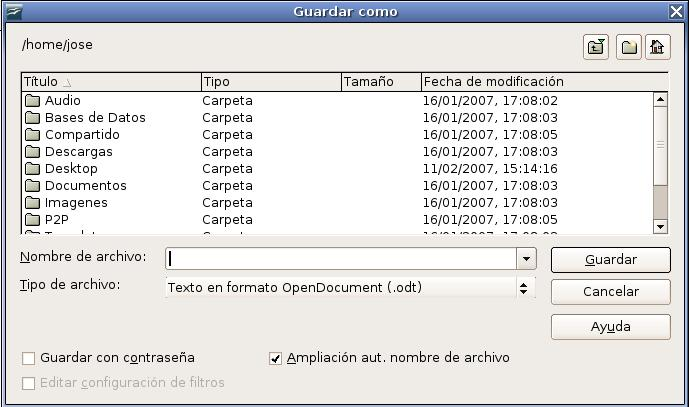
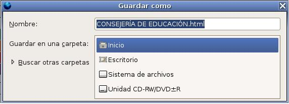
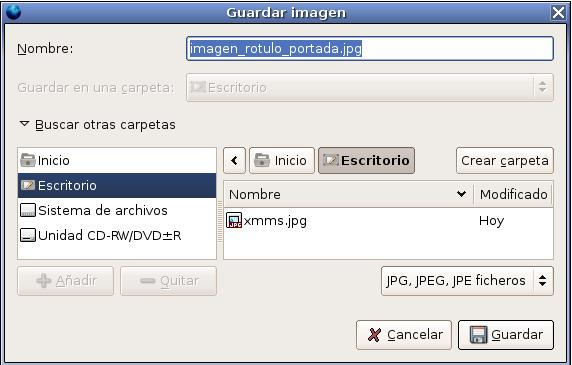
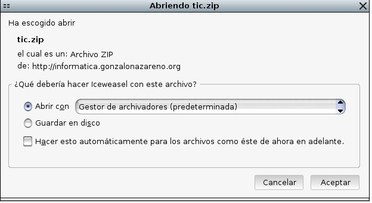
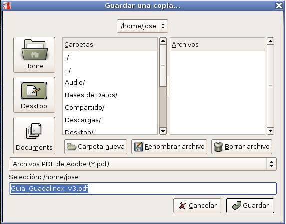

  
## Writer  
  
Una vez que has terminado de escribir el documento, tenemos que guardarlo.  

En el momento de guardar el documento creado utilizaremos, también, el menú **Archivo** pero usaremos la opción **Guardar**, con la que obtendremos el siguiente cuadro de diálogo:

  

Hay que prestar especial atención a dos aspectos en esta etapa:

1. El lugar donde se guarda el archivo, ya que de eso depende que más adelante lo podamos encontrar. 
2. El tipo de archivo. Acá es donde OpenOffice se luce, ya que tiene una enorme variedad de posibilidades según lo que necesitemos.

El formato propio de Writer es **.odt**, pero podemos elegir **.doc**, .sxw, **.html**, entre otros.

También, este diálogo le permite crear nuevos directorios para guardar sus documentos o moverse por los que ya existen.

## Guardar imagen desde Firefox  

Para guardar una imagen desde el Firefox, pulsamos con el botón derecho sobre la imagen y escogemos "Guardar imagen como..."

Posteriormente escogemos en la carpeta y el nombre del fichero donde lo vamos a guardar.  

  

* Si elegimos la lista Guardar en una carpeta: nos encontramos las siguientes opciones:

  
  
* Si queremos guardar el archivo en otra carpeta, debemos escoger la opción Buscar otras carpetas

  
  
## Descargar un documento con Firefox  
  
Cuando descargamos un fichero desde internet con el navegador Firefox, aparece esta ventana de dialogo, en las que podemos realizar dos operaciones:  

* Abrir con: Y nos da una lista con los programas que podemos utilizar para visualizar dicho fichero.
* Guardar en disco: Que nos permite guardar el fichero en el disco duro (normalmente en el escritorio), sin abrirlo on un programa.

  

## Guardar un fichero de Acrobat Reader

Cuando abrimos un fichero pdf con el programa Acrobat Reader y le damos al botón "Guardar una copia" nos encontramos con la siguiente pantalla:

  
  
> Este documento se distribuye bajo una licencia Creative Commons Reconocimiento-NoComercial-CompartirIgual  
  
> Reconocimiento. Debe reconocer los créditos de la obra de la manera especificada por el autor o el licenciador.  
> No comercial. No puede utilizar esta obra para fines comerciales.  
> Compartir bajo la misma licencia. Si altera o transforma esta obra, o genera una obra derivada, sólo puede distribuir la obra generada bajo una licencia idéntica a ésta.  
  
  
> Para más información visitar: http://creativecommons.org/licenses/by-nc-sa/2.5/es/