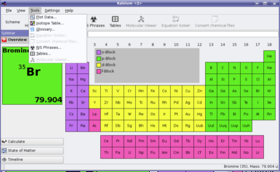
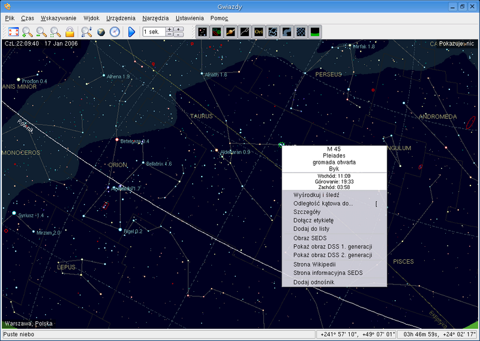
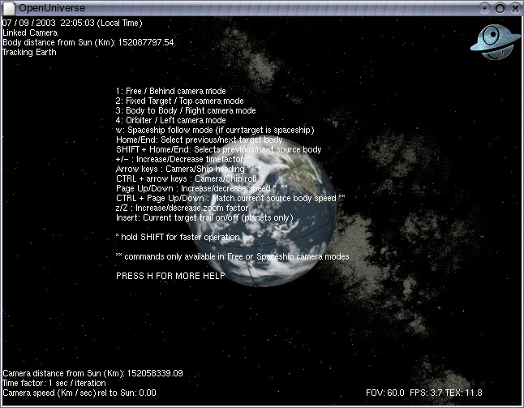
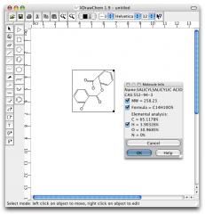

## Kalzium

Kalzium es una aplicación para Linux que nos muestra información sobre el sistema periódico de los elementos. Este programa puede ser usado como fuente de información o consulta por estudiantes o profesores, incluso investigadores químicos. Además, provee de dos tests distintos que pondrán a prueba nuestros conocimientos de Química General.

  
  
[Manual de Kalzium](http://docs.kde.org/development/es/kdeedu/kalzium/)  

## Kstars

**KStars** es un programa para [Linux](http://es.wikipedia.org/wiki/Linux "Linux") y otros sistemas operativos de la familia [Unix](http://es.wikipedia.org/wiki/Unix "Unix"), que simula un planetario.  
Ofrece una detallada representación gráfica del cielo nocturno, desde cualquier lugar de la [Tierra](http://es.wikipedia.org/wiki/Tierra "Tierra"), a cualquier fecha. Incluye más de 130.000 [estrellas](http://es.wikipedia.org/wiki/Estrella "Estrella"), 13.000 [objetos del espacio profundo](http://es.wikipedia.org/wiki/Objeto_del_espacio_profundo "Objeto del espacio profundo"), las 88 [constelaciones](http://es.wikipedia.org/wiki/Constelaci%C3%B3n "Constelación"), miles de cometas y asteroides, así como los ocho planetas del [Sistema Solar](http://es.wikipedia.org/wiki/Sistema_Solar "Sistema Solar") , el [Sol](http://es.wikipedia.org/wiki/Sol "Sol") y la [Luna](http://es.wikipedia.org/wiki/Luna "Luna"). Por otro lado, ofrece múltiple información sobre todos los objetos estelares en forma de hipertexto. Permite además controlar [telescopios](http://es.wikipedia.org/wiki/Telescopio "Telescopio") y cámaras [CCD](http://es.wikipedia.org/wiki/CCD "CCD") desde el propio programa.  
  
  
## Openuniverse

Es una espectacular representación en tres dimensiones del sistema solar, con todos los cuerpos desplazándose según sus propias órbitas. Admite la posibilidad de controlar muchos de los parámetros bajo los que realizamos la observación. Podemos decidir que nos muestre la atmósfera, los nombres de los planetas y las estrellas,... incluso, realizar capturas de la imagen.  
  
  
## Xdrawchen

XDrawChem es un programa para dibujar estructuras químicas. Las características incluyen dibujos de ángulo y largo fijo, una herramienta anillo para dibujar automáticamente anillos, y alineación automática de estructuras (para reacciones). Tiene soporte para los formatos de archivo MDL Molfile y CML (lenguaje de marcaje químico).
 

[Manual de XDrawChem  
](http://xdrawchem.sourceforge.net/doc/index.html)

  
> Este documento se distribuye bajo una licencia Creative Commons Reconocimiento-NoComercial-CompartirIgual  
  
> Reconocimiento. Debe reconocer los créditos de la obra de la manera especificada por el autor o el licenciador.  
> No comercial. No puede utilizar esta obra para fines comerciales.  
> Compartir bajo la misma licencia. Si altera o transforma esta obra, o genera una obra derivada, sólo puede distribuir la obra generada bajo una licencia idéntica a ésta.  
  
  
> Para más información visitar: http://creativecommons.org/licenses/by-nc-sa/2.5/es/

