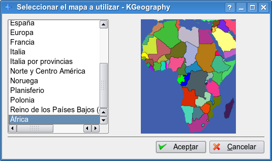

## KGeography

KGeography es una herramienta de geografía para KDE. Le permitirá aprender acerca de las divisiones políticas de algunos países (divisiones, capitales o aquellas divisiones y sus banderas asociadas si hay alguna).

Los mapas disponibles en la versión actual son: África, Asia, Austria, Brasil, Canadá, China, Europa, Francia, Alemania, Italia, Italia por provincias, Norte y Centro América, Noruega, Polonia, Sudamérica, España, Estados Unidos y el mundo.

[Manual de KGeography](http://docs.kde.org/stable/es/kdeedu/kgeography/introduction.html)

  
> Este documento se distribuye bajo una licencia Creative Commons Reconocimiento-NoComercial-CompartirIgual  
  
> Reconocimiento. Debe reconocer los créditos de la obra de la manera especificada por el autor o el licenciador.  
> No comercial. No puede utilizar esta obra para fines comerciales.  
> Compartir bajo la misma licencia. Si altera o transforma esta obra, o genera una obra derivada, sólo puede distribuir la obra generada bajo una licencia idéntica a ésta.  
  
  
> Para más información visitar: http://creativecommons.org/licenses/by-nc-sa/2.5/es/