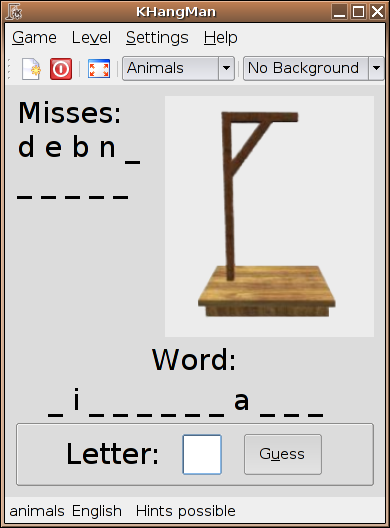
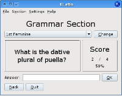
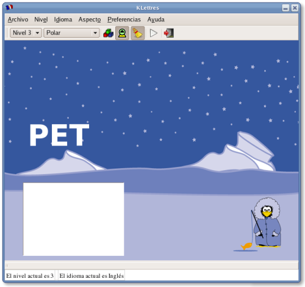
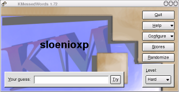

## i2e

Diccionario de inglés a español.  

## KHangMan

KHangMan es un juego basado en el conocido juego del ahorcado. Está dirigido a niños de seis años o más. Tiene cuatro niveles de dificultad: Animales (palabras de animales), Fácil, Medio y Difícil. Se escoge una palabra aleatoriamente, las letras están ocultas, se debe adivinar la palabra probando una letra tras otra. Cada vez que se pulsa una letra equivocada, se va dibujando la imagen del ahorcado. Hay que adivinar la palabra antes de que le cuelguen. Hay 10 intentos.  
  
  
  
[Manual de KHangMan](http://docs.kde.org/stable/es/kdeedu/khangman/introduction.html)  
  
## KLatin

KLatin es un programa que ayuda a repasar el latín. Contiene tres «secciones» en cada una de las cuales pueden repasarse diferentes aspectos de la lengua. Las secciones son: vocabulario, gramática, secciones de pruebas de verbos y además, una serie de notas de revisión que puede usar como repaso autodidacta.

En la sección de vocabulario se carga un archivo XML, que contiene varias palabras y sus traducciones a su idioma. KLatin le pregunta qué palabras de éstas desea traducir. Las preguntas se producen en un entorno de elección múltiple.

En las secciones de gramática y verbos KLatin le pregunta por una parte concreta de un sustantivo o verbo, como el «ablativo singular», o la «1ª persona del plural del indicativo de la voz pasiva», y no se trata de respuesta múltiple.

  

[Manual de KLatin](http://docs.kde.org/stable/es/kdeedu/klatin/index.html)

## Klettres

KLettres es una aplicación muy sencilla que ayuda a los niños o a los adultos a aprender el alfabeto y otros sonidos sencillos de su propio idioma o de uno extranjero. El programa elige una letra o una sílaba de forma aleatoria, esta letra/sílaba se muestra en pantalla y se escucha su sonido correspondiente. El usuario debe entonces escribir esta letra o sílaba. El entrenamiento finaliza en los niveles en los que no se muestra ninguna letra o sílaba y simplemente se escucha su sonido. No es necesario que el usuario sepa manejar el ratón, basta con utilizar el teclado.

  
  
[Manual de Klettres](http://docs.kde.org/development/es/kdeedu/klettres/index.html)  
  
## KMessedWords

KMessedWords es el juego, basado en puzzles de letras y palabras, al que yo jugaba de niño. Es un juego de sencilla construcción, con tres niveles de dificultad, y cada nivel merece su propia valoración. Es completamente personalizable, le permite escribir sus propias palabras y establecer un ?aspecto y comportamiento? personalizado. Está dirigido a niños de más de 10 años debido a su dificultad, pero todos pueden intentarlo. Se elige una palabra aleatoriamente y se muestra con las letras desordenadas, con la dificultad dependiendo del nivel. El número de intentos es ilimitado, y se mantienen las puntuaciones.  
  
  
  
[Manual de KMessedWords](http://docs.kde.org/development/es/kdeedu/kmessedwords/index.html)  
  
  
> Este documento se distribuye bajo una licencia Creative Commons Reconocimiento-NoComercial-CompartirIgual  
  
> Reconocimiento. Debe reconocer los créditos de la obra de la manera especificada por el autor o el licenciador.  
> No comercial. No puede utilizar esta obra para fines comerciales.  
> Compartir bajo la misma licencia. Si altera o transforma esta obra, o genera una obra derivada, sólo puede distribuir la obra generada bajo una licencia idéntica a ésta.  
  
  
> Para más información visitar: http://creativecommons.org/licenses/by-nc-sa/2.5/es/