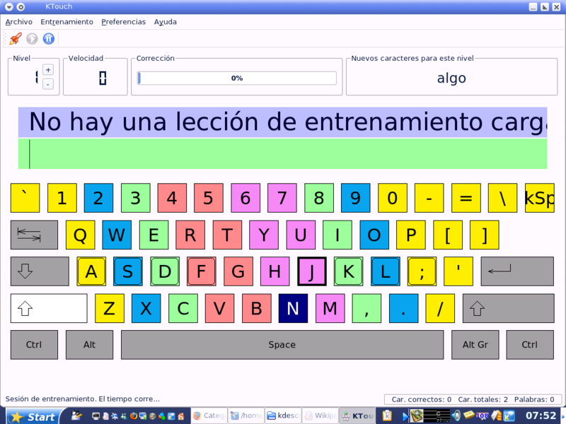
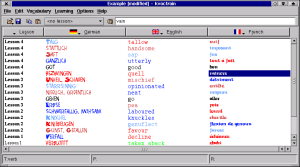

## gtypist

Gtypist v2.6 te da la posibilidad de aprender a escribir correctamente a máquina de forma muy sencilla, mejorando tu habilidad mediante la práctica de ejercicios regulares.  

## KTouch

Ktouch es un programa informático que enseña a mecanografiar. El programa visualiza un teclado qwerty iluminando la siguiente tecla a pulsar y actúa con acciones sonoras en caso de error. Permite usar distintas lecciones, así como modos de entrenamiento. Funciona en sistemas operativos Unix y GNU/Linux  
  
  
  
[Manual de KTouch](http://docs.kde.org/development/es/kdeedu/ktouch/index.html)  

## KVocTrain

KVocTrain es un programa de vocabulario para Linux, que le ayudará a entrenar su vocabulario si está estudiando un idioma extranjero. Puede crear su propia base de datos con las palabras que necesite.

Su intención es sustituir a las tarjetas de índice.

Probablemente recuerde este juego de su época en el colegio. El profesor escribía la expresión original en el anverso de una tarjeta y la traducción en el reverso. Entonces se miraba las tarjetas una tras otra. Si sabía la respuesta podía apartarla. Si fallaba, volvía a ponerla en el montón para volver a intentarlo.

KVocTrain no pretende enseñar gramática u otras cosas sofisticadas. Eso está y probablemente siempre estará fuera del objetivo de esta aplicación.

  

[Manual de KVocTrain](http://docs.kde.org/stable/es/kdeedu/kvoctrain/index.html)  
  
> Este documento se distribuye bajo una licencia Creative Commons Reconocimiento-NoComercial-CompartirIgual  
  
> Reconocimiento. Debe reconocer los créditos de la obra de la manera especificada por el autor o el licenciador.  
> No comercial. No puede utilizar esta obra para fines comerciales.  
> Compartir bajo la misma licencia. Si altera o transforma esta obra, o genera una obra derivada, sólo puede distribuir la obra generada bajo una licencia idéntica a ésta.  
  
  
> Para más información visitar: http://creativecommons.org/licenses/by-nc-sa/2.5/es/

**