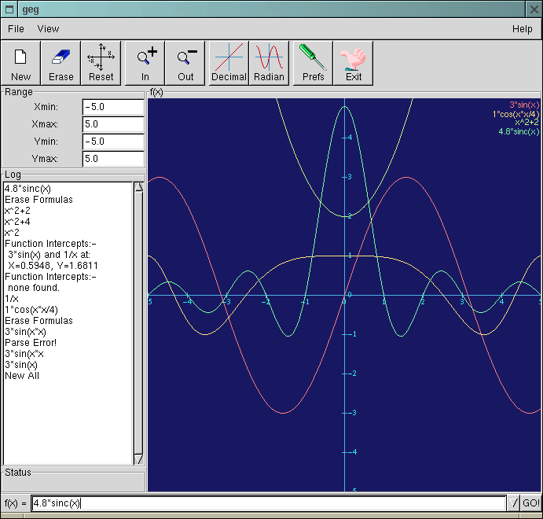
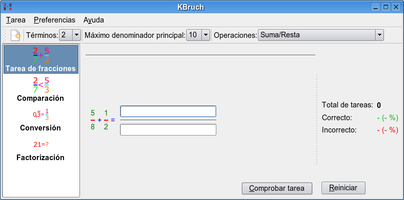
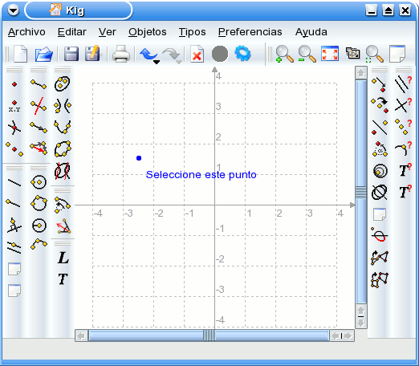
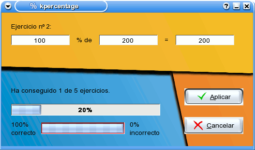
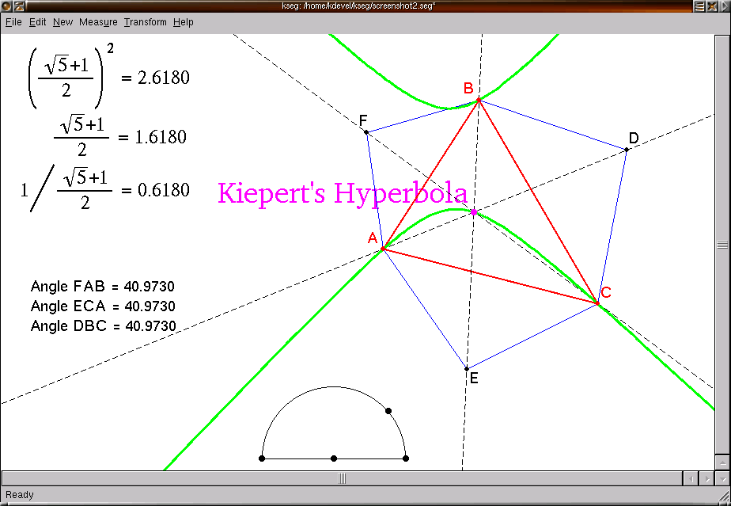
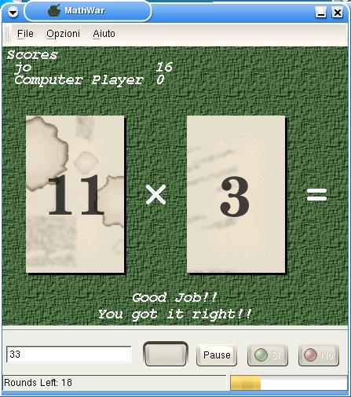
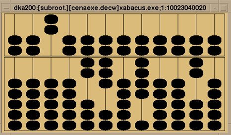

## bc

bc es una calculadora en línea de comandos.  
  
[Introducción a bc](http://bulma.net/body.phtml?nIdNoticia=2045)  
  
## geg

Sencillo pero potente programa para representación de funciones, disponible en Guadalinex.  
  
  
  
[Página principal de geg](http://www.infolaunch.com/%7Edaveb/)  
  
## KBrush

KBruch es un pequeño programa para practicar cálculos con fracciones. Para ello se ofrecen 4 tipos de ejercicios diferentes:

* Tarea de fracciones. En este ejercicio tendrá que resolver una operación con fracciones. Deberá introducir el numerador y el denominador. Éste es el ejercicio principal.
* Comparación. En este ejercicio tendrá que determinar cual de las 2 fracciones dadas es mayor.
* Conversión. En este ejercicio deberá convertir un número dado en una fracción.
* Factorización. En este ejercicio deberá factorizar un número dado en sus factores primos.
  
En todos los diferentes ejercicios KBruch generará una tarea y el usuario deberá resolverla. El programa comprueba la entrada y da información sobre ella.

KBruch cuenta cuántas tareas se resolvieron y de ellas cuántas se resolvieron correctamente. Las estadísticas se muestran al usuario en la ventana principal, aunque se pueden ocultar. El usuario puede reiniciar las estadísticas en cualquier punto.

  
  
[Manual de KBruch](http://docs.kde.org/stable/es/kdeedu/kbruch/index.html)  

## Kig

Kig es una aplicación de geometría interactiva. Intenta servir para dos propósitos:

* Permitir que los estudiantes exploren figuras y conceptos matemáticos por medio del ordenador.
* Servir como editor visual para dibujar figuras matemáticas e incluirlas en otros documentos.

  
[Manual de Kig](http://docs.kde.org/stable/es/kdeedu/kig/index.html)  
  
## KmPlot

KmPlot es un trazador de funciones matemáticas para el escritorio KDE. Incluye un potente procesador. Puede trazar diferentes funciones de forma simultánea y combinar sus elementos para construir nuevas funciones.

KmPlot admite funciones con parámetros y funciones con coordenadas polares. Hay varios modos de cuadrícula disponibles. Los trazados se pueden imprimir de forma muy precisa y correctamente escalados.

KmPlot también proporciona algunas características numéricas y visuales como:

* Rellenar y calcular el área entre el gráfico y el primer eje.
* Encontrar los valores máximo y mínimo.
* Cambiar parámetros de la función dinámicamente.
* Dibujar funciones derivadas e integrales.

Estas características ayudan a aprender las relaciones entre las funciones matemáticas y su representación gráfica en un sistema de coordenadas.

[Manual de KmPlot](http://docs.kde.org/stable/es/kdeedu/kmplot/index.html)  
  
## KPercentage

KPercentage es una pequeña aplicación matemática que ayuda a los alumnos a mejorar sus habilidades en el cálculo de porcentajes.

Hay una sección especial de entrenamiento para las tres tareas básicas. Por último el alumno puede seleccionar el modo aleatorio, en el que se mezclan las tres tareas al azar.

  

[Manual de KPercentage](http://docs.kde.org/stable/es/kdeedu/kpercentage/index.html)

## Kseg

KSEG es un programa interactivo libre de la geometría para explorar geometría euclidiana. Funciona en plataformas Unix-basadas (según los usuarios, también compila y funciona en OS X del mac y debe funcionar en cualquier otro soporte Qt). Cuando se crea una construcción, tal como un triángulo con un circuncentro, si se arrastra los vértices del triángulo, se puede ver el circuncentro moverse en tiempo real. Por supuesto, se puede hacer mucho más que eso (ver la lista de las características).  
  
  

  
[Manual de Kseg](http://matematicas.uis.edu.co/%7Ebelky/TRABAJO%20FINAL%20INFORMATICA%20EDUCATIVA.pdf)  
  
## MathWar

MathWar es un nuevo juego tipo concurso de matemáticas, con una dificultad añadida: Una operación matemática se muestra al jugador, tal como 17+4 o 5*7, y un reloj cuenta el tiempo mientras el jugador está pensando. Pasado un tiempo (configurable) el ordenador propone una solución. El jugador entonces tiene que decir si la respuesta del ordenador es correcta. Hay un cierto "error al azar" agregado a la respuesta del ordenador, por lo que no siempre es correcta. El jugador obtiene puntos al adivinar la respuesta correcta, o cuando responde correctamente sobre la respuesta del ordenador.  
  
  
  
## Scilab

Scilab es un programa **gratuito** de cálculo numérico especialmente diseñado para aplicaciones científicas y de ingeniería. Desarrollado desde 1990 por investigadores del INRIA (Institut National de Recherche en Informatique et Automatique) y del ENPC (Ecole Nationale de Ponts et Chaussées), es mantenido y desarrollado desde mayo del 2003 por  Scilab Consortium.  
  
[Manual de Scilab](ftp://ftp.inria.fr/INRIA/Scilab/contrib/SCISPANISH/Intro_Spanish.pdf)  
  
## Xabacus

Programa para aprender a utilizar un ábaco.

  

## xmaxima

Maxima es un programa de cálculo simbólico o CAS (_Computer Algebra System_) que comenzó su andadura allá por 1967 de la mano del MIT IA Lab, el Laboratorio de Inteligencia Artificial del Instituto Tecnológico de Massachussets, y sufragado por el Departamento de Energía de EEUU. Inicialmente conocido con el nombre MACSYMA, mantuvo una trayectoria errática de la mano de empresas privadas, de forma que pronto perdió presencia frente a otros programas como Maple o Mathematica.

[Aplicación de XMaxima a la docencia de las matemáticas](http://portal.jornadespl.org/biblioteca/iii-jornades/ponencies/390917-14-05-2004.pdf/download)  
[Introducción a xMaxima](http://www.guadalinex.org/modules/mydownloads/visit.php?cid=4&lid=100)  
[Manual básico de uso del programa XMAXIMA - MAXIMA.](http://www.ieslacucarela.com/PaginaIES/dptos/Matematicas/manualxmaxima.htm)

  
> Referencias:  
> Aula Tecnológica Siglo XXI (http://www.aula21.net/)  
  
> Este documento se distribuye bajo una licencia Creative Commons Reconocimiento-NoComercial-CompartirIgual  
  
> Reconocimiento. Debe reconocer los créditos de la obra de la manera especificada por el autor o el licenciador.  
> No comercial. No puede utilizar esta obra para fines comerciales.  
> Compartir bajo la misma licencia. Si altera o transforma esta obra, o genera una obra derivada, sólo puede distribuir la obra generada bajo una licencia idéntica a ésta.  
  
  
Para más información visitar: http://creativecommons.org/licenses/by-nc-sa/2.5/es/