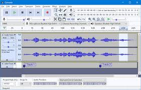
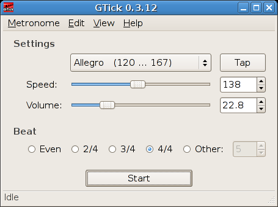
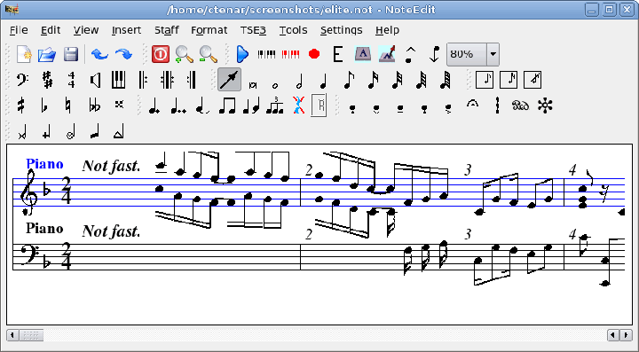
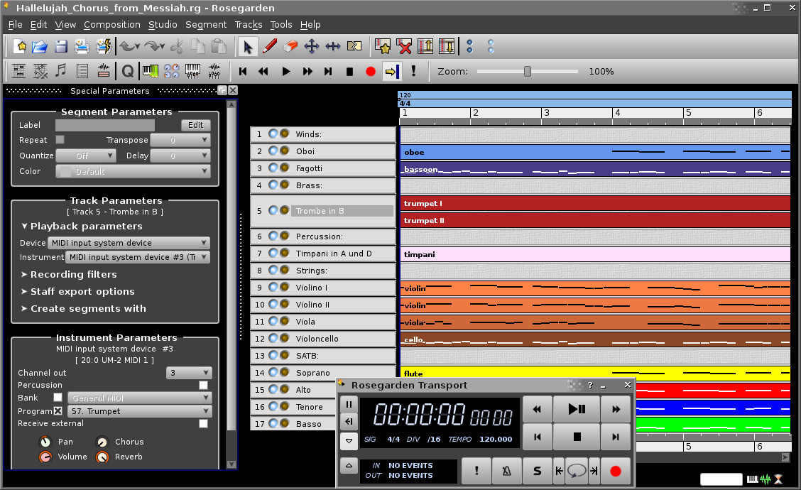

## Audacity

Audacity es un programa libre y de código abierto para grabar y editar sonidos.  
  
  
  
[Manual de Audacity](http://mosaic.uoc.edu/pdf/Captura_y_Edicion_de_Audio_con_Herramientas_Libres_II.pdf)  
  
## gtick

Gtick es una aplicación de metrónomo gráfica y acústica, con muestra de tabla de acentos, posibilidad de ajuste de velocidad (de 30 a 250 pulsos por minuto) y volumen, y manejo de compases de 2/4, 3/4, 4/4 y otros.  
  
  
  
## noteedit

NoteEdit es probablemente el software más completo en Linux para editar partituras con una interfaz gráfica. Debido a que las notas introducidas suenan inmediatamente en el dispositivo Midi seleccionado, NoteEdit permite incluso a principiantes crear partituras fácil y rápidamente. Este programa proporciona una gran variedad de signos musicales para escribir partituras. Con NoteEdit no sólo puede fijar notas, sino también reproducir y grabar archivos MIDI. Las partituras se pueden exportar en varios formatos (entre otros MusixTeX y LilyPond).?  
  
  
  
## Rosegarden4

Herramienta de composición y edición de música: Secuenciador de audio y midi, editor de partituras...  
  
Edicion y impresion de partituras. Editor en modo organillo. Se puede conectar audio/midi con otras aplicaciones que soporten JACK y puede usar ALSA (controladores de audio de baja latencia, equivalente a ASIO). Acepta plugins de efectos en tiempo real (Ladspa, equivalente a VST).  
  
  
  
  
> Este documento se distribuye bajo una licencia Creative Commons Reconocimiento-NoComercial-CompartirIgual  
  
> Reconocimiento. Debe reconocer los créditos de la obra de la manera especificada por el autor o el licenciador.  
> No comercial. No puede utilizar esta obra para fines comerciales.  
> Compartir bajo la misma licencia. Si altera o transforma esta obra, o genera una obra derivada, sólo puede distribuir la obra generada bajo una licencia idéntica a ésta.  
  
  
> Para más información visitar: http://creativecommons.org/licenses/by-nc-sa/2.5/es/